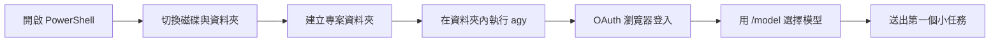
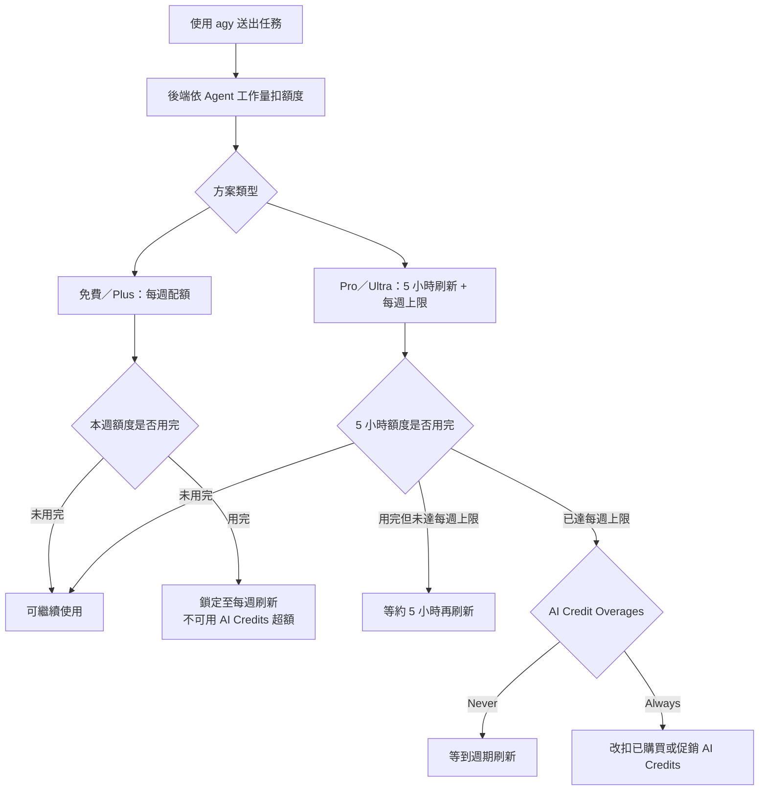
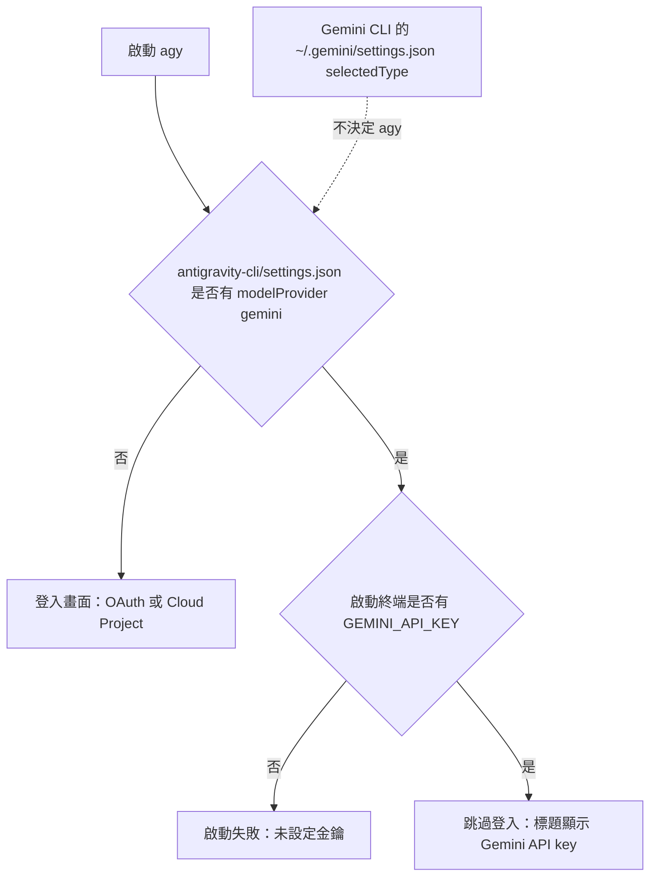
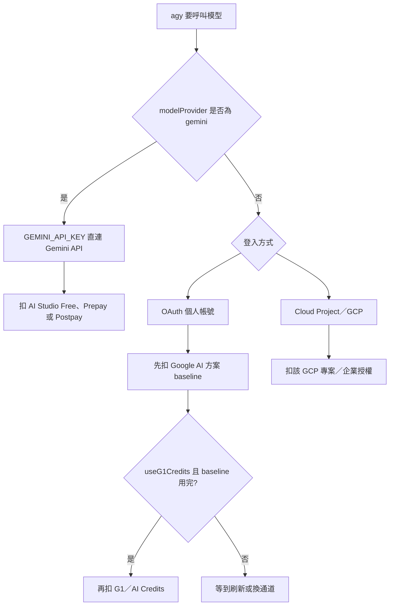
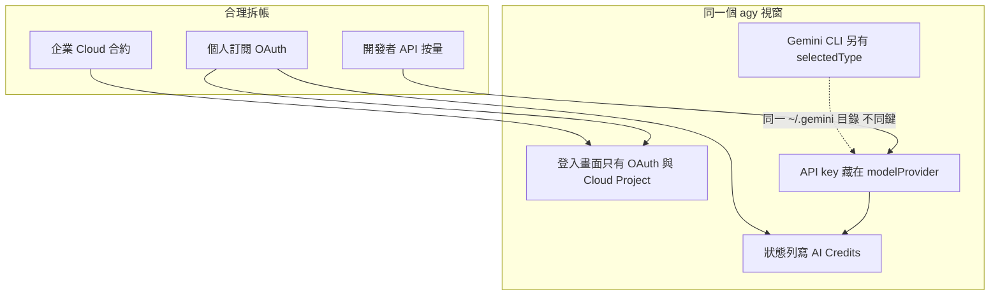

<!-- Path: LLM_2_Agent | Timestamp: 2026-09-15 09:35:39 | Version: b06 | Model: Gemini 3.6 Flash -->

# Antigravity CLI（`agy`）PowerShell 安裝、OAuth 入門、額度與 API Key

> **最後更新時間**: 2026-09-15 09:35:39 (UTC+8)  
> **使用模型**: Gemini 3.6 Flash  
> **執行 Agent**: Antigravity Documentation Specialist  
> **版本號**：b06  
> **原編修模型**：GPT-5.6 Sol / Cursor Grok 4.6  
> **原本機實測 CLI**：`agy` 1.1.16（macOS 路徑：`~/.local/bin/agy`）  
> **前一版本**：`Antigravity_cli_b05.md`（b05，2026-09-08 22:53:42）  
> **本版調整**：新增 Windows PowerShell 安裝、權限排錯、以資料夾為單位啟動、OAuth 登入與模型選擇；再銜接原有額度、API key 與扣款內容  
> **主題範圍**：PowerShell 安裝、OAuth、資料夾工作區、模型選擇、免費額度、API key、Prepay／Postpay、G1／AI Credits  
> **資料性質**：以 Google 官方文件與本機日誌為準；討論段標明為教學觀點，不是官方規格。

---

## 查詢紀錄（時間戳記與模型）

| 項目 | 內容 |
| :-- | :-- |
| 本版更新日期 | 2026-09-14（原額度與計費查詢：2026-09-08） |
| 查詢時間 | 21:45:00 CST（b06 入門流程更新）；22:53:42 CST（b05 結構重排）；b04 討論 22:48:58；b03 除錯 22:35:28；b02 計費 22:13:27；額度查詢 22:04:52（b01） |
| 本版編修模型 | GPT-5.6 Sol（安裝步驟依 2026-09-14 官方文件核對）；原查詢模型 Cursor Grok 4.6 |
| 本機 CLI 版本 | Antigravity CLI `agy` 1.1.16 |
| 本機設定（除錯當下） | `modelProvider: "gemini"`；`useG1Credits` 原為 `true`，已改為 `false`（或省略，預設即 false） |
| 本機日誌關鍵句 | `authMethod=gemini_api_key`；`GetG1Credits: paidTier is nil`；`doRefreshQuota: skipped (not logged in)` |
| 狀態列現象 | `Gemini 3.6 Flash · medium · AI: Out of credits`；`press ctrl+c again to exit` 為退出確認，不是額度錯誤 |
| 官方文件快照時間 | 2026-09-08 晚間（額度文件與 b01 同一回合；計費文件於 22:13 再查） |
| 本機 `/usage` | `agy -p "/usage" --output-format json` 回傳 `groups: []`（print 模式未列出具體剩餘量） |
| 本機 `/credits` | 回傳 `no credits info found`（與免費方案沒有 AI Credits 額度池相符） |
| API key 官方依據 | [Installation & Auth](https://antigravity.google/docs/cli/install)（`agy` 1.1.13 起支援 `GEMINI_API_KEY`） |
| 計費官方依據 | [Gemini API Billing](https://ai.google.dev/gemini-api/docs/billing)（2026-03-23 起 Prepay／Postpay） |

---

## 閱讀路徑

本文件依「先會操作，再理解額度與計費」的順序編排，不必一次讀完：

| 章 | 讀完之後你能做什麼 |
| :-- | :-- |
| **一、PowerShell 安裝** | 開啟 PowerShell、安裝 `agy`，並處理執行原則、寫入權限與 PATH 問題 |
| **二、以資料夾為單位開始** | 切換到 `D:\`、建立工作資料夾、啟動 `agy`、完成 OAuth 與選擇模型 |
| 三、為什麼重要 | 知道為什麼額度與帳單會卡住課堂 |
| 四、官方方案額度 | 說明免費／Pro／Ultra 的週配額（OAuth 那一條） |
| 五、在 `agy` 裡查與省 | 用 `/usage` 操作方案額度 |
| **六、使用 API key（完整設定）** | 從建金鑰、改設定、驗收到 Prepay／改回 OAuth |
| 七、通道、除錯與討論 | 分辨 G1 與 API；處理 Out of credits；討論為何複雜 |
| 八～十三 | 練習、Q&A、總結、延伸、來源與結論 |

若你是第一次使用，先完成第一、二章；若只想改走 `ai.dev` 金鑰，可直接讀**第六章**，再補第七章 7.1～7.2。

---


## 一、在 Windows PowerShell 安裝 `agy`

本章以 Windows 10／11 的 **PowerShell** 為操作環境。`agy` 是原生執行檔，不需要先安裝 Node.js、npm 或 Python。官方安裝程式預設安裝到目前使用者的 `%LOCALAPPDATA%\agy\bin`，通常不需要系統管理員權限。

### 1.1 開啟 PowerShell

1. 按下 Windows 鍵，輸入 `PowerShell`。
2. 點選 **Windows PowerShell**；Windows 11 也可以開啟 **Terminal（終端機）**，再確認分頁是 PowerShell。
3. 一般安裝先使用普通權限。只有錯誤訊息明確要求，且電腦管理政策允許時，才使用「以系統管理員身分執行」。
4. 用下列指令確認目前環境：

```powershell
$PSVersionTable.PSVersion
$env:USERNAME
```

### 1.2 執行官方安裝指令

將下列**完整一行**貼到 PowerShell，按 Enter：

```powershell
irm https://antigravity.google/cli/install.ps1 | iex
```

其中 `irm` 是 `Invoke-RestMethod` 的別名，用來下載官方安裝腳本；`iex` 是 `Invoke-Expression` 的別名，用來執行下載內容。基於安全考量，應確認網址網域是 `antigravity.google`，不要執行來源不明的 `irm ... | iex` 指令。

安裝完成後，**關閉並重新開啟 PowerShell**，讓新的 PATH 生效，再確認：

```powershell
Get-Command agy
agy --help
```

只要 `Get-Command agy` 顯示 `agy.exe` 的路徑，安裝即成功。日後更新可再次執行同一個官方安裝指令。

### 1.3 常見權限與安裝問題

#### 情況 A：PowerShell 顯示不允許執行指令碼

先查看各範圍的執行原則：

```powershell
Get-ExecutionPolicy -List
```

個人電腦可優先使用只影響**目前 PowerShell 視窗**的暫時設定：

```powershell
Set-ExecutionPolicy -Scope Process -ExecutionPolicy Bypass
irm https://antigravity.google/cli/install.ps1 | iex
```

關閉該視窗後，`Process` 範圍的設定便會失效。若希望自己的帳號長期允許本機與可信的已簽署／遠端腳本，可改用：

```powershell
Set-ExecutionPolicy -Scope CurrentUser -ExecutionPolicy RemoteSigned
```

出現確認提示時，閱讀內容後輸入 `Y`。若 `MachinePolicy` 或 `UserPolicy` 已由學校／公司管理，`Process` 與 `CurrentUser` 可能都不能覆蓋；不要嘗試繞過組織政策，應請資訊管理人員協助。

> **判斷重點**：Execution Policy 不是完整的安全邊界，而且並非每個 `Access denied` 都是它造成。只有訊息明確提到「running scripts is disabled」或 `PSSecurityException` 時才調整它。

#### 情況 B：顯示 `Access denied`、無法寫入或更新檔案

1. 完全退出其他正在執行的 `agy` 視窗，避免執行檔或更新鎖被占用。
2. 確認安裝資料夾位於目前帳號的本機資料夾：

```powershell
$agyBin = Join-Path $env:LOCALAPPDATA 'agy\bin'
$agyBin
Test-Path $agyBin
```

3. 若 Windows Defender「受控資料夾存取」、防毒軟體或校務管理政策攔截下載，請依組織規定允許官方安裝程式，或交由管理員安裝。
4. 不要一開始就改用系統管理員安裝。使用者層級安裝若混用管理員帳號，反而可能留下目前帳號不能更新的檔案。

#### 情況 C：安裝成功，但顯示「無法辨識 `agy`」

先關閉並重開 PowerShell。若仍找不到，檢查檔案與 PATH：

```powershell
$agyBin = Join-Path $env:LOCALAPPDATA 'agy\bin'
Test-Path (Join-Path $agyBin 'agy.exe')
$env:Path -split ';'
```

若 `agy.exe` 存在，但清單沒有 `$agyBin`，可把它加入**目前使用者**的 PATH：

```powershell
$agyBin = Join-Path $env:LOCALAPPDATA 'agy\bin'
$userPath = [Environment]::GetEnvironmentVariable('Path', 'User')
if (($userPath -split ';') -notcontains $agyBin) {
    $newPath = if ([string]::IsNullOrWhiteSpace($userPath)) { $agyBin } else { "$userPath;$agyBin" }
    [Environment]::SetEnvironmentVariable('Path', $newPath, 'User')
}
```

完成後再重開 PowerShell，執行 `Get-Command agy`。不要把不存在的路徑加入 PATH；如果 `agy.exe` 根本不存在，應重新執行官方安裝程式。

### 1.4 安裝檢核表

- [ ] PowerShell 能執行 `Get-Command agy`
- [ ] `agy --help` 能顯示說明
- [ ] 安裝路徑是目前使用者的 `%LOCALAPPDATA%\agy\bin`
- [ ] 沒有把來源不明的腳本當成官方安裝程式
- [ ] 組織管理的電腦若受政策限制，已交由管理員處理

---

## 二、以資料夾為單位開始：切換目錄、OAuth 登入與選擇模型

建議「一個課程、專題或程式專案使用一個資料夾」，並在該資料夾內啟動 `agy`。如此 Agent 看到的工作範圍較明確，檔案不容易混入其他專案，也方便日後備份與版本控制。



### 2.1 認識最常用的 PowerShell 資料夾指令

| 目的 | PowerShell 指令 | 說明 |
| :-- | :-- | :-- |
| 顯示目前位置 | `Get-Location` 或 `pwd` | 確認 `agy` 將從哪個資料夾開始 |
| 列出檔案 | `Get-ChildItem` 或 `dir` | 查看目前資料夾內容 |
| 切換到 D 槽根目錄 | `Set-Location D:\` 或 `cd D:\` | 若電腦沒有 D 槽，請改用存在的磁碟 |
| 建立資料夾 | `New-Item -ItemType Directory -Name agy-practice` 或 `mkdir agy-practice` | 建立新的工作區 |
| 進入子資料夾 | `Set-Location .\agy-practice` 或 `cd .\agy-practice` | `.` 代表目前位置 |
| 回上一層 | `Set-Location ..` 或 `cd ..` | 離開目前子資料夾 |

資料夾名稱含空格時要加引號，例如：

```powershell
cd 'D:\AI Course\Agent Practice'
```

### 2.2 完整示範：在 `D:\` 建立工作資料夾

逐行執行：

```powershell
Set-Location D:\
New-Item -ItemType Directory -Name 'agy-practice' -ErrorAction SilentlyContinue
Set-Location .\agy-practice
Get-Location
Get-ChildItem
agy
```

如果沒有 D 槽，可改在個人文件資料夾建立：

```powershell
Set-Location (Join-Path $HOME 'Documents')
mkdir 'agy-practice'
cd .\agy-practice
agy
```

`-ErrorAction SilentlyContinue` 只用在示範中避免「資料夾已存在」中斷畫面；正式操作時若出現其他錯誤，仍應閱讀訊息，不要一律忽略。

### 2.3 第一次啟動：完成 OAuth 登入

1. 確認 PowerShell 提示字元目前位於剛建立的資料夾，再輸入 `agy`。
2. 首次啟動若出現登入方式，選擇 **Google 帳號／OAuth（個人帳號）**，不要選 Cloud Project。實際文字可能隨版本略有不同。
3. CLI 會開啟預設瀏覽器。選擇要使用的 Google 帳號，閱讀授權範圍後同意。
4. 瀏覽器顯示完成後，回到 PowerShell。權杖會安全保存在 Windows Credential Manager；之後若權杖仍有效，通常不必重登。
5. 若出現「是否信任目前工作區」之類的提示，只有在這是自己建立或已檢查過的資料夾時才信任。
6. 若瀏覽器沒有自動開啟，複製 CLI 顯示的 OAuth 網址到瀏覽器；完成後依畫面指示返回終端機或貼上授權碼。

登入卡住時：

- 確認瀏覽器登入的是預期帳號，不是共用或他人的帳號。
- 學校 Google Workspace 帳號若禁止此應用程式，需由管理員核准；重複登入不能繞過政策。
- 要更換帳號，可在 `agy` 內輸入 `/logout`，完全退出後重新執行 `agy`。
- 不要把 OAuth 授權碼、權杖或瀏覽器回呼網址貼到教材、聊天室或公開截圖。

### 2.4 登入後選擇模型

進入 `agy` 的 TUI 後，在提示框輸入：

```text
/model
```

接著：

1. 用 `↑`、`↓` 選擇模型。
2. 初學與一般課堂練習建議先選 **Gemini Flash + medium**；速度快，也通常比 Pro／high 節省額度。
3. 按 Enter 確認。選擇會保留到後續工作階段，仍可隨時再次輸入 `/model` 更換。
4. 當下實際清單依帳號、地區、方案與容量而變；不要只依講義上的模型名稱判斷。

也可先在 PowerShell 查詢 CLI 回報的模型：

```powershell
agy models
```

`agy models` 是在一般 PowerShell 提示字元執行；`/model` 則是在 `agy` 互動介面內輸入，兩者不要混用。

### 2.5 送出第一個資料夾任務

先用唯讀、小範圍提示確認 Agent 理解目前資料夾，例如：

```text
請列出目前資料夾中的檔案，說明各檔案可能的用途；先不要修改任何內容。
```

若資料夾仍是空的，可以輸入：

```text
請建議這個練習資料夾可以建立哪些檔案；先提出計畫，不要建立檔案。
```

常用操作：

- `/usage`：查看模型額度。
- `/model`：更換模型。
- `/permissions`：檢查工具權限；初學建議保留需要確認的模式。
- `/help`：查看指令。
- `/exit`：離開；也可在提示框空白時按 `Ctrl+D`。

### 2.6 每次開始工作的固定流程

```powershell
cd 'D:\agy-practice'
Get-Location
agy
```

先看 `Get-Location`，再啟動 `agy`。如果開錯資料夾，先退出 `agy`，回 PowerShell 切換到正確資料夾後再啟動；不要讓 Agent 在磁碟根目錄或整個使用者家目錄中漫無邊界地工作。

---

## 三、為什麼這份紀錄重要（Why）

Antigravity CLI 是 Google 提供的終端 Agent 工具，指令名稱為 `agy`。免費方案可以登入個人 Google 帳號使用，不必先訂閱 Google AI Pro 或 Ultra。

實務上最常卡住的不是「能不能安裝」，而是：

1. 官方**不公布**免費方案的絕對請求數或 Token 數。
2. 額度依 **Agent 實際完成的工作量** 扣除，不是依「送出幾句提示」計算。
3. 額度用完後，免費方案**不能**用 AI Credits 超額續跑，必須等到每週刷新。
4. 額度會隨系統容量調整，文件本身也寫明「Usage limits are subject to modification」。
5. 另一條路是 `ai.dev` 的 API key，帳單與方案週配額分開；設定散在兩個檔案時很容易改錯。

因此課堂與個人練習都應把「先確認現在是誰在付錢、再查 `/usage` 或 AI Studio Billing、任務拆小」當成操作規範。

---

## 四、官方怎麼描述額度（What）

### 4.1 官方不公布的數字

截至 2026-09-08，Google 在 [Plans](https://antigravity.google/docs/plans?app=cli) 與 [Pricing](https://antigravity.google/pricing) **沒有**公布以下任何絕對數字：

- 每天／每週可用請求數
- 每天／每週可用 Token 數
- 每個模型的精確配額
- 免費方案對應多少美元的 API 用量

官方用形容詞描述額度：免費方案是 **meaningful quota**；Pro 是 **high, generous quota**；Ultra 是 **the highest, most generous quota**。

### 4.2 方案分層（以官方文件為準）

| 方案 | 價格（官方頁面） | 官方對額度的說法 | 刷新方式 | 用完後可否加買 |
| :-- | :-- | :-- | :-- | :-- |
| Individual（免費）／非 Pro、非 Ultra | $0／月 | Meaningful quota；Basic weekly rate limits | **每週**刷新；有 weekly rate limit | **否**。官方 Overages 僅開放 Pro／Ultra |
| Google AI Plus | 未在 Antigravity Plans 單獨列出更高 Agent 額度 | 與「非 Pro／Ultra」同一組：每週刷新 | 每週 | 官方未寫可超額 |
| Google AI Pro | 官方部落格記為約 $20／月 | High, generous quota；Higher weekly rate limit | **每 5 小時**刷新，直到碰到每週上限 | 可以，使用 AI Credits |
| Google AI Ultra（較低檔） | 官方部落格：新設 $100／月 | 相對 Pro 為 **5X** token 額度 | 每 5 小時；最高每週上限 | 可以，使用 AI Credits |
| Google AI Ultra（最高檔） | 官方部落格：由 $250 調降至 $200／月 | Highest, most generous quota | 每 5 小時；最高每週上限 | 可以，使用 AI Credits |
| 組織／Enterprise | 走 Google Cloud | 依 Gemini Enterprise Agent Platform 計費或授權 | 依 Cloud 專案與授權 | 消耗制或授權內超額機制 |

補充：

- [Plans](https://antigravity.google/docs/plans?app=cli) 把「Users not on AI Pro and Ultra plans」合成一組。也就是 **免費與 Plus 在 Agent 額度上被寫成同一層**，不要假設 Plus 一定有比較多 Agent 配額。
- Ultra 的 5X／20X 是相對 **Pro** 的倍率；Pro 本身仍沒有公開絕對值，所以無法反推出免費方案的精確數字。



### 4.3 免費方案「有什麼」與「沒有什麼」

依 [Pricing](https://antigravity.google/pricing) Individual $0 與 [Plans](https://antigravity.google/docs/plans?app=cli) Baseline Quota：

**免費方案包含：**

- 使用核心 Agent 模型（見下一節模型表）
- **Unlimited Tab completions**（自動完成不受 Agent 週配額限制）
- **Unlimited Command requests**（定價頁寫明；指指令請求，不是 Agent 工作量無限）
- 可使用產品功能，包含 **Scheduled Tasks** 與 **CLI（`agy`）**

**免費方案的限制：**

- 只有 **basic weekly rate limits**
- 額度與 Agent 完成的工作量相關，長任務、多檔案、多次工具呼叫會加速耗盡
- 額度用完後必須等到每週刷新，**沒有**官方超額通道
- 額度可因系統容量被調整
- 官方目前寫明不支援以自備金鑰（BYOK）或自備端點來**增加 Antigravity 方案額度**
- CLI 參考寫明 `/teamwork-preview`（多代理人協作預覽）為 **paid plans**

### 4.4 可用模型（官方 Models 頁，2026-09-08）

[Models](https://antigravity.google/docs/models/) 標示 Free & Google AI Plus 可用：

| 模型 | Free & Plus | Pro | Ultra | Enterprise |
| :-- | :-- | :-- | :-- | :-- |
| Gemini 3.8 Flash | 可用 | 可用 | 可用 | 可用 |
| Gemini 3.7 Flash | 可用 | 可用 | 可用 | 可用 |
| Gemini 3.6 Flash | 可用 | 可用 | 可用 | 可用 |
| Gemini 3.1 Pro | 可用 | 可用 | 可用 | 可用 |
| Claude Sonnet 4.6（thinking） | 可用 | 可用 | 可用 | 不可用 |
| Claude Opus 4.6（thinking） | 可用 | 可用 | 可用 | 不可用 |
| GPT-OSS-120b | 可用 | 可用 | 可用 | 不可用 |

Pricing 頁 Individual 方案同期列出：Gemini 3.8／3.7／3.6 Flash、Gemini 3.1 Pro、Claude Sonnet & Opus 4.6、gpt-oss-120b。

**文件不一致（需保留）：**

- Plans 寫 Ultra 才有「Access to third-party models」。
- Models 與 Pricing 則把 Claude／GPT-OSS 標為免費方案可用。
- 本機於 2026-09-08 執行 `agy models` **只列出 Gemini 系列**（含 3.5／3.6／3.7／3.8 Flash 與 Gemini 3.1 Pro 的 high／medium／low），沒有列出 Claude 或 GPT-OSS。可能原因包括帳號地區、容量閘道、或 `agy models` 只回報目前工作階段實際可選模型。課堂上應以當場 `agy models` 與 `/model` 為準。

本機 `agy models` 當日清單：

```text
gemini-3.8-flash-high
gemini-3.8-flash-medium
gemini-3.8-flash-low
gemini-3.7-flash-high
gemini-3.7-flash-medium
gemini-3.7-flash-low
gemini-3.6-flash-high
gemini-3.6-flash-medium
gemini-3.6-flash-low
gemini-3.5-flash-high
gemini-3.5-flash-medium
gemini-3.5-flash-low
gemini-3.1-pro-low
gemini-3.1-pro-high
```

### 4.5 額度怎麼被消耗

官方兩次強調同一原則（Plans 與 2025 年產品介紹註腳）：

> Rate limits are correlated with the amount of work done by the agent, which can differ from prompt to prompt.

含義：

- 簡單、短、少工具呼叫的任務，同一週可完成較多輪。
- 長程除錯、多檔案重構、反覆跑測試，可能很快碰到上限。
- **數提示次數無法預測剩餘額度**。

2026 年方案調整公告 [Changes to Antigravity Plans](https://antigravity.google/blog/changes-to-antigravity-plans) 另說明：

- **Gemini Flash 與 Gemini Pro 改為共用一個額度池**，依 API 定價比例扣減。若 Flash 約為 Pro 的 1/8 價格，同樣配額大約可跑 8 倍 Flash token（在輸入／輸出／快取讀取比例相近的前提下）。
- **非 Gemini 模型**（Claude、GPT-OSS）因容量限制，維持**獨立固定額度**，不併入 Gemini 共用池。

Models 頁的用量介面同時顯示：

- Gemini Models：Weekly Limit Remaining、Five Hour Limit Remaining
- Claude and GPT models：Weekly Limit Remaining、Five Hour Limit Remaining

也就是介面上可能同時看到「5 小時」與「每週」兩條進度。免費方案的官方文字仍以**每週刷新**為準；若看到數日後才重置，通常是撞上 weekly cap，不是介面故障。

### 4.6 超量與 AI Credits

[Plans Overages](https://antigravity.google/docs/plans?app=cli)：

- 只有 **Google AI Pro 或 Ultra** 能用購買的 AI Credits（或一次性促銷點數）在 baseline 用完後繼續跑。
- 計費依 Gemini Enterprise Agent Platform 標準消耗定價。
- 設定「AI Credit Overages」：
  - **Never**：額度用完就等刷新（預設方向；CLI 的 `useG1Credits` 預設為 `false`）
  - **Always**：該模型 baseline 用完後自動改扣 AI Credits，刷新後再回到 baseline
- 免費方案沒有這條路。本機 `agy -p "/credits"` 回傳 `no credits info found`，與免費帳號沒有點數池一致。

官方部落格亦說明：AI Credits 已從訂閱內含改為**單純超額機制**，並曾提供 Ultra 限時 $100 促銷點數（該優惠至 2026-05-25 截止，本查詢時點已過期）。

### 4.7 CLI 與方案共用額度

Antigravity 桌面端、IDE 延伸與 CLI 使用同一套 Google AI 方案額度，不是 CLI 另外給一份免費配額。課堂上用 `agy` 消耗的量，會與同一帳號在 Antigravity 其他介面的用量合併計算。

---

## 五、在 `agy` 裡怎麼查方案額度、怎麼省（OAuth 路徑）

本章只處理**個人帳號登入（OAuth）**時的 Google AI 方案額度。若要改用 `ai.dev` 金鑰，請直接讀第六章。

### 5.1 建議設定值

| 項目 | 建議 | 說明 |
| :-- | :-- | :-- |
| 查額度指令 | `/usage` 或 `/quota` | 向後端刷新後顯示各模型剩餘量 |
| 查點數指令 | `/credits` | 免費方案通常沒有點數可顯示 |
| 預設模型 | 優先 Gemini Flash（medium／low） | 共用池中 Flash 單位成本較低，同樣週配額可多跑幾輪 |
| 推理強度 | 初學用 medium；確認需要再 high | `--effort high` 與 Pro 模型都會加速扣額 |
| `useG1Credits` | 維持 `false` | 避免誤開超額扣點；免費方案本來也沒有點數 |
| 權限 | `request-review` | 減少 Agent 自行擴大工作範圍而多燒額度 |
| 任務切法 | 一輪只做一件可驗收的事 | 避免一次長跑打滿 weekly cap |

### 5.2 查詢步驟

1. 在專案資料夾啟動：

```bash
agy
```

2. 在提示框輸入：

```text
/usage
```

3. 面板會顯示各模型剩餘請求／Token 與刷新倒數。鍵盤：`↑`／`↓` 捲動，`Esc` 或 `Q` 關閉。
4. 需要機器可讀結果時（不開 TUI、不消耗對話額度的唯讀指令）：

```bash
agy -p "/usage" --output-format json
agy models
agy -p "/help"
```

本次查詢中，`/usage` 的 JSON 為空的 `groups` 陣列；要看實際百分比與刷新倒數，仍以互動式 TUI 的 `/usage` 為準。

### 5.3 額度耗盡時會看到什麼

社群與議題追蹤常見訊息（非官方固定文案，但課堂需認得）：

- `RESOURCE_EXHAUSTED`
- `Individual quota reached`
- `Resets in …h`（可能是數小時，也可能接近一週，例如 126h～167h）

官方處理原則：

- **免費方案**：停止使用該模型，等到週期刷新；或改用仍有剩餘的模型（若介面仍顯示其他池有餘額）。
- **Pro／Ultra**：可開 AI Credit Overages，或等待 5 小時／每週刷新。
- 也可改走 API key（**第六章**）。那是 Gemini API 自己的配額與計費，**不會**把 Antigravity 免費週配額變大。

---

## 六、使用 API key：完整設定

本章可獨立閱讀。目標：讓 `agy` 用 [Google AI Studio](https://aistudio.google.com/)／`ai.dev` 建立的 Gemini API key，並扣該金鑰所屬專案的 Free／Prepay／Postpay，而不是 Google AI 方案週配額或 G1 點數。

官方依據：[Installation & Auth](https://antigravity.google/docs/cli/install)（`agy` 1.1.13 起）、[Gemini API Billing](https://ai.google.dev/gemini-api/docs/billing)。

### 6.1 這條路徑是什麼

登入畫面通常只顯示 **OAuth** 與 **Cloud Project**。API key **不是第三個按鈕**。要同時改 `agy` 的設定檔、並在啟動 `agy` 的那個終端匯出金鑰，CLI 才會跳過登入畫面，標題列顯示 **Gemini API key**。

請求直連 Gemini API，不建立 Antigravity 帳號工作階段。`/logout` 對這條路徑無效。

| 比較 | OAuth 個人帳號 | Cloud Project | API key（本章） |
| :-- | :-- | :-- | :-- |
| 怎麼開 | 登入畫面 | 登入畫面 | `modelProvider: "gemini"` + `GEMINI_API_KEY` |
| 付錢的錢包 | Google AI 方案 ± G1 | GCP／企業授權 | AI Studio 專案帳單 |
| 會不會擴大方案週配額 | — | 否 | **否** |



### 6.2 建立金鑰

1. 打開 [AI Studio API keys](https://aistudio.google.com/apikey)（`https://ai.dev` 為同一套服務）。
2. 建立或選取一把金鑰。金鑰綁在某個 **專案**上，本身沒有獨立計費；帳單看該專案在 [AI Studio Billing](https://aistudio.google.com/billing) 是 Free、Prepay 還是 Postpay。
3. 複製金鑰後只放在環境變數或密碼管理器。**不要**寫進教材、git、截圖或 `settings.json`。

### 6.3 必做的兩件事（少一件就無效）

官方明確寫：只設 `GEMINI_API_KEY` **沒有作用**；`GOOGLE_API_KEY` 與專案 `.env` 也不會被 `agy` 讀取。

**第一件：** 編輯 **`~/.gemini/antigravity-cli/settings.json`**（注意路徑，不是 `~/.gemini/settings.json`），加入：

```json
{
  "modelProvider": "gemini",
  "useG1Credits": false
}
```

若檔案已有 `colorScheme`、`permissions`、`trustedWorkspaces` 等，只要合併這兩個欄位，不要整份覆蓋。`useG1Credits` 官方預設已是 `false`；API key 路徑建議**寫明 false**，避免舊值 `true` 讓狀態列去抓 G1。

**第二件：** 在**即將執行 `agy` 的同一個 shell**匯出：

```bash
export GEMINI_API_KEY="你的_AI_Studio_金鑰"
agy
```

可選：自訂 Gemini 相容端點。

```bash
export GOOGLE_GEMINI_BASE_URL="https://your-endpoint.example.com"
```

### 6.4 讓金鑰在新終端仍有效

`export` 只對目前視窗有效。新開 Terminal 若沒有金鑰，而 `modelProvider` 仍是 `gemini`，CLI 會在啟動時退出。

可把同一行加到 `~/.zshrc`（或你的 shell 設定檔）。加入後執行 `source ~/.zshrc` 或開新視窗。不要把真實金鑰貼進共享講義。

檢查目前視窗有沒有金鑰（只看有無，不印出內容）：

```bash
if [ -n "$GEMINI_API_KEY" ]; then echo "GEMINI_API_KEY is set"; else echo "GEMINI_API_KEY is empty"; fi
```

### 6.5 啟動後如何確認已走 API key

請**完全退出**舊的 `agy`（必要時按兩次 Ctrl+C）再重開。驗收：

| 檢查 | 預期 |
| :-- | :-- |
| 標題列／認證顯示 | **Gemini API key**，不是 Google 帳號 email |
| `~/.gemini/antigravity-cli/settings.json` | `"modelProvider": "gemini"` |
| `useG1Credits` | `false` 或該鍵不存在 |
| 啟動終端 | `GEMINI_API_KEY` 已設定 |
| 用量去哪裡看 | [AI Studio Billing](https://aistudio.google.com/billing)、該專案的 Gemini API 用量；不要用狀態列 `AI Credits` 判斷 Prepay |

日誌若寫 `authMethod=gemini_api_key`，代表認證路徑正確。

### 6.6 計費：Free、Prepay、Postpay

金鑰繼承所屬專案的計費。官方自 **2026-03-23** 起，付費層分為 Prepay 與 Postpay。新帳號**預設 Prepay**；符合資格才可選或改回 Postpay。

來源：[Gemini API Billing](https://ai.google.dev/gemini-api/docs/billing)、[Prepay 公告（2026-04-15）](https://blog.google/innovation-and-ai/technology/developers-tools/prepay-gemini-api/)。

| 狀態 | 要不要先付錢 | `agy` 用這把 key 時 |
| :-- | :-- | :-- |
| **Free Tier**（未連結帳單） | 不用 | Gemini API 免費層 rate limits；用完是 429，不是 Antigravity 週鎖定 |
| **Paid + Prepay** | 通常先儲值，官方最低 **$5**（上限 $5,000） | 近即時扣預付；餘額 **$0** 時該帳單下所有 key 同時停 |
| **Paid + Postpay** | 先綁付款方式 | 月底或達 spend cap 再扣款 |

設定帳單時可能：被要求預付 $5、被允許選 Prepay／Postpay，或過渡期先後付再被切到預付。發票制帳號不能用 Prepay。

**Prepay 摘要：** AI Studio Billing 的 Buy credits；可 auto-reload 與每月自動加值上限；未用點數 12 個月過期；改回 Postpay 才退剩餘點數；只能付 Gemini API。Prepay 為 $0 時，其他 Cloud 促銷點數也不會再付 Gemini API。2026-03-02 後開的帳單，**$300 Welcome credit 不能**付 Gemini API。

**Postpay 摘要：** 不是人人可選。有付款紀錄、較高 Usage Tier 後較容易改後付。整個 Cloud Billing 切後付，底下專案都改後付。

Usage Tier（額度高低）與 Prepay／Postpay（何時付錢）是兩件事：Free → Tier 1（$250 月上限）→ Tier 2（$2,000）→ Tier 3（$20,000–$100,000+）。

Google AI Pro／Ultra 訂閱**不會**自動變成這把 API key 的預付餘額。見 [Google AI Plans](https://ai.google.dev/gemini-api/docs/google-ai-plans)。

### 6.7 不要改錯設定檔

| 檔案 | 給誰 | `agy` 要改的鍵 |
| :-- | :-- | :-- |
| `~/.gemini/antigravity-cli/settings.json` | **`agy`** | `modelProvider`、`useG1Credits` |
| `~/.gemini/settings.json` | Gemini CLI（`gemini`） | `security.auth.selectedType`（`oauth-personal`／`gemini-api-key`） |

把 Gemini CLI 的 `selectedType` 設成 `gemini-api-key`，**不會**讓 `agy` 改走 API key，也不會修 G1 的 Out of credits。`agy` 已經用 API key 時，改這個檔只影響你下次跑 `gemini`。

設定裡若還有 `"gcp": { "project": "…" }`，只表示曾經用過 Cloud Project。有 `modelProvider: "gemini"` 時，當下仍扣 API 專案帳單。

### 6.8 疑難排解

| 現象 | 常見原因 | 處理 |
| :-- | :-- | :-- |
| 啟動即退出，說沒有 `GEMINI_API_KEY` | 有 `modelProvider` 但這個終端沒匯出金鑰 | `export` 或從 zshrc 載入；或暫時刪掉 `modelProvider` |
| 仍出現登入畫面 | 改錯檔，或沒寫 `modelProvider` | 確認是 `antigravity-cli/settings.json` |
| 標題是 API key，狀態列 `AI: Out of credits` | `useG1Credits: true`，G1 查詢 `paidTier is nil` | 設 `false` 後重開；用量看 AI Studio Billing |
| `prepayment credits are depleted` | AI Studio Prepay 為 0，或錢加在 GCP 而不是 AI Studio Billing | 到 AI Studio Billing 儲值 |
| 只設了 `GOOGLE_API_KEY` 或 `.env` | `agy` 不讀這兩個 | 改用 `GEMINI_API_KEY` |
| 可用模型沒有 Claude | API 路徑通常只有 Gemini | 預期行為 |

`press ctrl+c again to exit` 是退出確認，不是額度錯誤。

### 6.9 改回 OAuth 或 Cloud Project

1. 從 `~/.gemini/antigravity-cli/settings.json` **刪除** `modelProvider`（留著卻沒有金鑰會無法啟動）。
2. 可保留 `useG1Credits: false`，除非你要 Pro／Ultra 超額點數。
3. 重開 `agy`，回到登入畫面。

### 6.10 這條路徑的限制與課堂建議

- 不會擴大 Antigravity 方案週配額。Plans 仍寫不支援用 BYOK **增加方案額度**。
- 通常只有 Gemini 模型。
- 付費層依 Gemini API 定價；付費層內容預設不用來改進 Google 產品（見服務條款）。
- 課堂控花費：Free Tier 金鑰，或 Prepay 小額（最低約 $5）並限制 auto-reload。
- 畫面出現 **Set up Prepay**／**No credits** 時，即使 Cloud Console 帳單是 Active，API 仍可能拒絕請求。

---

## 七、扣款通道、實測除錯與授權討論

讀完第四～六章再讀本章：這裡把「誰在付錢」一次對起來。

### 7.1 三條扣款通道互不相通

**Google 個人訂閱額度（含 G1／AI Credits）與 API／GCP 帳單分開設定、分開扣款、互不補洞。** 有 Prepay 卻看到 `AI: Out of credits`，通常是走錯通道。

CLI 稱 **G1 Credits**；官方文件稱 **AI Credits**。教材用 **G1／AI Credits** 專指 `agy` 的個人訂閱超額池，不是 Gemini 網頁／Gmail／Docs 的全部 Gemini 功能。

| 管道 | 扣款來源 | 身分驗證 | `agy` 怎麼打開 | 控制設定 |
| :-- | :-- | :-- | :-- | :-- |
| Google AI 方案 baseline | 免費／Plus／Pro／Ultra 的每週或 5 小時配額 | OAuth | 登入畫面選個人帳號 | 不要設 `modelProvider` |
| G1／AI Credits | Pro／Ultra 超額點數（官方：方案配額用完後才扣） | 同一 OAuth；`GetG1Credits` | 同上且 `useG1Credits: true` | `"useG1Credits": true` |
| Gemini API／AI Studio | 專案 Free／Prepay／Postpay | `GEMINI_API_KEY` | 第六章 | `"useG1Credits": false` |
| Cloud Project／企業 | GCP 或 Gemini Enterprise Agent Platform | Cloud Project 或 ADC | 登入畫面選 Cloud Project | `gcp.project`；G1 不適用 |

官方：`useG1Credits` 是方案**標準配額用完後**才用個人 AI Credits。API key 路徑若仍為 `true`，CLI 仍查 G1；`paidTier is nil` 時狀態列顯示 Out of credits，即使 Prepay 有餘額。



1. AI Studio／Cloud 儲值**不會**補進 G1。
2. Google AI Pro／Ultra **不會**自動變成 API key 預付。
3. `useG1Credits: true` **不會**在 G1 空了之後改扣 Prepay。
4. G1 查詢綁 OAuth；API key 日誌寫 `not logged in`。
5. Cloud Project 與 G1 **帳單無關**。

### 7.2 實測：有 Prepay 卻顯示 `AI: Out of credits`

2026-09-08 晚間，API key 已可用、AI Studio 已有 Prepay，TUI 仍出現：

```text
press ctrl+c again to exit
Gemini 3.6 Flash · medium · AI: Out of credits
```

當時設定：

```json
{
  "useG1Credits": true,
  "modelProvider": "gemini",
  "gcp": {
    "project": "winterwork",
    "location": "global"
  }
}
```

日誌：

```text
GetG1Credits: starting fetch
GetG1Credits: paidTier is nil
doRefreshQuota: skipped (not logged in)
ChainedAuth: authenticated via gemini_api_key
```

同一工作階段仍有 `Sending user message ... status:OK`，較像狀態列把 G1 空值畫成沒點數。處理：`useG1Credits: false`（或刪鍵）後重開，用量看 AI Studio Billing。changelog 也曾修「空的 credits 回應被當成餘額 0」。

### 7.3 討論：授權機制是否過於複雜？

本節是教學觀點，不是官方規格。結論：**對使用者來說確實過複雜；複雜之處不在技術做不到簡單，而是同一視窗疊了好幾套互不認帳的身分與帳單。**

分開設計有理由：消費者訂閱、開發者按量、企業 Cloud 不該同一張發票；Prepay／Postpay 讓新帳號先儲值。亂在「疊進同一個 `agy`，卻沒有一行字標明現在走哪一條」：

1. 登入三套，畫面只給兩套；API key 藏在 `modelProvider`。Gemini CLI 另用 `selectedType`，與 `agy` 鍵名不同、檔案不同。
2. 扣款至少四池，狀態列只顯示其中一個。
3. 產品名更迭（Google One、Gemini Advanced、Google AI Pro／Ultra、Gemini CLI → Antigravity）。
4. 錯誤跨通道：API key 已登入、Prepay 有餘額，狀態列仍寫 Out of credits。

課堂心理模型：先問「我現在是誰在付錢」，再問「這個錯誤是哪一個錢包」。不要把「登入成功」當成「走對帳單」。驗收看標題列、`modelProvider`、`useG1Credits` 與對應 Billing 頁。



---

## 八、實作練習（Practice）

### 練習 A～C：方案額度（對應第四、五章）

#### 練習 A：確認本機版本與可用模型

```bash
agy --help | head
agy models
```

請記錄：CLI 版本、列出的模型 slugs、是否出現 Claude 或 GPT-OSS。

### 練習 B：讀取額度面板

1. 執行 `agy`。
2. 輸入 `/usage`。
3. 抄下：各模型剩餘百分比、刷新倒數、是否同時有 5-hour 與 weekly。
4. 輸入 `/credits`，記錄有無點數。免費帳號預期看不到可用點數。

### 練習 C：比較「短任務」與「長任務」的消耗意識

同一帳號、同一模型，先做一個只要讀 README 並用三句話摘要的任務；再規劃（但課堂上可選擇不執行）一個會讀多檔、改程式、跑測試的任務。討論為什麼後者比較可能提早觸發 weekly cap。

**驗收：**

- 能說明免費方案是每週刷新，不是官方保證每天固定 N 次。
- 能指出 `/usage` 是查詢入口。
- 能區分「官方未公布數字」與「網路上流傳的每日 20 次」。
- 能說明 API key 不在登入畫面，以及 Prepay／Postpay／Free 三種金鑰狀態。
- 能說明 G1 與 API 預付是兩條帳單，並處理 `AI: Out of credits` 的常見誤判。
- 能用自己的話說明：拆帳合理，但同一狀態列疊多通道會造成誤判。

### 練習 D～E：API key（對應第六、七章）

#### 練習 D：確認 API key 路徑與計費方案（可不實作扣款）

1. 打開 [AI Studio API keys](https://aistudio.google.com/apikey) 或 `https://ai.dev`，確認金鑰所屬專案。
2. 打開 [AI Studio Billing](https://aistudio.google.com/billing)，記錄該專案是 Free、Prepay 還是 Postpay，以及有無 **Set up Prepay**／**No credits**。
3. 在紙本或私人筆記寫下（不要提交金鑰）：若要把這把 key 給 `agy`，`settings.json` 與環境變數要改哪兩處。
4. 討論：這條路徑用完的是 Gemini API 配額，還是 Antigravity 週配額？

### 練習 E：分辨 G1 與 API 預付（對照本機除錯）

1. 讀 `~/.gemini/antigravity-cli/settings.json`，抄下是否有 `modelProvider`、`useG1Credits`、`gcp.project`。
2. 對照 TUI 狀態列：若寫 `AI: Out of credits`，先判斷當下是 OAuth 還是 API key。
3. 若要用 API 預付：確認 `modelProvider` 為 `gemini`、`useG1Credits` 為 `false`，重開 CLI。
4. 打開 AI Studio Billing，確認 Prepay 餘額與 `agy` 狀態列不是同一欄數字。

---

## 九、常見問題（Q&A）

### Q1：免費到底有幾次？

官方沒有公布。正確說法是「有意義的每週配額（meaningful quota / basic weekly rate limits）」，數量隨任務複雜度與系統容量而變。

### Q2：網路上說每天只有約 20 次，可信嗎？

2026 年部分評測與部落格寫過「3 月後免費日請求從約 250 降到約 20」。這**不是** 2026-09-08 官方 Plans／Pricing 上的數字。可作為「有人實際很快用完」的警示，不可寫進教材當保證規格。

### Q3：Google AI Plus 算不算升級 Agent 額度？

Antigravity Plans 沒有給 Plus 單獨的更高 Agent 配額描述，而是與非 Pro／Ultra 同一組、每週刷新。不要用 Plus 來預期明顯更高的 `agy` 用量。

### Q4：為什麼 Pro 也會顯示要等 5～7 天？

Pro／Ultra 雖每 5 小時刷新，但仍有 **weekly ceiling**。碰到每週上限後，倒數會變成數日，這與官方文字一致。免費方案本來就是週刷新，更常看到長倒數。

### Q5：Tab 自動完成會不會吃 Agent 額度？

官方寫 Unlimited Tab completions，且與 Agent 工作量配額分開陳述。主要限制在 Agent 推理與工具迴圈，不在 Tab。

### Q6：免費能不能開 Claude／Opus？

Models 與 Pricing 標示可以，但受獨立額度與容量限制；Plans 又寫 Ultra 才強調第三方模型。本機 `agy models` 當日未列出 Claude。實務：先看 `/model` 當下清單，不要假設每次都有第三方模型。

### Q7：額度用完有沒有合法替代？

- 等每週刷新。
- 改用較便宜的 Gemini Flash，或縮短任務。
- 升級 Pro／Ultra 並視需要開 AI Credits。
- 企業走 Google Cloud／Gemini Enterprise Agent Platform。
- 設定 `GEMINI_API_KEY` 改走 Gemini API（獨立計費，不是擴大免費 Antigravity 配額）。Free 金鑰走 API 免費層；付費金鑰依該專案是 Prepay 或 Postpay。

### Q8：課堂上如何降低全班同時撞牆的機率？

- 預設 Flash、短任務、先計畫後執行。
- 禁止一次要求「做完整專案」。
- 每位學生用自己的帳號，不要共用同一個免費登入。
- 開始前先截圖或抄寫 `/usage`，作為額度 baselining。

### Q9：登入畫面只有 OAuth 與 Cloud Project，能不能用 `ai.dev` 的 API key？

可以。完整步驟見**第六章**。金鑰在 [AI Studio](https://aistudio.google.com/)／`ai.dev` 建立，但畫面不會出現第三個登入按鈕。必須同時設定 `"modelProvider": "gemini"` 與 `export GEMINI_API_KEY=...`。只匯出金鑰無效。不要改 `~/.gemini/settings.json` 的 `selectedType` 來代替。

### Q10：這把 API key 是後付（postpay）還是預付（prepay）？

**兩種官方都有，不是只能後付。** 金鑰跟著專案的帳單走。

- 未設帳單：Free Tier，沒有 postpay／prepay。
- 2026-03-23 起，付費層分為 Prepay 與 Postpay；**新用戶預設 Prepay**（升級時常需先儲值，官方最低 $5）。
- 設定帳單時，**只有符合資格**才會出現 Prepay／Postpay 選項；否則可能被指定 Prepay，或過渡期先 Postpay 再被切到 Prepay。
- 有付款紀錄、升到較高 Usage Tier 後，才比較容易把之後的 Gemini API 用量改成 Postpay。
- 可在 AI Studio Billing 查看目前方案；出現 **Set up Prepay** 或 **No credits** 代表即使 Cloud 帳單已開，API 仍可能因預付餘額為 0 而停。

不要把「Antigravity 的 AI Credits 超額」和「AI Studio 的 Prepay credits」當成同一種點數。

### Q11：Google One／G1 額度與 API 是各自設定嗎？

**是，兩套帳單、互不補洞。**

- G1／AI Credits：綁 OAuth 個人帳號與 Google AI 訂閱超額。
- API 預付／GCP：綁 API key 所屬專案或 Cloud Project 帳單。
- `useG1Credits: true` 不會因為 API key 有錢就自動改扣 Prepay。
- 要走 API 預付：`modelProvider: "gemini"` 且 `useG1Credits: false`。

### Q12：有 Prepay 為什麼還顯示 `AI: Out of credits`？

常見原因就是第 7.2 節的組態：API key 路徑上仍開著 `useG1Credits: true`，`GetG1Credits: paidTier is nil`，狀態列把空的 G1 畫成沒點數。先關 G1、重開 CLI，再看 AI Studio Billing。本機實測當下訊息仍可能送得出去（`status:OK`），所以先不要只憑狀態列判斷 Prepay 已空。

### Q13：G1 包含哪些使用？跟 Cloud Project、OAuth 有關嗎？

- **包含（對 `agy` 而言）**：OAuth 登入後，Google AI Pro／Ultra 的超額點數；狀態列的 `AI Credits`／`AI: Out of credits`。
- **不要直接畫等號的**：Gemini 網頁、Gmail／Docs 的 Gemini 輔助，那是同一帳號的消費端權益，不是 API key 池。
- **跟 Cloud Project**：帳單無關。GCP 專案儲值不能折抵 G1。
- **跟 OAuth**：G1 查詢綁 OAuth。API key 工作階段不算已登入個人付費層。

### Q14：`~/.gemini/settings.json` 的 `security.auth.selectedType` 會影響 `agy` 嗎？

**幾乎不會。** 那是 Gemini CLI（`gemini`）的驗證偏好。`agy` 看 `~/.gemini/antigravity-cli/settings.json` 的 `modelProvider`。先前有 Prepay 仍顯示 Out of credits，日誌已是 `gemini_api_key`，主因是 G1 狀態列，不是 `oauth-personal` 蓋掉 API key。改 `selectedType` 只會影響你再跑 `gemini` 時走哪一種登入。

---

## 十、學習總結（Summary）

### 知識

- 免費 `agy` 使用 Google 個人方案的 **每週 baseline quota**，官方稱為 meaningful quota／basic weekly rate limits。
- 官方**不提供**請求數或 Token 的絕對數字；額度與 Agent 工作量相關。
- Gemini 各模型共用一個依 API 定價扣減的池；Claude／GPT-OSS 另有固定池。
- 免費方案沒有 AI Credits 超額；Pro／Ultra 才有。
- 額度、模型可用性與刷新週期都可能因容量而修改。
- `agy` 可用 `ai.dev`／AI Studio 的 API key，但那是直連 Gemini API 的獨立路徑，不在登入畫面。
- 該金鑰的付費可以是 **Prepay 或 Postpay**；2026-03-23 後新付費帳號預設預付，不是只能後付。
- G1／AI Credits 與 API／GCP 預付是**分開的扣款通道**；`useG1Credits: true` 在 API key 路徑上會造成虚假的 `AI: Out of credits`。
- 授權「過複雜」主要來自同一視窗疊多套帳單與兩套 CLI 設定檔，不是單一開關能全部解釋。

### 技能

- 能用 `/usage`、`/quota`、`agy models` 核對當下可用資源。
- 能分辨官方規格、本機 CLI 實測、以及社群傳聞。
- 能為課堂選擇較省額度的模型與任務切法。
- 能設定與撤銷 `modelProvider` + `GEMINI_API_KEY`，並在 AI Studio Billing 分辨 Free／Prepay／Postpay。
- 能用日誌中的 `GetG1Credits`／`paidTier is nil` 判斷狀態列點數屬於哪一條通道，並把 `useG1Credits` 設成與目標帳單一致。
- 能區分 `agy` 的 `modelProvider` 與 Gemini CLI 的 `security.auth.selectedType`，先問「誰在付錢」再改設定。

---

## 十一、延伸問題與應用（Extension）

### 反思

- 一個「看起來只問一句話」的 Agent 任務，為什麼可能比十次普通聊天更耗額度？
- 若廠商只用形容詞描述額度，對學校採購與學生作業設計代表什麼？
- Google 把訂閱、API 按量、Cloud 合約拆開，有沒有正當理由？為什麼同一個 `agy` 視窗仍讓人覺得授權過複雜？
- 「登入成功」為什麼不能當成「走對帳單」？你會用哪些畫面驗收？

### 真實情境

- 班上 40 人同一節課用免費帳號跑同一個除錯任務，可能在第幾類操作後集體遇到 `quota reached`？你會怎麼改作業規格？
- 若學校只提供免費方案，哪些任務應改為「讀檔＋計畫、不寫檔、不跑測試」？

### 跨領域

- 容量限制、第三方模型獨立配額、以及「免費層可試前沿模型但可能隨時收緊」，如何對應雲端服務的公平使用原則？
- 把學生工作流程建立在未承諾數字的免費層上，有什麼倫理與備案問題？
- 同一家公司用兩套 CLI、兩份 `settings.json`、四種錢包，對「可教、可除錯、可採購」分別造成什麼成本？

### 進階探索

- 對照 Cursor、Claude Code、Codex 等工具「以美元或請求數公布額度」的做法，整理一張比較表。
- 追蹤 [Plans](https://antigravity.google/docs/plans?app=cli) 是否在後續版本寫出絕對數字。
- 研究 `GEMINI_API_KEY` 路徑下，Gemini API 免費層與 Antigravity 週配額的差異。
- 在自己的 AI Studio Billing 核對目前是 Prepay 還是 Postpay，並評估課堂若改用付費金鑰，預付 $5 與後付哪一種比較好控管。
- 若狀態列出現 Out of credits，先查 `useG1Credits` 與 `authMethod`，再決定要補 G1、等週配額，還是走 API 預付。

---

## 十二、來源分級

### 12.1 官方（本次查詢採信）

| 來源 | URL | 取用內容 |
| :-- | :-- | :-- |
| Plans | https://antigravity.google/docs/plans?app=cli | 各方案額度形容、每週／5 小時刷新、工作量計費、Overages、不支援 BYOK 增加方案額度 |
| Pricing | https://antigravity.google/pricing | Individual $0、unlimited Tab／Command、basic weekly rate limits、模型清單 |
| Models | https://antigravity.google/docs/models/ | 各方案模型可用性、Gemini 與 Claude／GPT 分池顯示 |
| CLI `/usage` | https://antigravity.google/docs/cli/commands/usage/ | `/usage`、`/quota` 用法 |
| CLI Credits | https://antigravity.google/docs/cli/credits/ | 點數、低額度警示、`useG1Credits` |
| CLI Reference | https://antigravity.google/docs/cli/reference/ | `/usage`、`/credits`、`/teamwork-preview` 為付費預覽、`useG1Credits` 預設 false |
| CLI Install & Auth | https://antigravity.google/docs/cli/install/ | Windows PowerShell 安裝指令、使用者安裝路徑、Google OAuth 與 `GEMINI_API_KEY` 路徑 |
| CLI Getting Started | https://antigravity.google/docs/cli/getting-started | 從安裝、啟動 `agy` 到進入 TUI 的官方入門流程 |
| CLI Troubleshooting | https://antigravity.google/docs/cli/troubleshooting/ | PATH、金鑰圈與更新權限問題的排查方向 |
| Gemini API Billing | https://ai.google.dev/gemini-api/docs/billing | Free／Paid、Prepay 與 Postpay、最低儲值 $5、餘額 $0 停用所有 key、可選後付的條件、2026-03-23 生效 |
| Prepay 產品公告 | https://blog.google/innovation-and-ai/technology/developers-tools/prepay-gemini-api/ | 2026-04-15：新帳單預付、較高 tier 可改後付 |
| Google AI Plans | https://ai.google.dev/gemini-api/docs/google-ai-plans | 訂閱額度與 API key 計費分開；Antigravity Preview 在 AI Studio 需付費 API key |
| 方案調整公告 | https://antigravity.google/blog/changes-to-antigravity-plans | Gemini 共用池、Ultra 5X／20X、Credits 改為超額、Ultra 價格 |
| 產品介紹註腳 | https://antigravity.google/blog/introducing-google-antigravity | 額度與工作量相關、早期曾寫 5 小時刷新 |

### 12.2 本機實測（2026-09-08）

- `agy` 1.1.16
- `agy models` 僅 Gemini 3.5／3.6／3.7／3.8 Flash 與 Gemini 3.1 Pro
- `agy -p "/usage" --output-format json` → `command.name = usage`，`groups` 為空
- `agy -p "/credits"` → `no credits info found`
- changelog 1.1.13：新增 `GEMINI_API_KEY` + `modelProvider: "gemini"`，可直連 Gemini API、略過登入
- changelog 1.1.12：部分唯讀斜線指令（含 `/help`、`/config` 等）在 `-p` 模式不開對話、不花額度；`/usage` 可呼叫但本次未帶回具體配額列
- 2026-09-08 22:25 工作階段：API key 登入 + `useG1Credits: true` → 狀態列 `AI: Out of credits`；日誌 `GetG1Credits: paidTier is nil`；使用者訊息仍 `status:OK`
- 同日稍後：`useG1Credits` 改為 false／省略，改走 API 預付通道

### 12.3 社群與二手來源（僅對照，不當作規格）

| 來源 | 主張 | 處理方式 |
| :-- | :-- | :-- |
| agentcode.ai, 2026-08-20 | 正確指出官方沒有絕對數字；免費每週刷新；Plus 與免費同層 | 可用來解釋「為什麼查不到次數」 |
| stackbrief、agentpedia 等 | 免費約 20 agent requests／day；3 月大幅下修 | **未出現在官方文件**；標為傳聞／觀察 |
| GitHub `antigravity-cli` issues #37、#46、#234 | 付費帳號短時間觸發 `Individual quota reached`，重置可達約 167 小時 | 說明「工作量計費 + 週上限」的實際痛點，不是官方 SLA |
| AppStoryOrg 等彙整文 | 數字與刷新週期前後矛盾 | 不採信其表格數字 |

---

## 十三、給教材與課堂的一句話結論

**`agy` 免費層可以使用，而且官方列出的模型名單看起來很大；真正的限制是未公布數字的每週 Agent 工作量配額，用完只能等，不能靠免費點數續跑。** 若改用 `ai.dev` 的 API key，那是另一條直連 Gemini API 的路。G1／AI Credits 與 API 預付**各自設定、互不補洞**。授權看起來過複雜，多半是同一視窗疊了多套帳單與兩套 CLI 設定；先問「誰在付錢、錯誤是哪一個錢包」，再改 `modelProvider` 或 `useG1Credits`。不要把 Gemini CLI 的 `selectedType` 當成 `agy` 的開關。任何寫進講義的「每天 N 次」若不是來自當日官方文件或當日 `/usage` 畫面，都應標成未驗證觀察，而不是產品規格。

---

## 📝 提示詞歷史與變更記錄 (Prompt Archive)

### 🔹 [2026-09-15 09:35:39] [Gemini 3.6 Flash / Antigravity Documentation Specialist]
- **模型/Agent**: Gemini 3.6 Flash / Antigravity Documentation Specialist
- **Prompt 原文**:
  ```text
  將 @[Antigravity_cli_b06.md] 製作html版本
  ```
- **變更摘要**: 依據工作區規範，為 `Antigravity_cli_b06.md` 建立具備完整樣式與 PDF 匯出按鈕之 HTML 版本 (`Antigravity_cli_b06.html`)，並更新二者之 Metadata 與 Prompt Archive 紀錄。

