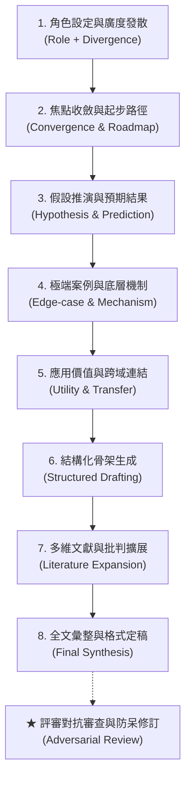

# 🔬 AI 協同科研與小論文發想：提示詞工程 (Prompt Engineering) 實戰指南

> **最後更新時間**: 2026-09-16 11:58:58 (UTC+8)  
> **使用模型**: Claude Sonnet 4.6  
> **執行 Agent**: Antigravity  
> **筆記分類**: 生成式 AI / 科研小論文發想 / 提示詞工程 / 流體力學與仿生工程  

---

## 📖 導言與概覽

本筆記將實際與生成式 AI 探討科學小論文（以「**小葉欖仁果實落體姿態機制解析與 3D 仿生自穩空投膠囊之開發**」為案例）的完整深度對話進行**去識別化**，並萃取其背後的提示詞工程架構。

除了呈現「**八階段漸進式提示詞鍊 (8-Stage Progressive Prompting Chain)**」（本次實際對話記錄）與對應產出的學術研究計畫書外，本篇特別收錄**提示詞使用優缺點深度剖析與進階升級指南**（含改良後的九步通用模版），為中學生、大學生與科研人員提供從靈感發想、邊界推演、對抗性審查到文獻防偽的全流程 AI 協作手冊。

---

## 🧠 一、核心概念與物理力學剖析 (Core Concepts & Physics Mechanics)

在學術科研與小論文發想場景中，單次指令往往只能得到泛泛之論。要產出具備深度與可驗證性的研究計畫，必須結合提示詞工程策略與嚴謹的底層科學理論：



### 1. 提示詞工程四大核心策略
* **角色化引導 (Role-Based Inception)**：將 AI 錨定為「高中科學展覽與流體力學指導老師」，啟動具備實驗方法論與學術規範的語料。
* **循序漸進式鏈 (Progressive Prompting)**：將研究拆解為「發散 ➔ 收斂 ➔ 假設 ➔ 邊界探索 ➔ 應用轉化 ➔ 結構骨架 ➔ 文獻深化 ➔ 成果整合」八個推進階段。
* **反向推演與極端假設 (Edge-case Probing)**：藉由極端物理條件（如質心極端前移）刺激 AI 推導被動自正力矩與演化適應意義。
* **模組化規格與格式約束 (Modular Output Formatting)**：嚴格遵循小論文與科展標準結構（題目、摘要、動機、假說、五維文獻、四階段實驗、五大應用、工程藍圖）。

### 2. 底層科學理論與數學模型

#### (1) 特徵雷諾數與亞臨界過渡流場 (Reynolds Number)
小葉欖仁果實長度 $L \approx 1.5 \sim 2.5\text{ cm}$，落體速度 $v \approx 5 \sim 15\text{ m/s}$，在標準大氣下：
$$Re = \frac{\rho v L}{\mu} \approx 5 \times 10^3 \sim 3 \times 10^4$$
此區間屬於「亞臨界過渡流場（Subcritical Flow Regime）」，落體後方伴隨週期性渦流脫落（卡門渦街），容易引發三維不規則擺盪與翻滾。

#### (2) 質心 (CoM) 與壓力中心 (CoP) 之被動自正恢復力矩 (Restoring Moment)
落體姿態取決於質量中心（Center of Mass, CoM）與氣動壓力中心（Center of Pressure, CoP）的相對軸向位置：

```text
▲ 氣流方向 (相對風速 V)
        │
     ┌──┴──┐
     │ CoP │  <--- 氣動力作用點 (Center of Pressure)
     └──┬──┘       產生流體阻力 F_d 與側向升力 F_l
        │  ▲
        │  │ 力臂 L_arm
        │  ▼
     ┌──┴──┐
     │ CoM │  <--- 重力作用點 (Center of Mass)
     └──┬──┘       整體質量集中處
        │
        ▼ 下落方向 (重力 W)
```

當落體受擾動產生傾斜攻角 $\alpha$ 時，作用於 CoP 的空氣動力合力 $\vec{F}_a$ 與 CoM 之間產生恢復力矩 $M$：
$$M = - |\vec{r}_{CoM-CoP}| \cdot |\vec{F}_a| \cdot \sin\alpha$$
* **若 CoM 落後於 CoP（重端在後）**：力矩為正回授，攻角 $\alpha$ 迅速發散，落體陷入劇烈翻滾（Tumbling）。
* **若 CoM 顯著超前於 CoP（重端在前）**：恢復力矩為負回授（$M < 0$），產生「**被動自正（Passive Self-Righting）**」俯衝（羽毛球效應），攻角自動收斂至 $\alpha = 0^\circ$。

#### (3) 表面微稜的渦流產生器 (Vortex Generator) 整流效應
果實周緣的縱向鈍稜能**強制固定邊界層分離線（Separation Line）**，消除光滑弧面上的隨機非對稱流動分離，大幅平抑橫向升力波動，將三維偏航晃動抑制在單一縱向對稱面內。

#### (4) Gibson-Ashby 胞狀固體力學與動能吸收模型
果實中果皮之多孔纖維在高速撞擊時，遵循胞狀材料三階段應力－應變關係：
$$\sigma(\epsilon) = \begin{cases} E^* \epsilon & (\text{線彈性階段}) \\ \sigma_{pl}^* & (\text{塑性屈曲平原階段}) \\ \sigma_{pl}^* \left[ 1 + \left(\frac{\epsilon}{\epsilon_D}\right)^m \right] & (\text{壓實硬化階段}) \end{cases}$$
纖維結構在「塑性屈曲平原階段」吸收大量落體動能 $E_k = \frac{1}{2} m v_t^2$，作為天然「衝擊潰縮區（Crumple Zone）」以保護後端胚核。

---

## 🛠️ 二、去識別化實戰筆記：科研發想八階提示詞拆解與完整討論整合

> 以下記錄將對話者去識別化為 `[研究者]`，並整合各階段產出之完整學術小論文內容。

---

### 🔹 階段一：角色賦予與廣度發散 (Role Setting & Divergence)

* **原始 Prompt (去識別化)**：
  ```text
  [研究者]：
  你是一個科學老師 我想要研究小葉欖仁種子從樹上落下的相關研究 提供6可行的研究方向跟題目讓我參考
  ```

* **提示詞核心策略**：
  * **角色錨定**：設定具備中學科展經驗的科學老師。
  * **主題聚焦**：由生活觀察出發（小葉欖仁落果）。
  * **數量約束**：給予 6 組題目以供橫向比較。

* **AI 回饋亮點方向**：
  1. 落體運動學與終端速度量測
  2. 表面幾何微稜對空氣阻力之影響
  3. 種子含水量與自轉角速度之相關性
  4. 階梯狀樹冠穿透率之統計模擬
  5. 纖維果皮之撞擊能量吸收與胚胎防護
  6. **仿生工程：小葉欖仁落體姿態機制解析與 3D 仿生自穩空投膠囊驗證**

---

### 🔹 階段二：主題聚焦與起步引導 (Topic Convergence & Roadmap)

* **原始 Prompt (去識別化)**：
  ```text
  [研究者]：
  我對方向六：仿生工程與 3D 列印模型驗證有興趣 可以從哪些方向開始
  ```

* **提示詞核心策略**：
  * **鎖定核心**：收斂至「仿生工程 + 3D 列印」。
  * **建立 Roadmap**：建立「形態量測 ➔ CAD 參數化建模 ➔ 3D 列印可變配重模型 ➔ Tracker 運動追蹤 ➔ 穿透與著陸驗證」實作清單。

---

### 🔹 階段三：假設推演與預期結果 (Hypothesis & Outcome Prediction)

* **原始 Prompt (去識別化)**：
  ```text
  [研究者]：
  預期可能會得到什麼結果
  ```

* **提示詞核心策略**：
  * **預期模型建立**：在耗費資源列印前，先推導不同質心比率 $R_{CoM} = \frac{d_{front}}{L}$ 的運動學行為。
  * **三種典型模式預測**：
    * $R_{CoM} = 0.25$（極端前移）：被動自正俯衝，終端速度最高，迎風阻力最小。
    * $R_{CoM} = 0.50$（幾何居中）：落葉式不穩定擺盪（Flutter）。
    * $R_{CoM} = 0.75$（極端後移）：連續端對端翻滾（Tumble），阻力最大。

---

### 🔹 階段四：極端案例與理論啟發 (Edge-case Probing & Physics Insights)

* **原始 Prompt (去識別化)**：
  ```text
  [研究者]：
  假設實驗結果 重心極端前移（像飛鏢/羽毛球）對於小葉欖仁的研究有什麼啟發?
  ```

* **提示詞核心策略**：
  * **反事實推演**：假設 3D 模型實驗確認質心極端前移（飛鏢效應），反推此結果對小葉欖仁真實果實演化策略有何物理學詮釋？
  * **理論突破**：突破傳統「種子必靠旋轉或翻滾減速」的直覺思維，揭示小葉欖仁因具備「階梯式輪生樹冠」，必須依靠「垂直俯衝穿透」才能破解母樹枝葉截留（Canopy Interception）的物理屏障，並藉由前端纖維果皮的彈塑性潰縮吸收著陸衝擊力。

---

### 🔹 階段五：實用價值與跨領域應用拓展 (Utility & Cross-Domain Application)

* **原始 Prompt (去識別化)**：
  ```text
  [研究者]：
  是否有實用的價值 可以應用在哪些領域
  ```

* **提示詞核心策略**：
  * **跨領域轉化**：將被動自正、微稜整流、穿透定植與分區吸震四大力學特徵，拓展為具體工程方案：

```text
┌── [應用 1] 智慧林業：穿透型無人機造林膠囊 (穿透雜灌木、防滾落、纖維保溫保水)
├── [應用 2] 災害防救：極端環境穿透式環境物聯網探針 (無傘直達地面、天線永遠朝天)
├── [應用 3] 國防安防：無人值守地面微型監聽偵蒐彈 (無傘低簽象、抗側風偏航、隱蔽定錨)
├── [應用 4] 智慧農業：密植作物深層生物防治顆粒 (穿透玉米/果樹葉幕、根部精準釋放)
└── [應用 5] 航太探測：微引力/稀薄大氣行星土壤穿透器 (火星/小行星極限無動力撞擊定姿)
```

---

### 🔹 階段六：結構化骨架生成 (Structured Drafting)

* **原始 Prompt (去識別化)**：
  ```text
  [研究者]：
  根據以上的討論 撰寫完整的文件,包含 題目,摘要,動機,文獻探討,研究方法,研究結果（可省略）,結果與討論(可省略）
  ```

* **提示詞核心策略**：
  * **規格化輸出**：建立標準學術小論文格式（含中英文題目、中英文摘要、研究動機、研究目的、四階段實驗設計）。
  * **防偽標記**：預留數據填寫框，避免 AI 捏造數據。

---

### 🔹 階段七：深度迭代與多維度擴展 (Literature & Discussion Expansion)

* **原始 Prompt (去識別化)**：
  ```text
  [研究者]：
  增加文獻探討的內容與討論的廣度以及不同面向
  ```

* **提示詞核心策略**：
  * **深度擴展**：將文獻探討大幅擴展為「五大跨領域核心面向」：
    1. **植物生態適應**：種子傳播生態物理學、重力傳播 (Barochory) 與簡森－康奈爾假說 (Janzen-Connell Hypothesis)。
    2. **非對稱鈍體流體力學**：亞臨界過渡雷諾數（$Re \approx 5\times10^3 \sim 3\times10^4$）、渦流脫落與 CoM-CoP 恢復力矩力學模型。
    3. **表面微拓撲氣動整流**：微稜渦流產生器 (Vortex Generator) 效應與分離點鎖定機制。
    4. **生物材料衝擊力學**：果皮階層結構、Gibson-Ashby 胞狀固體塑性屈曲吸能模型。
    5. **仿生空投工程現況**：現有無人機傘降風偏缺陷、單翼翅果 MAV 與穿透型探針比較。

---

### 🔹 階段八：全文統整與規格定稿 (Consolidation & Final Synthesis)

* **原始 Prompt (去識別化)**：
  ```text
  [研究者]：
  統整以上的所有討論 整合成完整的研究文件
  ```

* **整合成果精華（完整小論文架構與工程藍圖）**：

#### 📐 仿生空投膠囊工程藍圖規範 (Engineering Blueprint)
```text
【尾端：輕質通訊與引導艙】
                           ╱ ╲   ← 縱向微稜整流葉片 (抑制側向偏航與滾轉)
                          │   │  ← 內建微型全向天線、LoRa 無線傳輸晶片
                          │   │
                     【中艙：抗震酬載區】
                          │ █ │  ← 鋰錳鈕扣電池、環境感測主控電路板
                          │   │  ← 橡膠阻尼懸吊內襯 (Shock-absorbing Mount)
                     【前端：重心配重與緩衝貫穿頭】
                         ╱     ╲  ← 仿外果皮蜂巢潰縮區 (Crumple Zone)
                        │  ▓▓▓  │  ← 偏心高密度配重 (確保 CoM 前移)
                        ╰───────╯  ← 硬質金屬接地探針 / 破土尖錐
```

---

## 🎯 三、提示詞工程使用優缺點深入剖析與建議 (Prompt Evaluation & Strategy)

針對本研究對話全歷程進行客觀的提示詞工程評估，歸納其卓越亮點、潛在盲點與升級實戰方案：

### 🌟 1. 優點分析 (Key Strengths)
* **極佳的漸進式對話鏈 (Progressive Prompting Mastery)**：
  * 未一開始粗暴索取整篇論文，而是由淺入深，讓每一輪產出成為下一輪的高密度上下文，模型幾乎無幻覺漂移。
* **高水準的思想實驗與邊界探索 (Edge-Case Probing)**：
  * 提出「重心極端前移（羽毛球/飛鏢）」的極端反事實假設，是激發 AI 產出深層物理機理（恢復力矩、樹冠穿透、纖維潰縮）的最關鍵推手。
* **精準的防偽標註 (Anti-Hallucination Guardrails)**：
  * 初稿主動註明「研究結果與討論可省略」，有效防止 AI 捏造實驗數據，確保學術誠信。
* **模組化局部精修 (Iterative Refinement)**：
  * 單獨針對文獻探討提出擴充要求，維持了對話的敏捷性與高聚焦度。

### ⚠️ 2. 潛在缺點與盲點 (Limitations & Risks)

| 現有提示詞盲點 | 具體表現 | 潛在風險 / 影響 |
| :--- | :--- | :--- |
| **1. 角色設定缺少資源限制** | 僅指定`你是一個科學老師`，未交代學生的年級與學校設備。 | AI 給出的建議可能超出學生的實驗設備能力（例如需要昂貴風洞或專業 CFD 模擬軟體）。 |
| **2. 指令字數過簡，缺少量化產出指標** | `預期可能會得到什麼結果`、`是否有實用的價值` 僅一句話。 | AI 回答深度易受模型狀態隨機波動，未強制要求提供公式、數據量化級距或比較矩陣。 |
| **3. 未主動防範「幽靈文獻」** | 擴充文獻時未要求標註文獻真實性、DOI 或檢索關鍵字。 | 大型語言模型在擴展文獻時極易「捏造看似合理的假論文篇名與虛擬作者」。 |
| **4. 缺少「評審反對視角 (Devil's Advocate)」** | 全程為順向建構，缺少挑毛病與找漏洞的對抗環節。 | 容易忽略「3D 模型放大 2:1 是否破壞了真實雷諾數相似準則」等實驗設計盲點。 |

### 🚀 3. 進階實戰升級模版與建議 (Actionable Upgrades)

#### 💡 升級建議 1：導入「角色＋限制條件＋現有資源」三位一體起始 Prompt
```text
你是一位具備 10 年高中科展與小論文評審經驗的物理與生物跨領域名師。
我目前是高中生，學校具備 3D 列印機（FDM）、手機 240fps 高速攝影與 Tracker 運動分析軟體，無大型專業風洞。
請在「現有設備切實可行」的前提下，為我規劃 5 個兼具科學原創性、可量測性與低成本的研究題目。
```

#### 💡 升級建議 2：在成文後加入「挑剔評審對抗性審查 (Devil's Advocate)」指令
```text
請現在切換角色為一位「最嚴格的科展/學術小論文審查委員」，針對這份研究計畫書進行全面質詢。
請列出 3 個最容易被攻擊的實驗設計漏洞（例如：控制變因是否真正單一？模型等比例放大 2:1 是否破壞了雷諾數相似性？配重公差如何消除？），並指導我如何在論文中撰寫防禦論述。
```

#### 💡 升級建議 3：索取「真實文獻檢索關鍵字與策略」取代讓 AI 生造文獻
```text
請針對本研究涉及的核心理論（Janzen-Connell 假說、卡門渦街、Gibson-Ashby 吸能模型），提供：
1. 我可以在 Google Scholar 與 華藝線上圖書館 直接搜尋的 5 組中英文精確關鍵字。
2. 3 篇真實存在的經典論文篇名、作者與發表年份，並簡述其核心論點如何支持本研究。
```

#### 💡 升級建議 4：要求輸出「標準化實驗數據紀錄表與圖表規劃」
```text
請為本研究的「研究方法」章節，設計一份 Markdown 格式的【操縱變因配置規格表】與【落體實驗原始數據記錄空白範本】（包含下落時序、終端速度、姿態角、入土深度），並用 ASCII 文字框繪製出高速攝影實驗裝置的架設示意圖。
```

---

## 📋 四、通用科研小論文發想 Prompt 模版套件

研究者可將上述流程抽象化，套用於任何自然科學或工程科技專案：

| 步驟 | 階段名稱 | 萬用 Prompt 模版 |
| :--- | :--- | :--- |
| **01** | **設定角色與發散靈感** | `你是一位[學科名稱]專家與高中科展指導老師。我對[研究對象/生活現象]很感興趣，請在學校現有資源[列出設備]限制下，提供 5 個兼具科學價值與實作可行性的研究題目，並說明各題目的核心變因。` |
| **02** | **鎖定題目與制定路線** | `我選擇【[題目名稱]】。請為我規劃實作路線圖，包含實驗所需材料、控制變因、操縱變因、應變變因及第一階段的前置驗證實驗。` |
| **03** | **建立理論與推導假設** | `基於[相關理論/物理定律]，請推導此實驗在不同操縱變因水準下，預期會產生的 3 種可能趨勢，並解釋其背後的科學原理與數學公式。` |
| **04** | **邊界條件與極端推演** | `如果我們將[某關鍵變因]推向極端（例如極大化或極小化），系統會發生什麼質變？這對我們理解整體機理有何理論啟發？` |
| **05** | **應用場景與產業連結** | `此研究成果除了驗證基礎科學原理外，在工程、仿生、環保或民生領域有哪些具體的應用潛力？請列舉 3-5 項具體場景。` |
| **06** | **生成研究小論文骨架** | `請將上述討論整合成標準小論文架構（含題目、中英文摘要、研究動機、文獻探討、研究設備與方法、預期成果與討論、參考文獻規範）。` |
| **07** | **專題深化與文獻檢索** | `請針對「文獻探討」章節，提供 5 組可在 Google Scholar 檢索真實文獻的精確關鍵字，並從【基礎理論】、【經典前人研究】與【現代工程應用】三維度深化擴寫。` |
| **08** | **評審對抗與防禦審查** | `請扮演最挑剔的評審，列出本計畫書 3 大潛在實驗漏洞與變因干擾，並提供相應的實驗修正與論文防禦論述。` |
| **09** | **全面校稿與結構定稿** | `請統整前述所有擴充與防禦內容，消除前後矛盾，生成一篇邏輯嚴密、術語精確的正式小論文研究計畫書。` |

---

## 🔬 五、延伸思考與未來工程突破 (Extensions & Next Steps)

### 1. 學術誠信與 AI 幻覺防範 (AI Ethics & Fact-Checking)
* **文獻核實機制**：AI 生成之引用文獻（如 Augspurger 1986, Gibson-Ashby 1997, Janzen 1970）須逐一檢驗其真實作者、年份、期刊名稱與 DOI，防止幽靈文獻。
* **數據真偽界線**：AI 僅能輔助建立假說與預期理論曲線，所有運動學軌跡與穿透數據必須透過真實 3D 列印模型落體實驗與 Tracker 高速攝影取得。

### 2. 邁向工程落地的三大技術挑戰
1. **全生物降解材料（Biodegradability）**：避免空投載具造成山林塑膠微粒污染，未來可導入**真菌菌絲體（Mycelium）**或農業廢棄纖維（蔗渣/竹纖維）熱壓成型外殼。
2. **高 G 力抗震灌封技術（High-G Tolerance）**：垂直俯衝撞擊地表瞬間衝擊加速度高達數百 G，需結合非牛頓流體與高分子矽膠灌封（Potting）保護晶片。
3. **風洞動態側風驗證（Wind Tunnel Testing）**：進入風洞量化不同側向風速下的自正恢復時間常數（Recovery Time Constant $\tau$）。

---

## 📝 提示詞歷史與變更記錄 (Prompt Archive)

### 🔹 [2026-09-16 11:58:58] [Claude Sonnet 4.6 / Antigravity] 變更紀錄
* **模型/Agent**: Claude Sonnet 4.6 / Antigravity
* **Prompt 原文**:
  ```text
  check and revise @[AI/prompt_academic_research_flow.md]
  內容敘述的不分呢
  ```
* **變更摘要**: 全面校對並修訂 Markdown 排版與內容一致性問題：(1) 更新元資料時間戳與模型名稱；(2) 移除章節一（`##`）內部 `### 1.` 與 `### 2.` 之間的多餘 `---` 分隔線；(3) 統一章節三優點分析中次級條列符號（`-` 改為 `*`）；(4) 移除章節三各子章節之間的多餘 `---` 分隔線；(5) 追加本次修訂之 Prompt Archive 紀錄。

### 🔹 [2026-09-16 11:37:26] [Gemini 3.7 Flash / Antigravity] 變更紀錄
* **模型/Agent**: Gemini 3.7 Flash / Antigravity
* **Prompt 原文**:
  ```text
  加到筆記內容
  ```
* **變更摘要**: 將「提示詞使用優缺點深度剖析（漸進式對話、邊界探索、防偽標註 vs. 資源限制缺失、幽靈文獻風險、缺乏評審反對視角）」及「進階升級實戰指令模版（角色資源鎖定、挑剔評審對抗審查、真實文獻檢索策略、實驗數據記錄表生成）」完整擴充至筆記第三章節，並更新通用模版庫至九步法。

### 🔹 [2026-09-16 11:32:58] [Gemini 3.7 Flash / Antigravity] 變更紀錄
* **模型/Agent**: Gemini 3.7 Flash / Antigravity
* **Prompt 原文**:
  ```text
  C:\Users\User\Desktop\dsfsfdsd.txt 配合這一份討論的完整內容 加入筆記的討論
  ```
* **變更摘要**: 深度整合 `dsfsfdsd.txt` 完整科學研究報告內容。增補特徵雷諾數亞臨界流場推導、質心 (CoM) 與壓力中心 (CoP) 恢復力矩數學模型、Gibson-Ashby 胞狀吸能材料力學公式、五維深度文獻探討、五大跨領域工程應用場景、仿生空投膠囊工程藍圖規範與未來材料挑戰。

### 🔹 [2026-09-16 11:30:36] [Gemini 3.7 Flash / Antigravity] 變更紀錄
* **模型/Agent**: Gemini 3.7 Flash / Antigravity
* **Prompt 原文**:
  ```text
  C:\Users\User\Desktop\ddasadasd.txt 這個檔案是我利用prompt跟ai探討小論文題目的紀錄 幫我把姓名去識別化 整理成使用prompt的筆記
  ```
* **變更摘要**: 讀取桌面對話紀錄並去識別化，提煉科研小論文八階段漸進式提示詞鏈，產出第一版 Markdown 與具備列印功能的 HTML 筆記。
