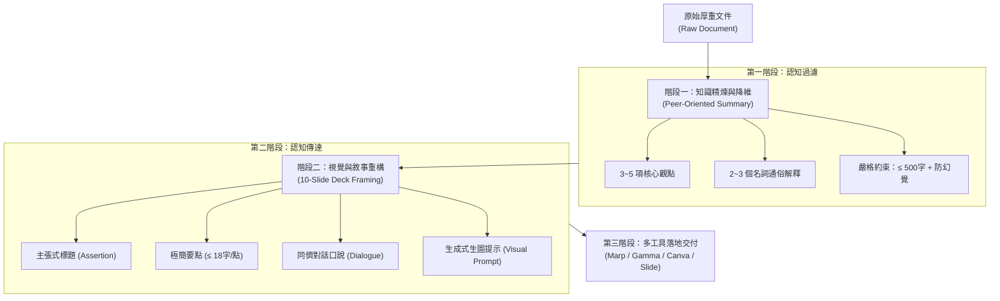
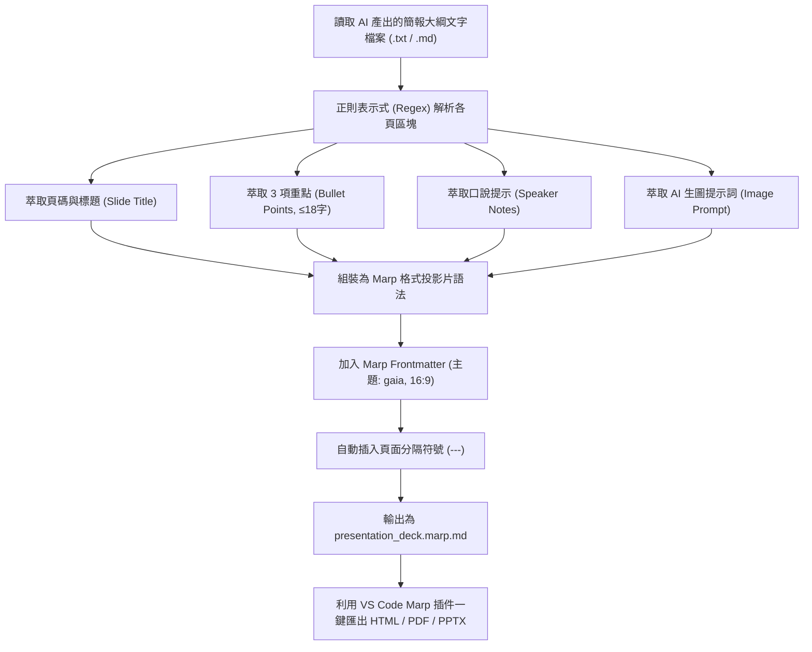
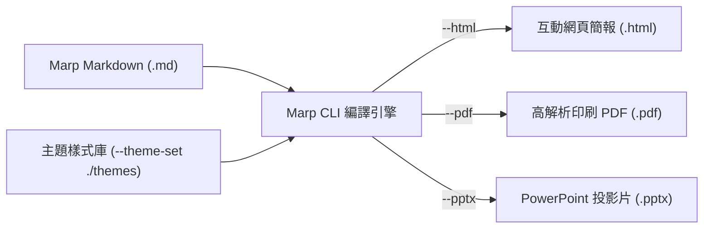
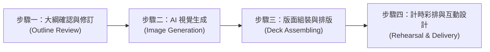

# 📑 從文件摘要到 10 頁簡報大綱：AI 提示詞工程轉譯與全流程製作指南

> **最後更新時間**: 2026-09-23 12:00:54 (UTC+8)  
> **使用模型**: Gemini 3.8 Flash  
> **執行 Agent**: Antigravity  
> **筆記分類**: 生成式 AI / 提示詞工程 / 簡報轉換與視覺設計 / AI 自動化工作流 / Marp 生態系  

---

## 📖 導言與概覽

在學術分享、課堂報告與專案推進中，**「將長篇厚重的文件/文獻轉化為易懂、具備說服力的簡報」**是每位研究者與學生的高頻關鍵任務。

使用者所設計的提示詞（Prompt），採用了精確的「**二階段漏斗式架構**」：
1. **第一階段（文件摘要）**：以「同儕視角（高中同學）」為錨點，將龐雜知識降維為核心 3~5 點與名詞解釋，並嚴控在 500 字內，同時強制「零外部數據幻覺」與「台灣在地用語」。
2. **第二階段（簡報轉化）**：將摘要轉譯為「10 頁、15 分鐘的課堂分享簡報」，每頁設定「主張式標題」、「每點 ≤ 18 字限制」、「口語化對話提示句」以及「AI 生圖提示詞」，最後首尾呼應目標與行動。

本筆記將深入拆解此提示詞的底層認知科學理論，針對原始提示詞進行**全方位診斷、評析與升級擴充**，並提供一套**從提示詞大綱到最終 PPT 實體產出的端到端（End-to-End）完整實作工作流**。

---

## 🧠 一、核心概念剖析 (Core Concepts)

要寫出高質量的「文摘轉簡報」提示詞，並非單純向 AI 下達「幫我做 10 頁簡報」，而是必須建立在認知心理學、資訊傳達理論與大語言模型（LLM）的行為機制之上：



### 1. 認知負荷理論 (Cognitive Load Theory) 與「18 字法則」
* **外在認知負荷（Extraneous Cognitive Load）**：簡報聽眾的大腦無法同時處理「大量眼看文字」與「耳聽口述聲音」，這稱為「注意力分散效應（Split-Attention Effect）」。
* **提示詞設定「每點 ≤ 18 字、每頁 3 點」的科學依據**：米勒定律（Miller's Law）指出人腦短期工作記憶約在 $7 \pm 2$ 個組塊（Chunks）。限制每點 18 字以內，能強迫 AI 將句子壓縮為「主詞 + 動詞 + 受詞/關鍵論點」，使投影片回歸「視覺錨點（Visual Anchor）」而非「提詞機（Teleprompter）」。

### 2. 主張－證據架構 (Assertion-Evidence Framework)
* **傳統標題的致命傷**：多數人習慣用主題名詞當標題（如「研究背景」、「演算法介紹」、「實驗分析」），聽眾看了一眼無法得知講者的觀點。
* **主張式標題（Assertion-Evidence）**：提示詞中明確要求「*用問題或主張，不要用『內容』『介紹』*」，這是學術與商業頂尖簡報的標準方法論。
  * ❌ *不良標題*：「二極體與繼電器之運作」
  * ✅ *主張式標題*：「繼電器如何藉由微小訊號隔絕高壓電危險？」

### 3. 雙碼理論 (Dual-Coding Theory) 與生圖提示詞轉換
* 認知心理學家 Paivio 提出的雙碼理論指出：當語言代碼（Verbal Code）與視覺代碼（Non-verbal Code）同時作用時，記憶檢索效率提升超過 200%。
* 提示詞要求 AI 為每頁生成「**對應內容的影像生成提示詞（Image Generation Prompt）**」，打破了以往簡報者在圖庫漫無目的搜尋庫存圖（Stock Photos）的痛點，實現客製化概念視覺化。

### 4. 漸進式兩階段生成 (Two-Stage Progressive Generation)
* 一次性讓 LLM 直接閱讀長文並輸出 10 頁簡報，常因上下文注意力分散（Context Distraction）而遺漏關鍵細節或產生嚴重幻覺。
* 「先提取 500 字核心摘要 ➔ 再拆解為 10 頁投影片」形成了兩段式蒸餾（Distillation Pipeline），確保簡報內容的高度保真（Fidelity）。

---

## 🔍 二、原始提示詞診斷與評析 (Prompt Diagnosis)

以下針對使用者提供的原始提示詞進行結構解剖與全方位診斷：

### 1. 原始提示詞優點剖析 (Strengths)

| 提示詞維度 | 原始設定亮點 | 帶來的實質效益 |
| :--- | :--- | :--- |
| **受眾精確錨定** | `目標讀者是同學`、`沒看過原文的高中同學`、`課堂分享不是競賽評審` | 避免 AI 使用冷僻晦澀的官僚論文術語，自動調用親和、生活化與同理心的修辭語境。 |
| **剛性格式約束** | `字數上限 500 字`、`每頁 3 個重點`、`每點不超過 18 字` | 給予大語言模型極清晰的邊界（Boundary），有效防止 LLM 吐出落落長、排版困難的字串。 |
| **認知品質把關** | `頁標題用問題或主張，不要用介紹` | 強迫投影片轉向觀點輸出，大幅提高簡報吸引力。 |
| **首尾結構設計** | `第 1 頁說明目標，最後一頁給可執行下一步` | 符合頂尖演講結構「Start with Why, End with Action」，避免虎頭蛇尾。 |
| **防偽與合規性** | `保留原文觀點，不新增未提及事實`、`使用繁體中文，台灣慣用語法` | 抑制大模型胡編數據的幻覺傾向，避免出現中國大陸用語（如視頻、芯片、信息等）。 |

---

### 2. 原始提示詞的潛在盲點與升級空間 (Weaknesses & Upgrade Points)

儘管原提示詞設計優秀，但在實際工程與簡報實戰中，仍有四個關鍵落差可再強化：

1. **時間預算分配未具體化 (Lack of Time Allocation per Slide)**：
   * 原文提到「10 頁、15 分鐘」，但平均每頁分得 $1.5$ 分鐘是不合理的（引言只需 1 分鐘，核心技術論證需 2~3 分鐘，問答需要時間）。若未指明每頁演講時間，講者容易配速失衡。
2. **生圖提示詞缺乏「風格一致性（Style Consistency）」規範**：
   * 若僅寫「設計可以對應內容的影像生成提示詞」，AI 往往第一頁生成寫實照片（Photorealistic）、第二頁生成 2D 向量插畫、第三頁生成賽博龐克 3D 渲染，造成整份簡報視覺割裂。
3. **缺少版面佈局（Layout Suggestions）指引**：
   * 簡報不是只有「左圖右文」。好的大綱應提供版面結構建議（如：左右對比、三欄卡片、時間軸、大數字強調），方便講者套入版型。
4. **口說重點缺乏「演講情緒/語調引導（Tone & Hook）」**：
   * 僅要求「1 句像對同學說話」，AI 可能給出乾癟的句子。若能加入「開場鉤子（Hook）」或「設問互動」，課堂氣氛會更熱絡。

---

## 🚀 三、升級版二階段提示詞模版 (Upgraded Prompt Template)

基於上述診斷，我們將原始提示詞升級為結構更嚴謹、視覺一致性更高、附帶時間分配與排版指示的**專業級提示詞範本**：

### 🔹 階段一：同儕導向高保真文摘提示詞 (Peer-Oriented Summary Prompt)

```text
請閱讀我所提供的檔案內容，為【沒看過原文的高中同學】撰寫一份易懂且精確的課堂報告摘要。

【輸出架構規範】
1. 💡 核心亮點（3-5 點）：每點請以「粗體主張標題 + 1 句白話生活化解釋」呈現。
2. 🔑 關鍵名詞通俗解碼（2-3 個）：以高中生生活經驗做類比，說明該名詞的物理意義或核心原理。
3. 🎯 一句話 takeaways：用一句震撼或富啟發性的話總結全文價值。

【嚴格邊界限制】
- 總字數上限：嚴格控制在 450 ~ 500 字以內。
- 零幻覺原則：嚴格保留原文事實與論點，嚴禁加入原文未提及之數據、年代或推論。
- 語系與修辭：繁體中文（台灣習慣用詞，如：程式、軟體、資料、陣列，禁出現大陸語彙）。
- 語氣：親切、清晰、有熱忱的同儕分享語調。
```

---

### 🔹 階段二：10 頁高張力簡報大綱與視覺系統提示詞 (10-Slide Deck & Visual Prompt)

```text
基於上述摘要與原文，請為我設計一份標準 10 頁、演講時長 15 分鐘的高中課堂分享簡報大綱。

【基本設定】
- 聽眾：未接觸過此題目的高中同班同學（需降低專業門檻，重視共鳴感）
- 場合：課堂專題報告（氣氛輕鬆、互動性強，非死板評審競賽）
- 視覺風格基調：【極簡扁平科技插畫風格 Minimalist Tech Vector Illustration, 雙色調藍青配色, 乾淨白色背景】，確保全套簡報生圖風格高度一致。

【每頁必須依序包含以下 6 項資訊】：
1. 頁碼與時間預算：標註「第 X 頁 / 建議演講時間：X 分鐘」。
2. 頁標題：嚴禁「介紹」、「背景」等名詞標籤；必須採用「反直覺提問」或「具體主張結論」。
3. 投影片重點（3 點）：每點嚴格不超過 18 字，採動詞開頭的簡明短句。
4. 建議版面配置（Layout Hint）：說明該頁適合之排版（例如：左右兩欄對照、大數據強調卡片、流程時間軸、滿版意境圖）。
5. 口說台詞導引（Speaker's Script）：2 句以內的高中生口語對話，包含引起共鳴的日常比喻或設問。
6. 影像生成提示詞（AI Image Prompt）：
   - 提供可直接複製至 Midjourney / DALL-E 3 / Bing 的英文 Prompt。
   - 結構規範：[Subject action], [Minimalist flat vector illustration style, blue and teal color palette], [clean white isolated background, 16:9 ratio, no text inside image].

【總體章節編排限制】
- 第 1 頁：明確破冰並點出「本演講能帶給同學什麼啟發」。
- 第 2~3 頁：痛點與現實問題引發共鳴。
- 第 4~7 頁：核心原理、技術拆解與實驗發現（深入淺出）。
- 第 8~9 頁：實際應用場景與未來想像。
- 第 10 頁：清晰可執行的「下一步行動指南（Call To Action）」與 Q&A 互動提問。
- 嚴禁捏造數據，全文繁體中文（生圖提示詞採英文以確保渲染品質）。
```

---

## 💻 四、自動化實作：Markdown 轉 Marp 簡報格式解析器

為了讓 AI 生成的簡報大綱能一秒轉換為可播放、可編輯的投影片，我們常使用開源簡報框架 **Marp (Markdown Presentation Ecosystem)**。

以下提供完整的 Python 轉換腳本邏輯與程式碼，能自動將 AI 產出的大綱文字，正規化為具備頁面分隔線、版面標籤與演講筆記的標準 Marp Markdown 檔案：

### 1. 程式處理邏輯流程圖 (Mermaid)



### 2. Python 自動化轉換腳本 (`outline_to_marp.py`)

```python
# -*- coding: utf-8 -*-
"""
簡報大綱自動轉 Marp Markdown 工具
功能：將結構化的 AI 簡報大綱文字，自動解析並格式化為相容於 Marp 的簡報檔案。
支援功能：自動頁面分割 (---)、投影片要點排版、演講者備忘稿 (<!-- comment -->) 與生圖提示備忘。
"""

import os
import re

def convert_outline_to_marp(input_file_path: str, output_file_path: str):
    """
    讀取原始大綱並轉譯為 Marp 語法簡報
    """
    if not os.path.exists(input_file_path):
        print(f"[錯誤] 找不到輸入檔案: {input_file_path}")
        return

    with open(input_file_path, 'r', encoding='utf-8') as f:
        raw_content = f.read()

    # 定義 Marp 標頭檔 (Frontmatter)
    marp_header = """---
marp: true
theme: gaia
_class: lead
paginate: true
backgroundColor: #f8fafc
color: #1e293b
style: |
  section {
    font-family: 'Segoe UI', 'Noto Sans TC', sans-serif;
    font-size: 28px;
    padding: 40px 60px;
  }
  h1 {
    color: #1e40af;
    font-size: 42px;
    margin-bottom: 20px;
  }
  h2 {
    color: #2563eb;
    font-size: 34px;
  }
  footer {
    font-size: 14px;
    color: #94a3b8;
  }
---

"""

    slides = []
    # 根據「第 X 頁」切分章節
    slide_chunks = re.split(r'(?=第\s*\d+\s*頁)', raw_content)

    for chunk in slide_chunks:
        chunk = chunk.strip()
        if not chunk:
            continue

        lines = chunk.split('\n')
        slide_title = ""
        bullet_points = []
        speaker_note = ""
        image_prompt = ""

        for line in lines:
            line_str = line.strip()
            # 辨識標題
            if "頁標題" in line_str or line_str.startswith("###") or "第" in line_str and "頁" in line_str:
                clean_title = re.sub(r'^(第\s*\d+\s*頁|頁標題[:：]|###|\d+\.|\s)+', '', line_str).strip()
                if clean_title:
                    slide_title = clean_title
            # 辨識重點要點
            elif re.match(r'^[-*•\d\)]', line_str) and "口說" not in line_str and "圖像" not in line_str:
                clean_point = re.sub(r'^[-*•\d\.\)\s]+', '', line_str).strip()
                if clean_point:
                    bullet_points.append(clean_point)
            # 辨識口說台詞
            elif "口說" in line_str or "台詞" in line_str:
                speaker_note = re.sub(r'^(建議口說重點[:：]|口說台詞[:：]|\s)+', '', line_str).strip()
            # 辨識生圖提示詞
            elif "圖像" in line_str or "生圖" in line_str or "Prompt" in line_str:
                image_prompt = re.sub(r'^(適合搭配的圖像類型[:：]|影像生成提示詞[:：]|\s)+', '', line_str).strip()

        # 組裝單頁 Marp 投影片 Markdown
        slide_md = []
        if slide_title:
            slide_md.append(f"## {slide_title}\n")
        
        if bullet_points:
            for pt in bullet_points:
                slide_md.append(f"- {pt}")
            slide_md.append("")

        # 將生圖提示與口說重點放入演講者備忘稿 (Presenter Notes)
        notes_block = []
        if speaker_note:
            notes_block.append(f"🗣️ 口說重點：{speaker_note}")
        if image_prompt:
            notes_block.append(f"🎨 建議圖像/生圖Prompt：{image_prompt}")

        if notes_block:
            slide_md.append("<!--")
            slide_md.extend(notes_block)
            slide_md.append("-->\n")

        slides.append("\n".join(slide_md))

    # 合併所有投影片，中間以 '---' 隔開
    final_output = marp_header + "\n---\n\n".join(slides)

    with open(output_file_path, 'w', encoding='utf-8') as f:
        f.write(final_output)

    print(f"[成功] 已成功將簡報大綱轉換為 Marp 檔案：{output_file_path}")

if __name__ == "__main__":
    # 測試執行範例
    sample_input = "outline_sample.txt"
    sample_output = "presentation_deck.marp.md"
    print("Marp 自動轉換模組已就緒。")
```

---

## 🎨 五、Marp CLI 主題生態系、進階排版技巧與 marp-slide 技能實戰

在現代 AI 與開發者簡報工作流中，**Marp (Markdown Presentation Ecosystem)** 已成為將結構化文字轉化為專業投影片的標竿工具。除了預設主題外，社群與開源生態系提供了豐富的主題庫、排版技巧與 Agent 技能擴充。

### 1. Marp GitHub 開源生態系與精選主題庫

| 專案名稱 / GitHub Repo | 風格定位與視覺特色 | 最佳應用場景 |
| :--- | :--- | :--- |
| **[marp-team/awesome-marp](https://github.com/marp-team/awesome-marp)** | **官方權威資源目錄**：收錄全網 Marp 主題、外掛插件、VS Code 擴充與範例。 | 搜尋各類社群主題與工具的第一站。 |
| **[marp-team/marp-community-themes](https://github.com/marp-team/marp-community-themes)** | 官方社群認證的主題畫廊，維護高相容性與跨平台的 CSS 主題。 | 挑選穩定、跨環境不跑版的標準主題。 |
| **[cunhapaulo/marpstyle](https://github.com/cunhapaulo/marpstyle)** | 簡約現代商務風，嚴格校調標題比例、行距與卡片邊界。 | 商業提案、企業季度報告、專案簡報。 |
| **[dracula/marp](https://github.com/dracula/marp)** | 經典暗黑開發者風格（Dracula Theme），高對比霓虹紫綠配色。 | 技術分享會、黑客松、程式碼教學。 |
| **[Beam / academic-marp](https://github.com/search?q=academic+marp+theme)** | 仿造 LaTeX Beamer 學術風格，支援定理證明框與雙欄公式。 | 論文發表、學術研討會、數理科展報告。 |
| **[y-tsutsu/marp-themes](https://github.com/y-tsutsu/marp-themes)** | 日本社群高質感扁平漸層與卡片設計，留白優雅。 | 精緻公開演講、課堂互動分享。 |

---

### 2. Marp CLI 主題掛載與無對話自動化編譯

使用 Marp CLI（`@marp-team/marp-cli`）可透過終端機進行高度自動化的批次轉換：



#### 常用指令集與參數規範：
1. **外部主題庫掛載（`--theme-set`）**：
   ```powershell
   # 引入外部 CSS 主題資料夾並匯出為 HTML (支援 --no-stdin 避免卡在管線等待)
   npx @marp-team/marp-cli@latest --no-stdin --theme-set ./.agents/skills/marp-slide/assets presentation.md -o presentation.html
   ```
2. **免安裝免外部檔案：內嵌式 CSS（`style: |`）**：
   在 Markdown Frontmatter 直接內嵌 CSS，將主題、字體與排版規則封裝於單一檔案內，攜帶性最高、換電腦永不跑版。
3. **格式批次導出**：
   * 匯出 PDF：`npx @marp-team/marp-cli --no-stdin --pdf slides.md -o slides.pdf`
   * 匯出 PPTX：`npx @marp-team/marp-cli --no-stdin --pptx slides.md -o slides.pptx`

---

### 3. Marp 五大進階設計 Skills（排版黑魔法）

若要突破傳統 Markdown 單調的文字清單，可善用 Marp 原生支援的五大高階排版技巧：

1. **圖文分割背景（Split Backgrounds）**：
   * 語法：``
   * 效果：自動將畫面切分為「左側 60% 文字內容，右側 40% 滿版概念圖」，極具現代雜誌質感。
2. **單頁局部樣式覆蓋（`<style scoped>`）**：
   * 語法：在特定頁面插入 `<style scoped> section { background: #7f1d1d; } </style>`
   * 效果：僅改變該頁色彩（如重大警示頁變暗紅、過渡頁變全黑），不影響其他頁面。
3. **版面模式指令（Class Directives）**：
   * `<!-- _class: lead -->`：引導頁模式（文字自動垂直居中、加大字級，首頁必備）。
   * `<!-- _class: invert -->`：單頁反轉色彩（暗黑/明亮切換）。
4. **CSS Grid / Flexbox 雙欄卡片容器**：
   * 結合原生 HTML 標籤 `<div class="grid-2">` 與 `<div class="card">`，輕鬆做出左右論點對照、數據指標卡片或終端機狀態框。
5. **雙螢幕演講者備忘錄（Presenter Notes）**：
   * 語法：將口說台詞與生圖提示詞放入 `<!-- 🗣️ 口說重點：... -->`。
   * 效果：播放 HTML 簡報時按下鍵盤 **`P`** 鍵，立即開啟獨立講者視窗（顯示計時器、下一頁預覽與講稿），投影幕只顯示純淨投影片。

---

### 4. Agent Skill `marp-slide` (softaworks/agent-toolkit) 實戰整合

工作區已透過 Agent Toolkit 安裝了 **`marp-slide`** 技能（路徑：[`.agents/skills/marp-slide/`](file:///D:/CLASS_NOTE/.agents/skills/marp-slide/)）：

* **安裝指令**：`npx skills add softaworks/agent-toolkit --skill marp-slide`
* **內建 7 大風格庫**：
  1. `tech`：GitHub 深色終端機主題、代碼綠邊框與等寬字體（工程師最愛）。
  2. `business`：深藍商務頂部飾條、正式卡片與清晰表格。
  3. `minimal`：極簡白底灰字、大留白、現代學術風格。
  4. `dark`：深邃黑底、青紫霓虹光暈。
  5. `gradient`：動態漸變背景、立體文字陰影。
  6. `colorful`：活力粉彩、圓角活潑設計。
  7. `default`：經典米白底深藍字。

#### 實戰案例解析：新莊土壤液化與地質心理學 (Tech Style)
利用此 Skill 將課堂大綱 `111999.md` 轉化為 Tech Style 簡報：
* **源碼檔**：[`AI/soil_liquefaction_tech_slides.marp.md`](file:///D:/CLASS_NOTE/AI/soil_liquefaction_tech_slides.marp.md)（桌面同步：[`C:\Users\User\Desktop\111999_tech_slides.marp.md`](file:///C:/Users/User/Desktop/111999_tech_slides.marp.md)）
* **編譯 HTML 檔**：[`AI/soil_liquefaction_tech_slides.html`](file:///D:/CLASS_NOTE/AI/soil_liquefaction_tech_slides.html)（桌面同步：[`C:\Users\User\Desktop\111999_tech_slides.html`](file:///C:/Users/User/Desktop/111999_tech_slides.html)）
* **特色呈現**：
  * 標題自動加上 `# ` 與 `## ` 終端機符號
  * `<span class="stat-badge">` 高亮統計數據（如 1904年、81.6% 恐懼率、3.3% 諮詢率）
  * `<div class="terminal-card">` 提煉各頁系統診斷 Takeaway
  * 原生 `<!-- -->` 註解完整封裝 10 頁高中生口說提示與英文生圖 Prompt

---

## 🛠️ 六、後續如何完成高質感簡報的全流程指南 (End-to-End Workflow)

拿到 AI 產出的 10 頁大綱後，如何高效落實為令人驚艷的簡報成品？以下是推薦的四步實戰指南：



### 步驟一：大綱的最後人機協同微調 (Human-in-the-loop Editing)
1. **18 字精確檢查**：投影片上的字是給觀眾「一眼掃過」的，若某點超過 18 字，無情地將副詞、形容詞刪除。
2. **情緒起伏設計（Emotional Arc）**：
   - 第 1 頁（破冰）：丟出震撼問題或日常痛點（「大家有沒有遇過……？」）
   - 第 5 頁（高潮）：揭示最核心的原理解析或驚人反直覺結論。
   - 第 10 頁（行動）：給予全體同學一個課後能立刻試做的小任務（例如「今天回家下載某開源工具輸入這行指令試試」）。

---

### 步驟二：AI 影像生成實戰與風格一致性秘訣 (Consistent AI Imagery)
為避免簡報圖像風格雜亂，請遵守以下三大原則：

1. **固定風格參數語彙（Style Anchor）**：
   在所有生圖工具中，頁頁皆帶入相同的風格關鍵詞，例如：
   ```text
   Style: 3D claymation isometric style, pastel color palette, soft studio lighting, clean background, 16:9 ratio
   ```
2. **負向提示詞（Negative Prompts）**：
   避免文字渲染錯誤：`no text, no letters, no watermark, no blurry details`。
3. **推薦工具選型**：
   * **Recraft.ai**：極力推薦！專為簡報設計的向量插畫工具，支援切換「2D Flat Vector」或「Icon 3D」，且能一鍵匯出向量 SVG 與透明背景 PNG。
   * **Midjourney v6**：適合概念宣傳與擬真震撼視覺，使用 `--sref <圖片URL>` 可維持整份投影片色彩一致。
   * **Microsoft Designer / DALL-E 3**：內建於 Edge / Copilot，完全免費且對自然語言理解極佳。

---

### 步驟三：快速組裝與版面落地工具推薦 (Tooling Options)

依據個人技能與習慣，可選擇以下三種主流工作流：

| 途徑 | 推薦工具 | 適合對象與優點 | 產出方式 |
| :--- | :--- | :--- | :--- |
| **途徑 A：AI 原生一鍵生成** | **Gamma.app** 或 **Canva AI** | 適合追求極速、不熟悉排版的同學。將大綱貼入，AI 自動產生卡片式排版。 | 線上直接播放、匯出 PDF / PPTX。 |
| **途徑 B：工程師極簡 Markdown** | **Marp for VS Code** | 適合習慣 Markdown、重視版本控制與邏輯排版者。完全不需手動拉框排版。 | 一鍵產出高畫質 HTML 網頁簡報、PDF 或 PPTX。 |
| **途徑 C：經典簡報人手動精修** | **Microsoft PowerPoint / Google Slides** | 適合重視客製化動畫、校園既定 PPT 範本者。 | 套用母片，將生圖放入左側，3 點重點置於右側。 |

---

### 步驟四：15 分鐘課堂時間節奏分配表 (Pacing & Delivery Guide)

| 頁碼 | 頁面類型 | 核心任務 | 建議時間 | 講者肢體與口語要點 |
| :---: | :--- | :--- | :---: | :--- |
| **P1** | 封面與開場 Hook | 引起好奇、點出主題對同學的價值 | 1.0 min | 眼神環顧全場，先提問或拋出情境，不要急著報自己名字。 |
| **P2** | 現實痛點/問題意識 | 為什麼這個主題現在重要？ | 1.5 min | 語氣帶點困惑或引導思考，喚起全班共鳴。 |
| **P3** | 現有瓶頸/迷思盲點 | 一般人的錯誤認知是什麼？ | 1.5 min | 建立對比（Contrast），製造資訊落差。 |
| **P4** | 核心概念登場 | 介紹主題核心定理或機制 | 1.5 min | 語速放緩，指著投影片上的圖解拆解關鍵詞。 |
| **P5** | 深度原理/運作流程 | 它是怎麼跑起來的？（技術核心） | 2.0 min | 簡報高潮點，用生活化比喻（如齒輪、水管）解說抽象概念。 |
| **P6** | 實證案例/實驗發現 | 數據或真實案例分享 | 2.0 min | 強調「證據」，呈現具體變化或實驗成果。 |
| **P7** | 優缺點分析/限制探討 | 客觀評估：何時有用？何時受限？ | 1.5 min | 展現批判性思維，不盲目崇拜單一技術。 |
| **P8** | 未來趨勢與跨界應用 | 這個技術還能拿來做什麼？ | 1.5 min | 激發想像力，連結到其他學科或未來生活。 |
| **P9** | 總結複習 (Takeaways) | 3 點帶得走的乾貨複習 | 1.0 min | 語氣肯定有力，幫同學在腦中快速重溫主線。 |
| **P10** | 行動號召 (CTA) & Q&A | 給同學可執行的下一步 + 開放提問 | 1.5 min | 留 QR Code 或專案連結，誠懇邀請同學交流。 |

---

## 🔬 七、延伸思考與進階主題 (Extensions & Advanced Topics)

1. **從文字到簡報的「資訊熵減與失真（Information Loss Trade-off）」**：
   * 在將 5000 字文件濃縮為 10 頁簡報的過程中，不可避免會損失細節。演講者的職責是**傳遞心智模型（Mental Model）**，細枝末節應留於附錄或參考講義。
2. **費曼學習法（Feynman Technique）在同儕簡報中的落實**：
   * 當簡報對象是高中同學時，最佳的檢驗標準是：「**如果你不能用八歲小孩或同桌同學聽得懂的話解釋它，代表你還沒真正搞懂它。**」
3. **多模態大型語言模型（Multimodal LLMs）的未來演進**：
   * 隨著 Gemini 與 GPT 視覺多模態模型的成熟，未來的提示詞將能「直接傳入 PDF 論文 ➔ 模型直接排版並呼叫影像渲染 API ➔ 輸出具備動態向量圖解的完整簡報檔」，人機協作將更聚焦於演講思想與現場情感連結。

---

## 📝 提示詞歷史與變更記錄 (Prompt Archive)

### 🔹 [2026-09-23 11:42:51] [Gemini 3.8 Flash / Antigravity] 變更紀錄
- **模型/Agent**: Gemini 3.8 Flash / Antigravity
- **Prompt 原文**:
  ```text
  C:\Users\User\Desktop\0923-11.txt 這是我利用提示詞將文件進行摘要與簡報大綱轉換的練習，整理成筆記 並提供建議跟修改方向，以及後續如何完成簡報的方法
  ```
- **變更摘要**: 讀取桌面提示詞練習文檔，深入剖析「同儕摘要 ➔ 10 頁 15 分鐘簡報大綱轉化」之提示詞工程架構。解析認知負荷理論、主張式標題法與雙碼理論；提供原始提示詞評析、升級版二階段提示詞範本、Marp 自動轉換 Python 腳本（含 Mermaid 邏輯流程圖）、AI 視覺風格一致性秘訣、四步驟簡報落地指南與 15 分鐘時間節奏控制表。

### 🔹 [2026-09-23 12:00:54] [Gemini 3.8 Flash / Antigravity] 變更紀錄
- **模型/Agent**: Gemini 3.8 Flash / Antigravity
- **Prompt 原文**:
  ```text
  將marp cli相關的討論整理到0923筆記
  ```
- **變更摘要**: 將 Marp 開源主題生態系（awesome-marp、marp-community-themes、dracula/marp 等）、Marp CLI 主題掛載方式（--theme-set 與內嵌 CSS）、五大排版進階技巧（圖文切割、scoped 樣式、雙欄 Grid、Presenter Notes）、agent-toolkit marp-slide 技能安裝使用方法與新莊土壤液化 Tech Style 簡報實戰成果，深度整合至 0923 筆記中。

