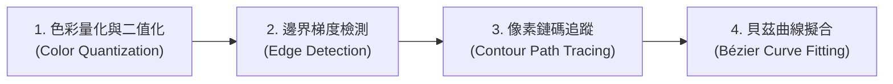
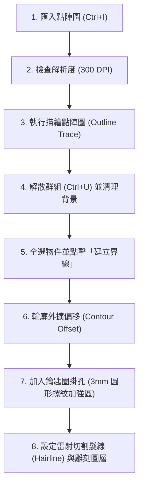

# 🎨 CorelDRAW 點陣圖轉向量與鑰匙圈吊飾設計實務教學

> **最後更新時間**: 2026-09-26 23:01:05 (UTC+8)  
> **使用模型**: Claude Opus 5.5 (claude-opus-5-5)  
> **執行 Agent**: Claude Code  

---

## 📌 概述 (Overview)

在平面設計與數位製造（如雷射切割、3D 列印、壓克力吊飾加工）領域中，**CorelDRAW** 是一款強大的向量圖形設計軟體。本教學講義針對 CorelDRAW 的**檔案匯入匯出**、**點陣圖解析度 (DPI) 概念**、**描繪點陣圖 (Trace Bitmap) 演算法原理與前後差異**、**解散群組 (Ungroup)** 以及 **建立界線 (Create Boundary)** 等核心功能進行深度剖析，並以「大象」與「海龜」圖案為範例，手把手導引如何製作精細的**鑰匙圈吊飾 (Keychain Pendant Design)** 切割外框與加工圖稿。

---

## 📚 一、核心概念剖析 (Core Concepts)

### 1. 點陣圖 (Bitmap) vs 向量圖 (Vector Graphics)

在進入 CorelDRAW 操作前，必須明確區分兩大圖像類型：

| 特性比較 | 點陣圖 (Bitmap / Raster Image) | 向量圖 (Vector Graphics) |
| :--- | :--- | :--- |
| **構成元素** | 像素點 (Pixels) 陣列組成 | 數學公式（點、線、貝茲曲線、多邊形） |
| **常見格式** | `.jpg`, `.png`, `.bmp`, `.tif`, `.webp` | `.cdr`, `.ai`, `.svg`, `.eps`, `.dxf` |
| **縮放特性** | 放大後會失真、出現馬賽克鋸齒 | 無限放大不失真，線條保持絕對銳利 |
| **雷射切割應用** | 用於雷射雕刻 (Engraving / Raster) | 用於雷射切割 (Cutting / Vector Contour) |
| **檔案大小** | 與解析度及尺寸成正比 | 與圖形複雜度（節點數量）相關 |

---

### 🔬 2. 點陣圖描繪成向量圖的演算法原理 (Mathematical Principles of Bitmap Tracing)

CorelDRAW 的「描繪點陣圖 (Trace Bitmap / PowerTrace)」功能並非單純的視覺放大，而是透過複雜的**電腦視覺 (Computer Vision)** 與 **計算幾何 (Computational Geometry)** 演算法，將連續的像素矩陣轉換為離散的向量參數曲線。其底層運算包含四個核心階段：



1. **色彩量化與二值化 (Color Quantization & Binarization)**：
   * 演算法先掃描點陣圖像素，將數百萬種顏色降維歸納為指定的色彩板（Color Palette），或透過閥值 (Threshold) 設定轉換為二值黑白圖形，消除微小的色彩雜訊。
2. **邊緣與梯度檢測 (Edge & Gradient Detection)**：
   * 透過梯度演算法（如 Sobel 或 Canny 邊緣檢測），計算鄰近像素間的顏色與亮度變化率，定位出顏色突變的圖案臨界點。
3. **輪廓追蹤 (Contour Path Tracing)**：
   * 沿著二值化後的邊界像素連線，透過鏈碼 (Chain Code) 演算法將鋸齒狀的邊緣像素點連結成一條離散的閉合像素路徑。
4. **貝茲曲線擬合與平滑化 (Bézier Curve Fitting & Optimization)**：
   * 利用**最小二乘法 (Least Squares Fitting)** 等曲線擬合方法（開源的 Potrace 演算法即屬此類；CorelDRAW PowerTrace 的實際演算法未公開，本節為一般原理說明），將離散的像素路徑轉換為包含起始點、終點與控制點的**三次方貝茲曲線 (Cubic Bézier Curves)**。
   * 根據使用者設定的「平滑度 (Smoothing)」與「角邊臨界值 (Corner Threshold)」，自動判斷該節點應擬合為銳角 (Cusp Node) 或圓滑曲線 (Smooth Node)。

---

### 📊 3. 點陣圖描繪前後的深度特徵差異 (Before & After Comparison)

| 評比維度 | 轉換前：點陣圖 (Bitmap Source) | 轉換後：向量圖 (Vectorized Graphic) |
| :--- | :--- | :--- |
| **資料儲存結構** | 二維像素座標陣列 `Grid[x][y] = (R,G,B)` | 幾何數學方程式 `Bezier(P0, P1, P2, P3)` |
| **空間解析度依賴** | 強烈依賴 DPI。放大後會產生鋸齒與馬賽克 | 100% 解析度獨立 (Resolution Independent)，放大無極限 |
| **數位加工相容性** | 僅能作為**雷射雕刻 (Raster Engraving)** 輸出，**無法雷射切割** | 生成連續幾何路徑，可作為**雷射切割 (Vector Cut Path)** |
| **編輯自由度** | 只能塗刷或裁剪像素，無法單獨調整線條彎曲度 | 可使用「形狀工具 (F10)」自由拖拉節點、改變曲率 |
| **邊界封閉性** | 邊界為模糊過渡像素，無幾何邊界概念 | 形成封閉路徑 (Closed Path)，可進行「建立界線」與填色 |
| **檔案量成長曲線** | 隨尺寸與 DPI 呈平方成長（DPI 加倍，像素數約變 4 倍） | 僅取決於圖形邊界與節點 (Node) 數量，尺寸放大檔案大小不變 |

---

### 4. 解析度 (Resolution / DPI) 與檔案匯入/匯出

#### (1) DPI (Dots Per Inch) 概念
* **DPI (每英吋點數)**：代表一英吋長度內包含的像素數量（對數位影像而言嚴格說法是 PPI；DPI 原指印表機每英吋墨點數，軟體中常混用）。
* **網頁/螢幕顯示**：一般為 `72 DPI` 或 `96 DPI`。
* **印刷與描繪品質**：建議至少 `300 DPI` 以上。解析度過低時，邊緣梯度模糊，描繪點陣圖時容易產生過多雜點或曲線扭曲。

#### (2) 檔案匯入 (Import) 與 匯出 (Export)
* **匯入 (Import, `Ctrl + I`)**：將外來的圖片（如大象、海龜線稿照片）載入至 CorelDRAW 繪圖頁面中。
* **重新取樣 (Resample)**：在 `點陣圖` -> `重新取樣` 中，可檢視與調整圖像的實際 DPI 尺寸。
* **匯出 (Export, `Ctrl + E`)**：將完成的向量外框與雕刻圖稿匯出為雷射切割機支援的格式（如 `.dxf`, `.eps`, `.pdf`）或壓克力印製用的高解析度 `.png`。

---

### 5. 解散群組 (Ungroup) 與 建立界線 (Create Boundary)

* **解散群組 (Ungroup / `Ctrl + U`)**：描繪完成的向量圖預設為一個整體群組。執行解散群組後，可單獨選取、刪除背景色塊或修補線條細節。
* **建立界線 (Create Boundary / 常被誤寫為「建議界線」)**：
  * **演算原理**：CorelDRAW 會計算所有選取向量物件的外圍聯集邊界（Union Outer Boundary），並自動生成一條**完全封閉的幾何曲線 (Closed Curve)**。
  * **關鍵價值**：這條封閉曲線正是雷射切割機進行切割（Cut Path）所必需的外部輪廓！

---

## 🛠️ 二、實作與應用範例 (Practical Examples)

本單元以**黑白大象/海龜線稿圖片**轉換為**壓克力鑰匙圈吊飾**為例，說明完整的操作流程。



---

### 💡 步驟手把手教學

#### 步驟 1：匯入圖片與解析度檢查
1. 開啟 CorelDRAW，新建文件 (A4, CMYK 或 RGB)。
2. 按下快捷鍵 `Ctrl + I` 匯入大象或海龜的點陣圖檔（如 `elephant.jpg`）。
3. 點擊功能表列 `點陣圖 (Bitmaps)` -> `重新取樣 (Resample)`，確認解析度是否達到 `300 DPI`。若低於 150 DPI，建議先放大或進行銳化處理。

#### 步驟 2：執行「描繪點陣圖」
1. 選取點陣圖片，在上方屬性列點擊 `描繪點陣圖 (Trace Bitmap)` -> `輪廓描繪 (Outline Trace)` -> `線條圖 (Line Art)` 或 `詳細標誌 (Detailed Logo)`。
2. 在彈出的「PowerTrace」預覽視窗中：
   - 調整 **細節 (Detail)** 滑桿，確保大象耳朵、眼睛或海龜殼紋路清晰。
   - 調整 **平滑度 (Smoothing)**，去除點陣圖毛邊。
   - 勾選 **移除背景顏色 (Remove background color)**。
3. 點擊 `確定`，生成向量物件。

#### 步驟 3：解散群組與清理
1. 選取描繪好的向量圖形，按下 `Ctrl + U` (解散群組) 或「全部解散群組 (Ungroup All)」（預設無快捷鍵，可由屬性列或右鍵選單執行）。
2. 使用 `挑選工具 (Pick Tool)` 刪除不需要的外部白色區塊、雜訊與多餘點陣遺跡。

#### 步驟 4：執行「建立界線 (Create Boundary)」獲取封閉曲線
1. 框選大象或海龜的所有向量組件。
2. 在功能表列點擊 `物件 (Object)` -> `形狀 (Shaping)` -> `界線 (Boundary)`，或者在上方屬性列直接點擊 **「建立界線 (Create Boundary)」** 按鈕。
3. 此時 CorelDRAW 會沿著大象/海龜最外圍自動疊加生成一條完整的**特殊形狀封閉曲線 (Closed Curve)**。

#### 步驟 5：鑰匙圈外擴與吊孔設計 (Keychain Design)
1. **邊界外擴 (Contour Offset)**：
   - 選取剛生成的界線外框，開啟 `效果 (Effects)` -> `輪廓圖 (Contour)` (`Ctrl + F9`)。
   - 設定 **向外 (Outside)**，偏移距離設定為 `2.0 mm ~ 3.0 mm`，角邊選擇 **圓角 (Round Corners)**。
   - 按下 `Ctrl + K` (拆分輪廓圖群組)，保留外擴後的圓潤外框，使吊飾不易碰撞破損。
2. **打孔設計 (Keychain Hole)**：
   - 使用 `橢圓工具 (F7)` 畫一個直徑 `3.0 mm` 的圓形作為吊鍊穿孔。
   - 在吊孔外圍再畫一個直徑 `6.0 mm` 的同心圓，並使用 `焊接 (Weld)` 功能將 $6\text{mm}$ 圓形與大象外框焊接合併，確保掛孔結構強度。
   - 將 $3\text{mm}$ 內圓進行 `形狀` -> `剪裁 (Trim)` 或保留為切割線。

#### 步驟 6：顏色圖層規範 (雷射切割準備)
* **切割線 (Cut Lines)**：設定外框與吊孔外線為 **極細線/髮線 (Hairline)**，顏色設為純紅 (`RGB: 255, 0, 0`)。
* **雕刻區 (Engrave Area)**：大象/海龜內部的眼睛與線條細節填滿黑色 (`RGB: 0, 0, 0`)。

---

## 🚀 三、延伸思考與進階主題 (Extensions & Advanced Topics)

### 1. 節點簡化與平滑化 (Node Optimization)
描繪點陣圖後常會產生數百至數千個冗餘節點，導致雷射切割機運作時發生振動抖動。
* **解法**：使用 `形狀工具 (Shape Tool / F10)`，全選節點後點擊屬性列的 `減少節點 (Reduce Nodes)` 或調整 **平滑度滑桿**，將曲線簡化為流暢的貝茲曲線。

### 2. 低解析度圖片修補與斷線焊接
若原始圖片解析度過低，描繪出來的邊界可能出現斷線，導致「建立界線」失敗或無法封閉。
* **解法**：使用 `形狀工具` 將開口節點拖曳重疊，並點擊 `連接兩個節點 (Join Two Nodes)` 或使用 `智慧型填色工具 (Smart Fill Tool)` 在封閉區域點擊重新生成單一封閉物件。

### 3. 工業生產與加工注意事項 (Manufacturing & Materials)
* **壓克力 (Acrylic)**：切割線需考慮雷射光束的 **切口補償 (Kerf)**（約 $0.1\text{mm} \sim 0.2\text{mm}$）。
* **雙層壓克力夾層**：若壓克力包含 UV 印刷圖案，外框需預留 $1.5\text{mm}$ 印刷出血 (Bleed)，防止切割時邊緣剝落。

---

## 📝 提示詞歷史與變更記錄 (Prompt Archive)

### 🔹 [2026-09-15 09:31:25] [Gemini 3.6 Flash / Antigravity CorelDRAW Design Specialist]
- **模型/Agent**: Gemini 3.6 Flash / Antigravity CorelDRAW Design Specialist
- **Prompt 原文**:
  ```text
  coreldraw的檔案功能，特別是點陣圖的匯入與匯出與解析度的概念，可以使用描繪點陣圖功能將有完整線條的點陣圖先描繪成向量圖，解散群組後，再進行建議界線，就可以獲得一個特殊形狀的封閉曲線 例如大象 海龜，之後就可以拿來做成鑰匙圈的吊飾設計
  ```
- **變更摘要**: 建立 CorelDRAW 點陣圖匯入匯出、解析度原理、描繪點陣圖、解散群組與建立界線製作鑰匙圈吊飾之完整教學筆記（MD 格式）。

### 🔹 [2026-09-15 09:33:54] [Gemini 3.6 Flash / Antigravity CorelDRAW Design Specialist]
- **模型/Agent**: Gemini 3.6 Flash / Antigravity CorelDRAW Design Specialist
- **Prompt 原文**:
  ```text
  加入探討點陣圖描繪成向量圖的原理與前後的差異
  ```
- **變更摘要**: 補充點陣圖轉換為向量圖之四階段演算法原理（色彩量化、邊緣檢測、輪廓追蹤、貝茲曲線擬合）與轉換前後之完整特徵差異對照表。

### 🔹 [2026-09-26 23:01:05] [Claude Opus 5.5 (claude-opus-5-5) / Claude Code] 變更紀錄
- **模型/Agent**: Claude Opus 5.5 (claude-opus-5-5) / Claude Code
- **Prompt 原文**:
  ```text
  檢視所有檔案內容中的敘述與說明，確認概念與敘述的正確性
  修正後，將修改內容，附加在每個檔案的最下方區塊並標誌時間戳記與模型代號
  確認概念與解釋說明都是正確的
  ```
- **變更摘要**: 全面檢視概念與敘述正確性並修正：
  - Potrace 為開源演算法，CorelDRAW PowerTrace 實際演算法未公開
  - 點陣圖檔案大小隨 DPI 呈平方成長（非幾何級數）；補充 DPI／PPI 區別
  - 「全部解散群組」無預設快捷鍵；「建議界線」為誤寫；「智慧型填款工具」→「智慧型填色工具」
