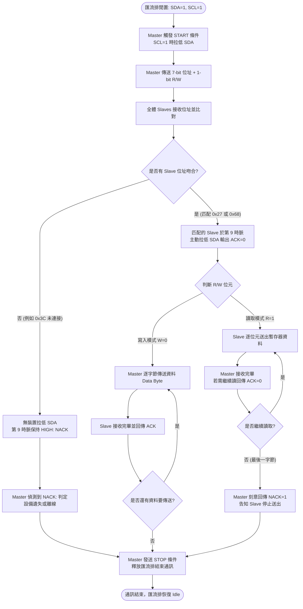

# 🔌 I2C 通訊協定原理解析與多裝置動態互動模擬 (Master + Dual Slaves 0x27 & 0x68)

> **最後更新時間**: 2026-10-01 13:15:21 (UTC+8)  
> **使用模型**: GPT-5 Codex  
> **執行 Agent**: /root  
> **互動式動態網頁版**: [I2C_simulation.html](./I2C_simulation.html)

---

## 📑 目錄 (Table of Contents)
1. [核心概念剖析 (Core Concepts)](#1-核心概念剖析-core-concepts)
   - 1.1 I2C 協定架構與硬體物理層
   - 1.2 開汲極 (Open-Drain) 與線接與 (Wired-AND) 邏輯
   - 1.3 訊號條件：START、STOP 與資料有效性 (Data Validity)
   - 1.4 7-bit 定址與 9-Clock 訊框 (Frame) 結構
   - 1.5 ACK / NACK 應答握手機制
   - 1.6 從波形理解單一位元如何傳送
   - 1.7 完整 Write / Read 交易逐步拆解
   - 1.8 Clock Stretching 與多主機仲裁
2. [硬體電氣特性與上拉電阻設計計算 (Pull-up Resistor Calculation)](#2-硬體電氣特性與上拉電阻設計計算)
3. [通訊時序邏輯流程圖 (Flowchart)](#3-通訊時序邏輯流程圖-flowchart)
4. [實作與應用範例 (Practical Implementation)](#4-實作與應用範例-practical-implementation)
   - 4.1 Arduino C++ Wire 同步控制雙周邊 (LCD 0x27 + RTC 0x68)
   - 4.2 純 GPIO 軟體模擬 I2C (Bit-Banging 演算法)
5. [延伸思考與進階專題 (Extensions & Advanced Topics)](#5-延伸思考與進階專題-extensions--advanced-topics)
   - 5.1 常用通訊協議對比矩陣 (I2C vs SPI vs UART)
   - 5.2 匯流排鎖死 (Bus Hang) 與 9-Clock Reset 復原程序
   - 5.3 位址衝突解決方案與 I2C 多工器 (TCA9548A)
6. [提示詞歷史與變更記錄 (Prompt Archive)](#6-提示詞歷史與變更記錄-prompt-archive)

---

## 1. 核心概念剖析 (Core Concepts)

### 1.1 I2C 協定架構與硬體物理層
**I2C (Inter-Integrated Circuit)** 由 Philips (現 NXP) 於 1982 年發明，是一種**同步 (Synchronous)、半雙工 (Half-Duplex)、多主多從 (Multi-Master / Multi-Slave)** 的板級串列通訊匯流排。

整個匯流排僅依賴兩條實體訊號線：
* **SCL (Serial Clock)**：串列時脈線，由 Master 主控端產生並主導通訊節拍。
* **SDA (Serial Data)**：串列資料線，Master 與 Slave 雙向共用，用於傳輸位址、控制位元與資料。

```
              VCC (+5V / +3.3V)
               |           |
              [Rp]        [Rp]  (Pull-up Resistors ~4.7kΩ)
               |           |
SCL  ----------+-----------+-----------+--------- (Clock Bus)
               |           |           |
SDA  ----------|-----+-----+-----------|----+---- (Data Bus)
               |     |                 |    |
        +------+-----+------+   +------+----+------+   +------+----+------+
        |   Master (MCU)    |   | Dev 1: LCD (0x27)|   | Dev 2: RTC (0x68)|
        |  ATmega328P/ESP32 |   |     PCF8574      |   |      DS3231      |
        +-------------------+   +------------------+   +------------------+
```

---

### 1.2 開汲極 (Open-Drain) 與線接與 (Wired-AND) 邏輯

I2C 匯流排上所有裝置的接腳均設計為 **開汲極 (Open-Drain)** 或 **開集極 (Open-Collector)**：

* **輸出 LOW (0)**：晶片內部 NMOS 導通，直接將匯流排線路接地 (GND)，強制拉低至 $0\text{V}$。
* **輸出 HIGH (1)**：晶片內部 NMOS 關斷，接腳呈現高阻抗 (High-Z 浮接)，由外部上拉電阻 $R_p$ 將線路電位拉升至 $V_{DD}$。

#### 線接與 (Wired-AND) 的物理優勢：
1. **防止短路毀損**：若兩裝置同時送出相反邏輯，絕不會產生「電源對地短路」的毀滅性大電流。
2. **多裝置協同仲裁與應答**：任一裝置拉低線路，整條線路即為 LOW。只有全體裝置均放開線路時，線路才為 HIGH。這正是 Slave 回應 ACK、Slave 進行時脈伸展 (Clock Stretching) 以及多主機匯流排仲裁 (Bus Arbitration) 的根本基礎。

---

### 1.3 訊號條件：START、STOP 與資料有效性 (Data Validity)

在 I2C 規範中，START 與 STOP 條件是全匯流排唯一允許「在 SCL 高電位時變更 SDA」的特殊狀態：

* **起始條件 (START Condition, S)**：
  當 `SCL = HIGH` 時，`SDA` 產生由 **HIGH 變為 LOW** 的負緣下降脈衝。
* **停止條件 (STOP Condition, P)**：
  當 `SCL = HIGH` 時，`SDA` 產生由 **LOW 變為 HIGH** 的正緣上升脈衝。
* **資料有效性原則 (Data Validity Rule)**：
  在正常的位元資料傳輸期間：
  - **SCL 為 HIGH 期間**：SDA 上的電位必須**保持絕對穩定**，此時接收端進行資料採樣。
  - **SCL 為 LOW 期間**：SDA 才允許改變高低電位（準備下一個 bit）。若在 SCL 為 HIGH 時切換 SDA，將會被所有裝置誤解為 START 或 STOP！

---

### 1.4 7-bit 定址與 9-Clock 訊框 (Frame) 結構

I2C 的通訊以 9 個時脈脈衝為一個資料訊框（8 位元數據 + 1 位元應答）：

```
時脈週期:  [ 1 ] [ 2 ] [ 3 ] [ 4 ] [ 5 ] [ 6 ] [ 7 ] [ 8 ]     [ 9 ]
SCL    :  __┌─┐___┌─┐___┌─┐___┌─┐___┌─┐___┌─┐___┌─┐___┌─┐_______┌─┐___
SDA    :  ──< A6 >─< A5 >─< A4 >─< A3 >─< A2 >─< A1 >─< A0 >─< R/W >───< ACK >──
              └────────────── 7-bit 設備位址 ──────────────┘  方向位元  周邊應答
```

* **Byte 1 (位址訊框)**：
  - 高 7 位 (Bits 7~1, A6~A0)：目標周邊裝置之實體位址。
    - 例如本實驗中的 LCD1602 背板 PCF8574 固定位址為 `0x27` (`0100111b`)。
    - DS3231 RTC 固定位址為 `0x68` (`1101000b`)。
  - 最低位 (Bit 0, R/W)：資料傳輸方向。
    - `0` (Write)：主機寫入資料至周邊裝置。
    - `1` (Read)：主機自周邊裝置讀取資料。

---

### 1.5 ACK / NACK 應答握手機制

* **第 9 個時脈 ACK (Acknowledge, 0)**：
  在第 8 個時脈結束後，發送端主動釋放 SDA（內部開關斷開，線路浮起）。若匯流排上有周邊裝置位址相符或接收到字節，該裝置會在第 9 個時脈高電位期間，**主動將 SDA 拉至低電位 (LOW)**，告知發送端「我收到且辨識正確！」。
* **第 9 個時脈 NACK (Not Acknowledge, 1)**：
  若無任何裝置回應（例如位址錯誤如 `0x3C`），或接收端緩衝區已滿、或讀取端不想再接收下一 Byte，SDA 線將藉由上拉電阻**保持在高電位 (HIGH)**。

### 1.6 從波形理解單一位元如何傳送

先把 I2C 想成一間由**老師（Master 主控端）**帶領的教室：

* **Master 主控端 = 老師 / 指揮者**：決定現在要跟哪位學生（哪個 Slave 位址）說話、何時開始、何時結束，並通常負責打拍子。
* **SCL = 老師的拍手節拍（什麼時候讀）**：SCL 低時是準備答案的時間；SCL 高時是全班正式看答案、接收端讀取資料的時間。
* **SDA = 寫答案的白板（答案是什麼）**：線上的 `0` 或 `1`、位址、資料與 ACK 都走 SDA。SDA 是雙向共用線，同一時間只能由目前的發送者負責寫。

最重要的關係可記成：**Master 用 SCL 告訴大家「何時看」，目前的發送者用 SDA 告訴大家「看到什麼」。**

| 通訊階段 | SCL 通常由誰控制？ | SDA 由誰控制？ | Master 在做什麼？ |
| :--- | :--- | :--- | :--- |
| START、位址、Write 資料 | Master | Master | 打拍子並把位址/資料放到 SDA |
| 位址或 Write 資料後的 ACK | Master | Slave | 繼續提供第 9 拍，但放開 SDA 讓 Slave 回答 |
| Read 資料 | Master | Slave | 提供時脈並從 SDA 讀取 Slave 的資料 |
| Read 資料後的 ACK/NACK | Master | Master | 用 ACK 要求下一 Byte，或用 NACK 表示讀完 |

> 「Master 控制通訊」不等於「Master 永遠控制 SDA」。Master 主要掌握交易流程與 SCL；讀取資料或等待 ACK 時，會主動放開 SDA，讓 Slave 發話。

I2C 並不是「SCL 上升一次就立刻改一次資料」，而是每個 bit 都依序經過下列三個階段：

1. **準備資料（SCL = LOW）**：發送端在 SCL 低電位時決定 SDA。要送 `0` 就拉低 SDA；要送 `1` 就放開 SDA，讓上拉電阻將它拉高。
2. **接收端取樣（SCL = HIGH）**：Master 放開 SCL，使 SCL 上升。接收端在 SCL 高電位期間讀取 SDA；這段期間 SDA 必須保持不變。
3. **完成此 bit（SCL 回到 LOW）**：Master 再拉低 SCL，發送端才可準備下一個 bit。

因此，看邏輯分析儀時可用一句話判讀：**SCL 低時看資料如何準備，SCL 高時看接收端讀到什麼。** 資料一律從最高位元 MSB 先傳至最低位元 LSB。

以資料 `0xA5 = 1010 0101b` 為例，八個 SCL 高電位期間依序取樣到：

| Clock | 1 | 2 | 3 | 4 | 5 | 6 | 7 | 8 | 9 |
| :--- | :---: | :---: | :---: | :---: | :---: | :---: | :---: | :---: | :---: |
| SDA | 1 | 0 | 1 | 0 | 0 | 1 | 0 | 1 | ACK/NACK |
| SDA 控制者 | 發送端 | 發送端 | 發送端 | 發送端 | 發送端 | 發送端 | 發送端 | 發送端 | **接收端** |

> 關鍵的「方向交接」發生在第 8 與第 9 個 Clock 之間：原發送端必須先放開 SDA，接收端才能在第 9 個 Clock 拉低 SDA 回覆 ACK。若雙方沒有正確交接，ACK 就無法被判讀。

#### 波形下方的 A0、D7、D6…代表什麼？

這些文字是每個 SCL 高電位採樣點的**位元名稱**，不是裝置接腳名稱：

| 標記 | 意義 |
| :--- | :--- |
| `S` | START，交易開始 |
| `A6`～`A0` | 7-bit 裝置位址；A6 是最高位元，A0 是最低位元 |
| `W(0)` / `R(1)` | 寫入或讀取方向 |
| `ACK(0)` / `NACK(1)` | 第 9 個 Clock 的應答 |
| `D7`～`D0` | 一個資料 Byte；D7 是最高位元且最先傳，D0 最後傳 |
| `P` | STOP，交易結束 |

所以完整順序應是：

```text
S → A6 A5 A4 A3 A2 A1 A0 → W/R → ACK
  → D7 D6 D5 D4 D3 D2 D1 D0 → ACK/NACK → P
```

例如資料是 `0x08 = 00001000b`，D7～D0 的電位依序為 `0 0 0 0 1 0 0 0`。如果畫面看似出現兩個 `D4` 或漏掉 `D3`，那不是 I2C 規則；正確位元名稱必定由 D7 連續遞減到 D0。

### 1.7 完整 Write / Read 交易逐步拆解

#### A. Master 寫入 LCD 0x27

```text
S → [0x27 + W] → ACK → [0x08] → ACK → [0x01] → ACK → P
     線上位元組 0x4E
```

1. 匯流排閒置時 SDA、SCL 都是 HIGH；Master 在 SCL 為 HIGH 時把 SDA 拉低，形成 START (`S`)。
2. Master 傳送 7-bit 位址 `0x27` 與 `W=0`。線上實際的 8-bit 位址位元組為 `(0x27 << 1) | 0 = 0x4E`。
3. 所有 Slave 都看到位址，但只有 0x27 裝置匹配並在第 9 個 Clock 拉低 SDA 回覆 ACK。
4. Master 依序送出資料 `0x08`、`0x01`；Slave 每收到一個完整 Byte 都回覆一次 ACK。
5. Master 在 SCL 為 HIGH 時讓 SDA 由 LOW 回到 HIGH，形成 STOP (`P`) 並釋放匯流排。

#### B. Master 讀取 RTC 0x68 的秒數暫存器

```text
S → [0x68 + W] → ACK → [Register 0x00] → ACK
  → Sr → [0x68 + R] → ACK → [Data: 0x32] → NACK → P
       線上 0xD1                    Slave 傳資料   Master 結束讀取
```

1. 第一段仍使用 `W=0`，因為 Master 要先把 RTC 的內部暫存器指標設為 `0x00`。
2. Master 不送 STOP，而送 Repeated START (`Sr`)；因此其他 Master 沒有機會在兩段操作之間取得匯流排。
3. Master 再次定址 0x68，但改送 `R=1`。線上位址位元組為 `(0x68 << 1) | 1 = 0xD1`。
4. 位址 ACK 之後，**SDA 的資料發送者改成 Slave**；RTC 送出暫存器內容，Master 產生時脈並取樣。
5. Master 讀完最後一個 Byte 後刻意保持 SDA 為 HIGH，送出 NACK，意思不是「資料錯誤」，而是「我不要下一個 Byte」。接著 Master 送 STOP。

#### C. 如何根據位址判斷誰接收、誰傳送？

Master 在 START 後送出的第一個 Byte 可拆成：

```text
Bit 7 ───────── Bit 1 | Bit 0
 A6 A5 A4 A3 A2 A1 A0 | R/W
 └── 7-bit 位址 ──────┘  └─ 資料方向（以 Master 的角度命名）
```

每個 Slave 都會接收這 8 個 bit，先比較前 7 bit 是否等於自己的位址，再查看最後的 R/W：

| 位址是否相符 | R/W | 結果 |
| :---: | :---: | :--- |
| 否 | 0 或 1 | 該 Slave 不回 ACK，也不參與後續資料，等待下一個 START |
| 是 | `0`（Write） | Slave 回 ACK；之後 **Master 傳送、Slave 接收** |
| 是 | `1`（Read） | Slave 回 ACK；之後 **Slave 傳送、Master 接收** |

可用四步判斷：

1. 先取線上第一個 Byte，例如 `0x4E`。
2. 右移一位取得 7-bit 位址：`0x4E >> 1 = 0x27`。
3. 取最低位判斷方向：`0x4E & 0x01 = 0`，所以是 Write。
4. 結論：選中 `0x27`，接下來由 Master 傳資料給 0x27 裝置。

若第一個 Byte 是 `0xD1`：`0xD1 >> 1 = 0x68`，且 `0xD1 & 1 = 1`，所以選中 `0x68`，接下來由 0x68 Slave 傳資料給 Master。

> 位址只回答「哪個 Slave 被選中」；R/W 才回答「接下來資料往哪個方向走」。另外，Slave 回覆 ACK 只表示它接受了這個位址與方向，不代表後續資料內容一定正確。

#### 7-bit 位址與 8-bit 位址最常見的混淆

資料手冊通常寫的是 7-bit 位址，例如 `0x27`、`0x68`；邏輯分析儀或舊文件有時會顯示已加入 R/W 位元的 8-bit 值。換算規則為：

| 7-bit 裝置位址 | Write 線上位元組 | Read 線上位元組 |
| :---: | :---: | :---: |
| `0x27` | `0x4E` | `0x4F` |
| `0x68` | `0xD0` | `0xD1` |

Arduino `Wire.beginTransmission()`、`Wire.requestFrom()` 應傳入 **7-bit 位址**；不可再自行左移，否則會呼叫錯誤位址。

### 1.8 Clock Stretching 與多主機仲裁

* **Clock Stretching（時脈伸展）**：Master 放開 SCL 準備讓它變 HIGH，但尚未準備好的 Slave 可繼續拉低 SCL。Master 必須確認實際 SCL 已變 HIGH 後才能繼續；不是所有 MCU、函式庫或周邊都完整支援此能力，實作時應查閱雙方資料手冊。
* **Arbitration（多主機仲裁）**：多個 Master 同時送資料時，每個 Master 都會比較「自己想送的 SDA」與「線上實際 SDA」。想送 `1` 卻讀到 `0` 的 Master 代表已輸掉仲裁，必須立即停止驅動。想送 `0` 的 Master 繼續工作，因此仲裁不會破壞正在傳送的訊息。
* **Bus Busy 判斷**：偵測到 START 後至 STOP 前，匯流排視為忙碌；新交易應等待匯流排回到 SDA=HIGH、SCL=HIGH 的 Idle 狀態。

---

## 2. 硬體電氣特性與上拉電阻設計計算

在設計 I2C 匯流排硬體時，上拉電阻 $R_p$ 的選值必須落在合理區間內：

$$R_{p,min} \le R_p \le R_{p,max}$$

### 2.1 最小上拉電阻 $R_{p,min}$ (由最大灌電流限制)
當晶片拉低 SDA/SCL 時，外部電源經由 $R_p$ 流入晶片接腳（灌電流 $I_{OL}$）。為確保輸出低電平不超過標準上限 $V_{OL,max} = 0.4\text{V}$，且電流不超過晶片額定容量（標準模式為 $3\text{mA}$）：

$$R_{p,min} = \frac{V_{DD} - V_{OL,max}}{I_{OL}} = \frac{3.3\text{V} - 0.4\text{V}}{3\text{mA}} \approx 966\,\Omega$$

### 2.2 最大上拉電阻 $R_{p,max}$ (由訊號上升時間限制)
當晶片釋放接腳時，匯流排由 $R_p$ 對寄生負載電容 $C_b$ (Bus Capacitance) 充電。訊號從 $0.3V_{DD}$ 上升至 $0.7V_{DD}$ 所需時間為：

$$t_r = 0.8473 \times R_p \times C_b \implies R_{p,max} = \frac{t_{r,max}}{0.8473 \times C_b}$$

* **標準模式 (Standard Mode, 100 kHz)**：最大允許 $t_r = 1000\text{ns}$。若 $C_b = 100\text{pF}$，則 $R_{p,max} \approx 11.8\text{k}\Omega$。
* **快速模式 (Fast Mode, 400 kHz)**：最大允許 $t_r = 300\text{ns}$。若 $C_b = 100\text{pF}$，則 $R_{p,max} \approx 3.54\text{k}\Omega$。
* **實務工程推薦值**：在 $3.3\text{V} \sim 5\text{V}$ 系統中，通常直接採用 **$2.2\text{k}\Omega \sim 4.7\text{k}\Omega$** 作為標準電阻值。

---

## 3. 通訊時序邏輯流程圖 (Flowchart)

以下流程圖說明 Master 主控端與雙周邊 (Device 1: 0x27 / Device 2: 0x68) 通訊的判斷邏輯：



---

## 4. 實作與應用範例 (Practical Implementation)

### 4.1 Arduino C++ Wire 同步控制雙周邊 (LCD 0x27 + RTC 0x68)

本範例展示 Arduino Uno 同時連接 **PCF8574 LCD1602 (位址 `0x27`)** 與 **DS3231 RTC (位址 `0x68`)** 的標準程式碼：

```cpp
#include <Wire.h>

// 定義兩台 I2C 設備的 7-bit 位址
#define LCD_ADDR  0x27  // 周邊 1: PCF8574 LCD 擴展晶片位址
#define RTC_ADDR  0x68  // 周邊 2: DS3231 RTC 時鐘位址

// BCD 碼轉十進位函式 (DS3231 內部秒/分/時均以 BCD 格式儲存)
byte bcdToDec(byte val) {
    return ((val / 16 * 10) + (val % 16));
}

void setup() {
    Serial.begin(115200);
    while (!Serial); // 等待序列埠監視器開啟

    // 初始化 I2C 主機模式 (Uno 預設: A4=SDA, A5=SCL)
    Wire.begin();
    Wire.setClock(100000); // 設定為標準模式 100 kHz

    Serial.println(F("========================================"));
    Serial.println(F("[I2C Master] 雙裝置 (0x27, 0x68) 通訊初始化完成"));
    Serial.println(F("========================================"));

    // 1. 寫入周邊 1 (LCD 0x27)：送出初始化控制背光指令
    Wire.beginTransmission(LCD_ADDR);
    Wire.write(0x08); // 寫入資料字節 1 (控制暫存器，開啟背光)
    Wire.write(0x01); // 寫入資料字節 2 (清除顯示器指令)
    byte errorLcd = Wire.endTransmission(); // 產生 STOP 條件並接收 ACK/NACK

    if (errorLcd == 0) {
        Serial.println(F("[SUCCESS] 成功與 0x27 (LCD) 握手並寫入控制字節 (ACK 回應)"));
    } else {
        Serial.print(F("[ERROR] 0x27 (LCD) 無法連線，錯誤代碼: "));
        Serial.println(errorLcd); // 2: 位址收到 NACK, 3: 資料收到 NACK
    }
}

void loop() {
    // 2. 讀取周邊 2 (RTC 0x68)：讀取即時時鐘之「秒」暫存器
    // 步驟 2.1: 先發送寫入模式，指定要讀取的暫存器位址為 0x00 (秒數暫存器)
    Wire.beginTransmission(RTC_ADDR);
    Wire.write(0x00); // 暫存器指標指向 0x00 (Seconds)
    byte errorRtc = Wire.endTransmission(false); // 傳送 Repeated START (不放開匯流排)

    if (errorRtc == 0) {
        // 步驟 2.2: 切換為讀取模式，向 0x68 請求讀取 1 個 Byte
        Wire.requestFrom(RTC_ADDR, 1);
        if (Wire.available()) {
            byte rawSeconds = Wire.read(); // 讀取資料並自動在最後一個 byte 回應 NACK + STOP
            byte seconds = bcdToDec(rawSeconds & 0x7F);
            Serial.print(F("[RTC 0x68 讀取成功] 當前秒數: "));
            Serial.println(seconds);
        }
    } else {
        Serial.println(F("[ERROR] 0x68 (RTC) 設備未回應 ACK"));
    }

    delay(1000); // 每秒讀取一次
}
```

---

### 4.2 純 GPIO 軟體模擬 I2C (Bit-Banging 演算法)

在某些沒有硬體 I2C 模組的 MCU 腳位上，可使用軟體演算法模擬開汲極輸出：

```cpp
// 模擬 Open-Drain 行為：
// 輸出 0: pinMode 為 OUTPUT, digitalWrite 為 LOW (強制拉地)
// 輸出 1: pinMode 為 INPUT (高阻態 High-Z, 藉由外部上拉電阻浮至 5V)
void sda_low(int pinSda)  { pinMode(pinSda, OUTPUT); digitalWrite(pinSda, LOW); }
void sda_high(int pinSda) { pinMode(pinSda, INPUT); }
void scl_low(int pinScl)  { pinMode(pinScl, OUTPUT); digitalWrite(pinScl, LOW); }
void scl_high(int pinScl) { pinMode(pinScl, INPUT); }

// 產生 START 條件：當 SCL 為 High 時，SDA 由 High 降為 Low
void i2c_start(int pinSda, int pinScl) {
    sda_high(pinSda);
    scl_high(pinScl);
    delayMicroseconds(5);
    sda_low(pinSda);   // SDA 下降沿
    delayMicroseconds(5);
    scl_low(pinScl);   // 鎖定時脈進入低電位，準備送出資料位元
}

// 產生 STOP 條件：當 SCL 為 High 時，SDA 由 Low 升為 High
void i2c_stop(int pinSda, int pinScl) {
    sda_low(pinSda);
    delayMicroseconds(5);
    scl_high(pinScl);
    delayMicroseconds(5);
    sda_high(pinSda);  // SDA 上升沿
    delayMicroseconds(5);
}

// 送出 1 個位元組並接收 Slave 的 ACK 訊號 (回傳 true 代表收到 ACK)
bool i2c_write_byte(int pinSda, int pinScl, uint8_t byteData) {
    // 依序由最高位元 (MSB, Bit 7) 送至最低位元 (LSB, Bit 0)
    for (int i = 7; i >= 0; i--) {
        if (byteData & (1 << i)) {
            sda_high(pinSda);
        } else {
            sda_low(pinSda);
        }
        delayMicroseconds(5);
        scl_high(pinScl); // 接收端在此上升沿與 High 期間進行採樣
        delayMicroseconds(5);
        scl_low(pinScl);
    }

    // 第 9 個時脈：釋放 SDA，讀取周邊裝置拉低的 ACK
    sda_high(pinSda); // 釋放 SDA 線
    delayMicroseconds(5);
    scl_high(pinScl);
    delayMicroseconds(5);
    bool ack = (digitalRead(pinSda) == LOW); // 0 代表 Slave 回應 ACK
    scl_low(pinScl);
    return ack;
}
```

---

## 5. 延伸思考與進階專題 (Extensions & Advanced Topics)

### 5.1 常用板級串列通訊協定全方位對比 (I2C vs SPI vs UART)

| 比較特性 | I2C (Inter-Integrated Circuit) | SPI (Serial Peripheral Interface) | UART (Universal Asynchronous Receiver/Transmitter) |
| :--- | :--- | :--- | :--- |
| **訊號線數量** | **2 條** (SDA, SCL) | **4 條以上** (MOSI, MISO, SCK, CS) | **2 條** (TX, RX) |
| **傳輸模式** | 半雙工 (Half-Duplex) | **全雙工 (Full-Duplex)** | **全雙工 (Full-Duplex)** |
| **典型通訊速率** | 100 kHz ~ 1 MHz (高速模式可達 3.4MHz) | **10 MHz ~ 80 MHz+ (極高速)** | 9600 bps ~ 1 Mbps (中低速) |
| **拓撲結構** | 多點匯流排 (最多 128 個設備) | 一主多從 (需專用 CS 線) | 點對點 (Point-to-Point) |
| **定址機制** | **7-bit / 10-bit 軟體位址** | 硬體片選引腳 (Chip Select) | 無 (點對點直連) |
| **通訊應答** | **每 Byte 均有 ACK/NACK 握手** | 無應答機制 (盲發盲收) | 無硬體應答 (需應用層自訂) |
| **硬體連線難度**| **極低 (僅需 2 個 Pin + 上拉電阻)** | 隨裝置增多引腳大幅增加 | 僅限一對一 |

---

### 5.2 匯流排鎖死 (Bus Hang) 與 9-Clock Reset 復原演算法

在嵌入式產品開發中，最常發生的重大 I2C 異常即為**匯流排鎖死 (Bus Lockup)**：

* **發生場景**：當 Master 正在讀取 Slave 時，Slave 剛好輸出 `0`（將 SDA 強制拉低接地）。此時若 Master 發生 Watchdog 重置或例外重開機，重啟後的 Master 會讓 SCL 處於閒置 High 電位；而 Slave 因尚未收到讀取完成的時脈訊號，會**永久將 SDA 拉死在 Low**！導致整條匯流排無法再次發動任何 START 條件。
* **9-Clock Reset 復原演算法**：
  1. Master 開機時，若檢測到 SDA 為 LOW，切換為 GPIO 手動模式。
  2. Master 連續送出 **9 個 SCL 時脈脈衝**（每次切換週期約 10µs）。
  3. 這會強迫處於傳輸途中的 Slave 跑完剩餘的位元，直到 Slave 釋放 SDA 線。
  4. Master 隨後送出一個常規的 **STOP 條件**，匯流排即可恢復正常運作。

---

### 5.3 位址衝突解決方案與 I2C 多工器 (TCA9548A)

當同一個系統上需要連接兩顆相同型號、且內部硬體位址完全相同的感測器時（例如兩片固定位址為 `0x27` 的 LCD 模組）：
1. **硬體位址選擇角 (Address Select Pins, A0/A1/A2)**：許多晶片提供 3 個位址引腳，透過接地或接 VCC 可切換 8 種不同組合。
2. **I2C 多工切換晶片 (I2C Multiplexer, 例如 TCA9548A)**：
   - TCA9548A 本身也是一個 I2C 設備（位址通常為 `0x70`）。
   - 它提供 8 組完全獨立的 I2C 通道 (SC0/SD0 ~ SC7/SD7)。
   - Master 只要先向 `0x70` 寫入通道編號，就能隨意切換控制掛在不同通道上的相同位址設備。

---

## 6. 提示詞歷史與變更記錄 (Prompt Archive)

### 🔹 [2026-10-01 13:15:21] [GPT-5 Codex] 變更紀錄
- **模型/Agent**: GPT-5 Codex / /root
- **Prompt 原文**:
  ```text
  📊 數位示波器 / 邏輯分析儀即時波形 (Logic Analyzer Waveform)
  綠線: START | 黃線: SCL 時脈 | 藍線: SDA 資料 | 綠/紅標記: ACK/NACK | 橘線: STOP  A0 D6 D5 D4 D4 D2 D1是什麼意思?
  ```
- **變更摘要**:
  - 新增 S、A6～A0、W/R、ACK/NACK、D7～D0、P 的波形標記圖例。
  - 修正波形畫布寬度不足造成後段位元超出或看似重複的問題，改為依封包長度自動縮放。
  - 修正單 Byte Read 結束時應由 Master 回傳 NACK，而非 ACK 的模擬結果。

### 🔹 [2026-10-01 13:12:31] [GPT-5 Codex] 變更紀錄
- **模型/Agent**: GPT-5 Codex / /root
- **Prompt 原文**:
  ```text
  如何根據位址判斷資料的接收與傳送
  ```
- **變更摘要**:
  - 新增位址匹配與 R/W 位元的判斷流程及結果表。
  - 使用 `0x4E` 與 `0xD1` 示範如何反推 7-bit 位址及資料方向。
  - 釐清位址決定目標裝置、R/W 決定資料方向、ACK 表示位址與方向已被接受。

### 🔹 [2026-10-01 13:10:22] [GPT-5 Codex] 變更紀錄
- **模型/Agent**: GPT-5 Codex / /root
- **Prompt 原文**:
  ```text
  用更容易理解的方式說明 sda與SCL以及主控端的關係
  ```
- **變更摘要**:
  - 以老師、拍手節拍與白板比喻 Master、SCL、SDA。
  - 新增各通訊階段的 SCL/SDA 控制權對照表，釐清 Master 控制交易不代表永遠控制 SDA。

### 🔹 [2026-10-01 13:07:25] [GPT-5 Codex] 變更紀錄
- **模型/Agent**: GPT-5 Codex / /root
- **Prompt 原文**:
  ```text
  D:\CLASS_NOTE\ec\I2C_simulation.html 是否可以更詳細明確的說明I2C的運作方式?
  ```
- **變更摘要**:
  - 補充單一位元的「準備、取樣、完成」三階段與 SDA 控制權交接。
  - 逐步拆解 0x27 寫入及 0x68 暫存器讀取交易，明確標示 START、Repeated START、ACK/NACK 與 STOP。
  - 新增 7-bit/8-bit 位址換算表、最後一個讀取 Byte 使用 NACK 的原因、Clock Stretching、多主機仲裁與 Bus Busy 判讀。

### 🔹 [2026-10-01 13:00:00] [Gemini 3.8 Flash] 變更紀錄
- **模型/Agent**: Gemini 3.8 Flash / Antigravity
- **Prompt 原文**:
  ```text
  利用動態網頁設計I2C 通訊的原理，包含主控端 兩個I2C devise(位址模擬) ，配合SDA,SCL, 模擬資料傳遞與時脈控制 I2C_simulation.html
  ```
- **變更摘要**:
  - 新建 `ec/I2C_simulation.html` 與 `ec/I2C_simulation.md`，完整建構 I2C 通訊協議動態網頁模擬器與專業教學筆記。
  - 網頁端設計 Master 主控端與兩組周邊設備（Device 1: 0x27 LCD、Device 2: 0x68 RTC）之拓撲視覺化圖表與 Open-Drain NMOS 開關狀態展示。
  - 整合 HTML5 Canvas 數位示波器 / 邏輯分析儀波形圖，實時標記 SCL、SDA、採樣時脈、START、STOP 與 ACK/NACK 狀態。
  - 提供多種通訊情境：寫入 0x27、寫入 0x68、讀取 0x68、未匹配位址 0x3C 之 NACK 響應與自訂封包傳輸。
  - 撰寫上拉電阻 $R_p$ 物理公式互動計算小工具，包含最大上升時間 $t_r$ 與灌電流極限推導。
  - 繪製 Mermaid 通訊握手時序流程圖，並提供 Arduino C++ Wire 函式庫與軟體模擬 Bit-Banging 完整程式碼與一鍵複製按鈕。
  - 嚴格遵守 `AGENTS.md` 與 `GEMINI.md` 規範（中元資料、關鍵字擴充三層次、累加式提示詞記錄、PDF 列印匯出功能）。
