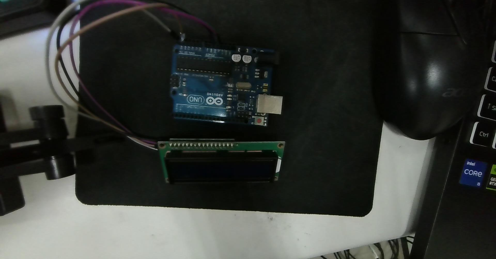

# 🛠️ Arduino IDE 開發環境教學與 I2C LCD 1602 實體硬體接線指南

> **參考實拍照**: `D:\CLASS_NOTE\ec\2026-10-01-145140.jpg` / [2026-10-01-145140.jpg](./2026-10-01-145140.jpg)  
> **對應 HTML 互動筆記**: [arduino_ide_i2c_lcd1602_guide.html](./arduino_ide_i2c_lcd1602_guide.html)  
> **建立時間**: 2026-10-01  
> **適用硬體**: Arduino Uno R3、LCD 1602 液晶模組（帶 PCF8574 I2C 轉接背板）  

---

## 📷 一、實際硬體接線照片解構 (Hardware Wiring)



### 🔌 1.1 實體 4-Pin 導線連接清單

在您的照片中，LCD 1602 背部焊接了一塊 **I2C 轉接板（PCF8574 背板）**，只引出 4 根引腳，透過 4 條杜邦線直接連接至 Arduino Uno：

| I2C 轉接板引腳 | 訊號功能 | Arduino Uno 對應腳位 | 接線說明與導線顏色建議 |
| :--- | :--- | :--- | :--- |
| **GND** | 電源負極（接地） | **GND** (POWER 排針) | 黑色或棕色線，接至電源排針的 GND |
| **VCC** | 模組電源正極 | **5V** (POWER 排針) | 紅色或紫色線，接至電源排針的 5V（請勿接 3.3V，對比度會不足） |
| **SDA** | 串列資料線 (Serial Data) | **類比 Pin A4** | 雙向資料傳輸（在 Uno 上，A4 與右上角 AREF 旁的 SDA 引腳內部相通） |
| **SCL** | 串列時脈線 (Serial Clock) | **類比 Pin A5** | 同步時脈傳輸（在 Uno 上，A5 與右上角 AREF 旁的 SCL 引腳內部相通） |

> [!NOTE]
> **為什麼 Uno 的 SDA 是 A4、SCL 是 A5？**  
> ATmega328P 微控制器的硬體 TWI（Two-Wire Interface / I2C）模組的內部物理線路就是硬體綁定在 Port C 的第 4 腳 (PC4 = SDA) 與第 5 腳 (PC5 = SCL)，也就是 Arduino 標示的 `A4` 與 `A5`。Arduino Uno R3 也在數位排針的最上方（AREF 旁邊）額外拉出兩個標示為 `SDA` 和 `SCL` 的孔位，兩者是完全相通的。

---

## 🖥️ 二、Arduino IDE 2.x 開發環境速成手冊

### 2.1 介面導覽與三大核心功能

1. **✔ 編譯 / 驗證 (Verify, `Ctrl + R`)**：
   - 檢查 C++ 語法是否有打錯、檢查 `#include` 函式庫是否存在，**只做編譯不燒錄**。
2. **➔ 上傳 (Upload, `Ctrl + U`)**：
   - 先自動執行編譯，編譯成功後透過 USB 序列埠將機器碼寫入 ATmega328P 晶片中。
3. **🔍 序列埠監視器 (Serial Monitor, `Ctrl + Shift + M`)**：
   - 右上角的放大鏡圖示。用於查看 Arduino 透過 `Serial.print()` 回傳的除錯文字，**視窗右下角鮑率（Baud Rate）必須與程式碼 `Serial.begin(9600)` 一致**。

---

### 2.2 上傳前的兩大必選設定（新手最常卡關點！）

在按下「➔ 上傳」前，必須確認 IDE 上方的下拉選單：
1. **開發板 (Board)**：選擇 `Arduino Uno`。
2. **通訊埠 (Port)**：
   - Windows 系統通常為 `COM3`、`COM4` 或 `COM5`（若拔掉 USB 線該選項會消失，重新插上出現的就是正確的埠）。
   - 若顯示 `COM1` 通常是主機板內建序列埠，**絕不是 Arduino**。

---

### 2.3 安裝必備函式庫：`LiquidCrystal_I2C`

1. 點擊 Arduino IDE 左側側邊欄的 **「書籍/函式庫圖示 (Library Manager)」**（快捷鍵 `Ctrl + Shift + I`）。
2. 在上方搜尋列輸入：`LiquidCrystal I2C`。
3. 找到由 **Frank de Brabander** 或 **Marco Schwartz** 維護的 **`LiquidCrystal I2C`** 函式庫。
4. 點選 **「INSTALL (安裝)」**，安裝完成後才能在程式中使用 `#include <LiquidCrystal_I2C.h>`。

---

## 📚 三、Arduino 程式庫（Library）的使用方法與核心重要性

### 3.1 什麼是 Arduino 程式庫 (Library)？
在寫程式時，軟體工程有一條黃金準則：「**不要重新發明輪子 (Don't reinvent the wheel)**」。
Arduino 程式庫本質上是由資深工程師或晶片原廠預先寫好的 **C/C++ 程式碼封裝包**：
- 它把底層極度繁雜的**微控制器暫存器配置（Register Manipulation）**、**通信協定訊號時序（如 I2C/SPI 脈衝切換）**以及**硬體控制邏輯**全部封裝隱藏起來。
- 只對外開放直覺、簡短的「高階 API 函式」，讓開發者用一句 `lcd.print("Hello")` 就能驅動硬體，而不需要自己寫幾百行電氣時序程式。

---

### 3.2 為什麼 Arduino 程式庫如此重要？（四大關鍵優勢）

1. **大幅降低學習與開發門檻（幾行搞定 vs 數百行）**：
   - **沒有程式庫時**：若要讓 I2C LCD 1602 亮起並顯示文字，你必須手動撰寫：
     - TWI/I2C 匯流排初始化、時脈暫存器設定 (TWBR/TWSR)。
     - 發送 START 條件、傳送 0x27 設備位址、監聽 ACK 響應。
     - 將 8-bit 字元拆成高 4 位與低 4 位，分別控制 PCF8574 的 P0~P7 引腳，並在 EN 腳精準產生正緣與負緣脈衝。
     - 至少需要寫 300~500 行繁複底層代碼，且極易出錯！
   - **有了程式庫後**：
     ```cpp
     #include <LiquidCrystal_I2C.h>
     LiquidCrystal_I2C lcd(0x27, 16, 2);
     void setup() {
       lcd.init();
       lcd.print("Hello!"); // 一行搞定！
     }
     ```
2. **極致的模組化與可重複利用性 (Reusability & Modularity)**：
   - 寫好一套感測器驅動，未來所有專案只需 `#include` 即可直接使用，邏輯清楚，避免重複造輪子。
3. **優異的硬體相容性與跨平台移植 (Hardware Abstraction)**：
   - 優質的程式庫具備硬體抽象層（HAL）。無論你是在標準 Arduino Uno (8-bit ATmega328P)、Mega (ATmega2560)，還是高效能的 ESP32、Raspberry Pi Pico (RP2040) 上運行，上層程式碼幾乎完全不需修改。
4. **全球開源社群生態系 (Open-Source Community)**：
   - Arduino 之所以能在全世界創客與工程教育中風靡，核心就在於全球數十萬開發者共享了海量的開源程式庫。不管是溫濕度感測器 (DHT22)、陀螺儀 (MPU6050)、WiFi 連網 (ESPAsyncWebServer) 還是液晶螢幕，幾乎任何市售零件都能在 1 分鐘內找到對應程式庫。

---

### 3.3 程式庫的內部組成解密（它是怎麼運作的？）

當你下載安裝一個 Arduino 程式庫時，其資料夾內部通常包含：
- **`xxx.h` (標頭檔 Header)**：定義了有哪些變數、常數和函式名稱（像是餐廳的菜單目錄）。
- **`xxx.cpp` (實作檔 Implementation)**：包含函式的具體 C++ 實作程式碼（廚師真正做菜的底層演算法）。
- **`keywords.txt`**：讓 Arduino IDE 辨識該程式庫的專屬關鍵字，使函式在編輯器中呈現橘色或藍色高亮。
- **`examples/` (範例資料夾)**：**學習程式庫最重要的地方！** 內含官方測試範例，可在 IDE 點選「檔案 ➔ 範例 ➔ [程式庫名稱]」直接開啟運行。

---

### 3.4 程式庫的三大安裝使用途徑

| 安裝途徑 | 適用情境 | 操作步驟 |
| :--- | :--- | :--- |
| **途徑 A：IDE 程式庫管理員 (最推薦)** | 官方與主流收錄的開源庫 | IDE 左側側邊欄點選「書籍圖示」(`Ctrl+Shift+I`) ➔ 輸入關鍵字 ➔ 點擊 **INSTALL**，IDE 自動下載並設定路徑。 |
| **途徑 B：匯入 .ZIP 壓縮檔** | 從 GitHub 下載的第三方新穎庫 | 在 IDE 上方選單：`草稿碼 (Sketch) ➔ 匯入程式庫 (Include Library) ➔ 加入 .ZIP 程式庫 (Add .ZIP Library...)` ➔ 選擇下載的 zip 檔。 |
| **途徑 C：手動放置資料夾** | 特殊或自製程式庫 | 解壓縮後將整包資料夾複製貼至電腦的 `我的文件/Arduino/libraries/` 目錄下，重新啟動 Arduino IDE 即可。 |

---

### 3.5 程式庫使用常見錯誤與除錯排查

1. **錯誤：`fatal error: LiquidCrystal_I2C.h: No such file or directory`**
   - **原因**：尚未安裝該程式庫，或檔名大小寫拼錯（C++ 對大小寫嚴格區分）。
   - **解決**：至 Library Manager 搜尋 `LiquidCrystal I2C` 安裝，並確認寫法為 `#include <LiquidCrystal_I2C.h>`。
2. **錯誤：`'class LiquidCrystal_I2C' has no member named 'xxx'`**
   - **原因**：安裝到了不同作者寫的同名函式庫。例如某些舊版本的 LCD 庫初始化函式叫 `lcd.begin()`，新版本叫 `lcd.init()`。
   - **解決**：確認使用的函式庫版本，或參考該程式庫提供的 `examples` 範例寫法。

---

## ⚠️ 四、實體硬體上機三大天坑與除錯秘訣（95% 初學者必看！）

如果程式已經上傳成功，但螢幕卻**什麼字都沒顯示**，請立刻檢查以下三點：

### 坑 1：I2C 設備位址不符（Tinkercad 是 0x20，實體通常是 0x27！）
- **Tinkercad 模擬器**中，PCF8574 預設將地址腳位全接地，位址為 `32`（即 `0x20`）。
- **市售實體模組**中，背板的 A0、A1、A2 三個位址焊點預設都是**懸空未焊接**：
  - 若晶片型號為 **PCF8574T**（晶片表面有印），預設位址是 **`0x27`**。
  - 若晶片型號為 **PCF8574AT**（型號帶 A），預設位址是 **`0x3F`**。
- **解法**：請先執行下文的 **I2C Scanner 程式**，立刻抓出真身！

---

### 坑 2：背部「藍色十字可變電阻」未調整（對比度過高/過低）
- 轉接板背後有一個**藍色方塊，中間有十字螺絲**（如圖）：
  - **對比度太低**：背光有亮，但字跡全透明，看起來像壞掉沒通電。
  - **對比度太高**：第一列顯示 16 個實心黑方塊。
- **解法**：拿小一字或十字起子，**順時針或逆時針慢慢旋轉**，直到黑方塊變淡、清晰英文字母浮現為止！

---

### 坑 3：背光跳線帽（Jumper Cap）鬆脫
- 轉接板邊緣有兩根排針，上面插著一個黑色或黃色的**小跳線帽**。
- 這是 LCD 背光 LED 的硬體通電開關，如果它掉落或遺失，螢幕背景燈就不會亮，畫面會非常暗。

---

## 🚀 五、實體驗證兩部曲（程式碼清單）

### 步驟 1：燒錄「I2C Scanner (位址自動掃描器)」
先確認實體硬體連線是否正常，並取得正確的十六進制位址：

```cpp
#include <Wire.h>

void setup() {
  Wire.begin();
  Serial.begin(9600);
  while (!Serial); // 等待序列埠連線
  Serial.println(F("\n================================="));
  Serial.println(F("🔍 I2C 匯流排位址自動掃描開始..."));
  Serial.println(F("================================="));
  
  byte count = 0;
  for (byte address = 1; address < 127; address++) {
    Wire.beginTransmission(address);
    byte error = Wire.endTransmission();

    if (error == 0) {
      Serial.print(F("✅ 找到 I2C 裝置！位址為: 0x"));
      if (address < 16) Serial.print("0");
      Serial.println(address, HEX);
      count++;
    } else if (error == 4) {
      Serial.print(F("⚠️ 位址 0x"));
      if (address < 16) Serial.print("0");
      Serial.println(address, HEX);
      Serial.println(F(" 發生不明錯誤"));
    }
  }

  if (count == 0) {
    Serial.println(F("❌ 未找到任何 I2C 裝置！請檢查 5V/GND/SDA/SCL 接線。"));
  } else {
    Serial.print(F("🎉 掃描完成！共找到 "));
    Serial.print(count);
    Serial.println(F(" 個裝置。"));
  }
}

void loop() {
  // 掃描完畢靜止
}
```

> **預期輸出範例**：
> ```
> =================================
> 🔍 I2C 匯流排位址自動掃描開始...
> =================================
> ✅ 找到 I2C 裝置！位址為: 0x27
> 🎉 掃描完成！共找到 1 個裝置。
> ```

---

### 步驟 2：燒錄「實體 LCD 1602 顯示測試程式」
將掃描到的位址（例如 `0x27`）填入第 4 行：

```cpp
#include <Wire.h>
#include <LiquidCrystal_I2C.h>

// ⚠️ 若剛才 Scanner 掃出來是 0x3F 或 0x20，請將 0x27 改為該位址
LiquidCrystal_I2C lcd(0x27, 16, 2);

void setup() {
  // 1. 初始化 LCD
  lcd.init();
  
  // 2. 開啟 LCD 背光
  lcd.backlight();

  // 3. 游標移至第 0 列第 0 格 (第一行)
  lcd.setCursor(0, 0);
  lcd.print("Arduino Uno I2C");

  // 4. 游標移至第 1 列第 0 格 (第二行)
  lcd.setCursor(0, 1);
  lcd.print("LCD 1602 Ready!");
}

void loop() {
  // 靜態文字展示
}
```

---

## 🎯 六、後續結合 PIR 與繼電器（回顧 Stage 3）

當 LCD 1602 測試成功顯示文字後，即可插上其餘兩組元件：
1. **PIR 人體感測器**：
   - 訊號線（SIG）接 **Pin 8**
   - VCC 接 **5V**，GND 接 **GND**
2. **繼電器模組 (Relay)**：
   - 控制端（IN）接 **Pin 4**
   - VCC 接 **5V**，GND 接 **GND**
3. 搭配先前設計的狀態切換程式：
   - 待機時顯示：`"DECT...."`
   - 感應移動時顯示：`"Warning"` 並驅動繼電器開燈
   - 人員離開 5 秒後熄燈並自動切換回待機！
