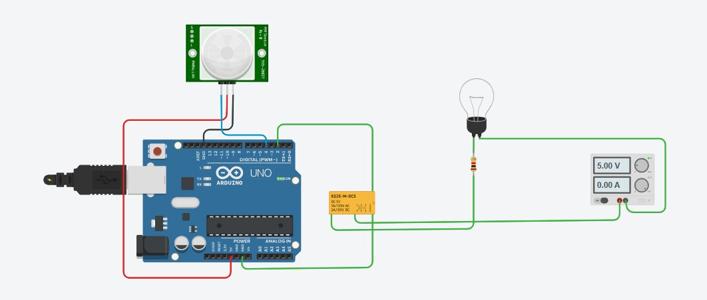
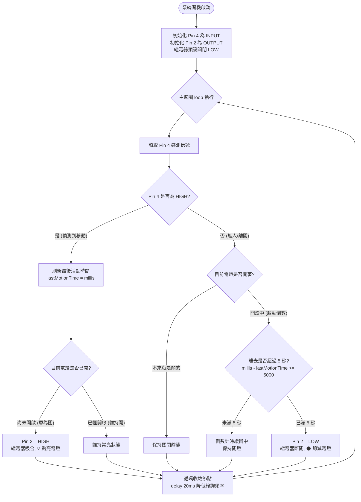

# 💡 Arduino 紅外線人體感測器 (Pin 4) 與繼電器 (Pin 2) 延遲 5 秒照明控制系統

> **最後更新時間**: 2026-09-26 23:01:05 (UTC+8)  
> **使用模型**: Claude Opus 5.5 (claude-opus-5-5)  
> **執行 Agent**: Claude Code  

---

## 📖 系統導論與電路規格 (Tinkercad Circuits)

在自動節能走廊燈、玄關感應燈與公共洗手間照明設計中，「**人來燈亮、人走後延遲 5 秒自動熄滅**」是最標準且實用的數位控制場景。

本專案依據使用者的實驗電路設計，使用 **Arduino Uno R3** 微控制器，將 **PIR 紅外線人體動態感測器** 連接至 **Pin 4** 作為輸入觸發端，將 **小型電磁繼電器（KS2E-M-DC5）** 連接至 **Pin 2** 作為負載開關輸出端，控制獨立電源回路中的負載燈泡。

---

### 📷 系統接線實驗截圖



#### 🔌 引腳接線對照清單 (Wiring Pinout)
* **PIR 人體紅外線感測器 (Parallax / HC-SR501 模組)**：
  * **VCC (紅線)** ──► 接 Arduino `5V`
  * **GND (黑線)** ──► 接 Arduino `GND`
  * **OUT / Signal (藍線)** ──► 接 Arduino 數位引腳 **`Pin 4`** (`INPUT`)
* **繼電器線圈控制側 (KS2E-M-DC5)**：
  * **Coil (+) (綠線)** ──► 接 Arduino 數位引腳 **`Pin 2`** (`OUTPUT`)
  * **Coil (-) (綠線)** ──► 接 Arduino `GND`
* **受控負載燈泡側 (外部獨立回路)**：
  * 直流電源供應器 ($5.00\text{V}$) 正極 ──► 串聯燈泡 ──► 限流電阻 ──► 繼電器 **COM (共同端)**
  * 繼電器 **NO (常開端)** ──► 直流電源供應器負極 (GND)

---

## 🔬 一、核心控制邏輯與時序機制 (Core Concepts)

### 1.1 四大核心行為準則
1. **即時觸發開燈（Immediate Activation）**：  
   當人體進入感測範圍時，PIR 感測器輸出高電位（Pin 4 = `HIGH`），系統在數毫秒內將 Pin 2 拉至 `HIGH`，驅動繼電器銜鐵吸合（COM-NO 導通），電燈瞬間點亮。
2. **持續活動刷新計時（Continuous Retriggering）**：  
   當人持續在感應範圍內活動時（Pin 4 保持 `HIGH`），系統持續刷新最後活動時間戳記 `lastMotionTime = millis()`，電燈維持常亮，不熄滅。
3. **離去精確延遲關燈（Off Delay 5 Seconds）**：  
   當人離開感應範圍後，PIR 訊號轉為低電位（Pin 4 = `LOW`）。系統啟動 **5 秒（5000ms）** 倒數計時。若 5 秒內無人再次經過，確認倒數逾時，Pin 2 轉為 `LOW`，繼電器釋放斷開，電燈熄滅。（注意：HC-SR501 本身有硬體保持時間，最短約 3 秒、可用旋鈕調長；人離開後 OUT 要等保持時間結束才轉為 LOW，因此實際熄燈時間 ≈ 硬體保持時間 + 5 秒。）
4. **防閃爍中途回跳（Anti-Flickering）**：  
   若在 5 秒倒數期間（例如第 3 秒）人突然折返或再次有活動，系統立即捕捉到 Pin 4 轉為 `HIGH`，自動撤銷關燈倒數並重新刷新計時戳記，徹底避免電燈頻繁啟閉閃爍。

---

### 1.2 為什麼必須採用 `millis()` 非阻塞式架構？

* 若使用初學者常見的 `delay(5000)`：
  ```cpp
  // ❌ 錯誤/劣質寫法：主迴圈完全被卡死 5 秒
  if (digitalRead(4) == LOW) {
      delay(5000); // 這 5 秒內 Arduino 宛如當機，無法接收任何新輸入！
      digitalWrite(2, LOW);
  }
  ```
  當人在第 2 秒折返走動時，因 CPU 被 `delay()` 卡死，無法讀取到新的動態訊號，燈泡仍然會在第 5 秒硬生生熄滅，造成極差的使用者體驗。
* 採用 **`millis()` 時間戳記比對**：  
  主迴圈不會被卡住（本例每圈含 `delay(20)`，約每 20 ms 輪詢一次、每秒約 50 次），既能在人離開後執行 5 秒倒數，又能在約 20 ms 內捕捉到人員重新進入的事件。

---

## 💻 二、程式邏輯流程圖與實作程式碼 (Code)

### 2.1 系統邏輯流程圖 (Mermaid Flowchart，無交叉走線架構)

在撰寫程式前，以下流程圖採用**左右平行雙分支**與**底部單一匯流收斂設計**，由上至下依序執行，徹底消除線條交錯糾纏：



---

### 2.2 工業級標準非阻塞程式碼 (推薦實務採用)

```cpp
/**
 * @file arduino_pir_relay_delay5s.ino
 * @brief Arduino PIR 人體感測器 (Pin 4) 控制繼電器 (Pin 2) 延遲 5 秒關燈程式
 * @note 採用非阻塞 millis() 狀態機架構，具備活動持續刷新與中途回跳防閃爍機制
 */

// 引腳定義 (嚴格對應使用者電路接線)
const int PIR_PIN   = 4; // 紅外線感測器信號輸出 (OUT)
const int RELAY_PIN = 2; // 繼電器控制輸入 (IN / Coil)

// 時間常數定義
const unsigned long OFF_DELAY_TIME = 5000; // 人離開後的關燈延遲時間 (5000毫秒 = 5秒)

// 系統狀態變數
unsigned long lastMotionTime = 0; // 記錄最後一次偵測到動態的時間戳 (毫秒)
bool lightState = false;          // 記錄當前電燈狀態 (true: 開燈 / false: 關燈)
int lastPirReading = LOW;         // 記錄前一次 PIR 讀數，用於事件邊緣觸發提示

void setup() {
    // 啟用序列埠監控 (鮑率 9600 bps)，便於除錯與即時觀測
    Serial.begin(9600);
    Serial.println(F("=================================================="));
    Serial.println(F("💡 Arduino PIR (Pin 4) + 繼電器 (Pin 2) 延遲照明系統啟動"));
    Serial.println(F("=================================================="));

    // 設定引腳模式
    pinMode(PIR_PIN, INPUT);
    pinMode(RELAY_PIN, OUTPUT);

    // 初始狀態：預設關閉繼電器，確保開機安全
    digitalWrite(RELAY_PIN, LOW);
    lightState = false;

    Serial.println(F("[系統狀態] 系統就緒，電燈初始為關閉 (Pin 2 = LOW)；PIR 模組上電後約需 30~60 秒暖機，期間可能誤觸發"));
}

void loop() {
    unsigned long currentMillis = millis(); // 取得目前系統開機毫秒數
    int pirValue = digitalRead(PIR_PIN);   // 讀取 Pin 4 紅外線感測信號 (HIGH / LOW)

    // --- 1. 感測器狀態變化事件監控輸出 ---
    if (pirValue != lastPirReading) {
        if (pirValue == HIGH) {
            Serial.println(F("\n[事件觸發] 🚨 偵測到人體移動！(Pin 4 = HIGH)"));
        } else {
            Serial.println(F("\n[事件觸發] 🍃 人已離開感應範圍 (Pin 4 = LOW)，啟動 5 秒倒數關燈計時..."));
        }
        lastPirReading = pirValue;
    }

    // --- 2. 核心邏輯處理 ---
    if (pirValue == HIGH) {
        // 【情況 A：有人在感應範圍內】
        lastMotionTime = currentMillis; // 持續刷新活動時間基準

        if (!lightState) {
            // 原本是關燈狀態 ──► 立即開燈
            digitalWrite(RELAY_PIN, HIGH);
            lightState = true;
            Serial.println(F("[動作執行] ⚡ 繼電器吸合 (Pin 2 = HIGH) ──► 💡 電燈已點亮"));
        }
    } else {
        // 【情況 B：無人 (Pin 4 = LOW)】
        if (lightState) {
            // 目前電燈仍開著，判斷是否超過 5 秒
            unsigned long elapsedTime = currentMillis - lastMotionTime;

            if (elapsedTime >= OFF_DELAY_TIME) {
                // 已超過 5 秒 ──► 正式關閉電燈
                digitalWrite(RELAY_PIN, LOW);
                lightState = false;
                Serial.println(F("[動作執行] ⏰ 延遲 5 秒已滿！繼電器釋放 (Pin 2 = LOW) ──► 🌑 電燈已熄滅"));
            } else {
                // 還在 5 秒倒數計時中，每秒印出一次剩餘秒數
                static unsigned long lastLogTime = 0;
                if (currentMillis - lastLogTime >= 1000) {
                    lastLogTime = currentMillis;
                    unsigned long remainingSeconds = (OFF_DELAY_TIME - elapsedTime + 999) / 1000;
                    Serial.print(F("[倒數計時] 關燈倒數中... 剩餘: "));
                    Serial.print(remainingSeconds);
                    Serial.println(F(" 秒"));
                }
            }
        }
    }

    delay(20); // 微幅延遲 20ms，降低輪詢頻率 (PIR 模組輸出已是穩定數位訊號，此處並非嚴格意義的消抖)
}
```

---

### 2.3 簡易版程式碼 (適合新手快速體驗)

若僅用於簡單教學展示，亦可使用直觀的條件判斷式：

```cpp
/**
 * @file arduino_pir_relay_simple.ino
 * @brief 簡易版 PIR 控制繼電器程式 (含 5 秒延遲)
 */

void setup() {
    pinMode(4, INPUT);  // Pin 4 連接 PIR 感測器
    pinMode(2, OUTPUT); // Pin 2 連接 繼電器
    digitalWrite(2, LOW);
}

void loop() {
    if (digitalRead(4) == HIGH) {
        digitalWrite(2, HIGH); // 偵測到人體，開燈
    } else {
        delay(5000);          // 無人時等待 5 秒
        digitalWrite(2, LOW);  // 5 秒後關燈
    }
}
```

---

## ⚠️ 三、工程防護重要提醒 (重要安全性考量)

在 Tinkercad 模擬中，雖然能直接將 Pin 2 接到繼電器線圈端，但在**實體真實電路**中請務必遵循以下工程防護規範：
1. **電晶體開關驅動**：微控制器 GPIO 輸出電流有限（建議 $\le 20\text{mA}$），直接推動線圈易燒毀 MCU 引腳。建議在 Pin 2 與線圈之間加入 **NPN 電晶體（2N2222，基極串聯 1kΩ 電阻）** 作為低側開關。
2. **並聯續流二極體（1N4007）**：線圈斷開時會產生極高反向感應電動勢（Back-EMF），必須在線圈兩端**反向並聯 1N4007 續流二極體**以箝制斷電瞬間的高壓感應突波（保護驅動電晶體與 MCU）。
3. **或直接選用商用 5V 繼電器模組**：市售 Arduino 繼電器模組通常板載 **驅動電晶體** 與 **續流二極體**，部分型號另有 **光耦合器 (PC817)**（購買前請確認規格），可直接以 Pin 2 安全推動。

---

## 📝 提示詞歷史與變更記錄 (Prompt Archive)

### 🔹 [2026-09-24 14:25:34] [Gemini 3.8 Flash / Antigravity] 變更紀錄
- **模型/Agent**: Gemini 3.8 Flash / Antigravity
- **Prompt 原文**:
  ```text
  C:\Users\User\Desktop\pir0924.jpg 寫一個arudino的程式， 人體紅外線感應器 pin 4, 繼電器 pin2, 人體紅外線感應器偵測到移動，繼電器開啟電燈，離開後延遲5秒
  ```
- **變更摘要**: 依據使用者提供的電路接線截圖（PIR 接 Pin 4，繼電器接 Pin 2），建立專題筆記 `arduino_pir_relay_delay.md` 與 `arduino_pir_relay_delay.html`，設計工業級非阻塞式 `millis()` 控制程式，具備 5 秒精確離去倒數、持續刷新與防閃爍回跳機制，繪製 Mermaid 邏輯流程圖與實體接線對照清單。

### 🔹 [2026-09-24 14:36:35] [Gemini 3.8 Flash / Antigravity] 變更紀錄
- **模型/Agent**: Gemini 3.8 Flash / Antigravity
- **Prompt 原文**:
  ```text
  流程圖的走線盡量不要交叉
  ```
- **變更摘要**: 重構 Mermaid 流程圖結構，採用平行左右雙分支（左側偵測移動開燈/維持、右側離開計時/關閉）向下推進，並匯流至底部單一循環收斂節點（delay 20ms）後以單一外環回繞主迴圈，徹底消除流程圖中的線條交錯糾纏，實現平面化無交叉走線。

### 🔹 [2026-09-26 23:01:05] [Claude Opus 5.5 (claude-opus-5-5) / Claude Code] 變更紀錄
- **模型/Agent**: Claude Opus 5.5 (claude-opus-5-5) / Claude Code
- **Prompt 原文**:
  ```text
  檢視所有檔案內容中的敘述與說明，確認概念與敘述的正確性
  修正後，將修改內容，附加在每個檔案的最下方區塊並標誌時間戳記與模型代號
  確認概念與解釋說明都是正確的
  ```
- **變更摘要**: 全面檢視概念與敘述正確性並修正：
  - 修正「主迴圈每秒數萬次、1 毫秒內捕捉」：程式含 delay(20)，實際約每 20 ms 輪詢一次
  - delay(20) 非嚴格意義的消抖，改述為降低輪詢頻率（程式註解與流程圖同步修正）
  - 補充 HC-SR501 硬體保持時間：實際熄燈時間 ≈ 硬體保持時間 + 5 秒；開機訊息改為提示 30~60 秒暖機
  - 續流二極體作用改述為箝制高壓感應突波；市售繼電器模組「必定內建光耦」改為「部分型號才有」
