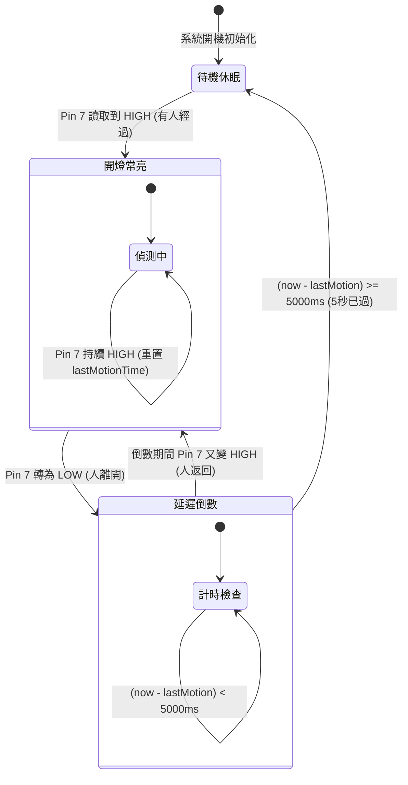

# 💡 Arduino 紅外線人體感測 (PIR) 與繼電器延遲照明控制系統

> **最後更新時間**: 2026-09-22 14:52:00 (UTC+8)  
> **使用模型**: Gemini 3.8 Flash  
> **執行 Agent**: Antigravity  

---

## 📖 系統導論與規格需求

在現代智慧建築、走廊照明與自動節能開關設計中，「**人來燈亮、人走延遲熄滅**」是最經典且實用的自動化控制情境。

本專案使用 **Arduino** 控制板，搭配常見的紅外線人體感測器（如 HC-SR501 PIR 或數位紅外線感測模組）與電磁繼電器模組（Relay Module），實現安全、穩定且人性化的電燈自動控制系統。

### 📌 系統接線與功能規格
* **感測器輸入 (Pin 7)**：連接紅外線感測器訊號輸出腳位（OUT / Signal）。當感測到人體移動時輸出高電位（HIGH），無人時輸出低電位（LOW）。
* **繼電器輸出 (Pin 8)**：連接繼電器控制腳位（IN），透過繼電器內部開關控制 AC 110V/220V 或 DC 12V 燈具電源。
* **核心行為邏輯**：
  1. **即時開燈**：只要感測器偵測到有人經過（Pin 7 = HIGH），立即驅動繼電器閉合點亮電燈。
  2. **持續刷新（Retriggering）**：當人在感應範圍內持續活動時，燈光保持常亮，並持續重置倒數計時。
  3. **延遲關燈（Off Delay 5s）**：當人離開感應範圍後（Pin 7 轉為 LOW），系統啟動 5 秒倒數計時；5 秒內若無人再度進入，則斷開繼電器熄滅電燈。
  4. **中途回跳（Anti-flicker）**：若在 5 秒倒數期間人再次經過，立即重置倒數並維持開燈，徹底避免頻繁啟閉閃爍。

---

## 🔬 一、核心概念剖析 (Core Concepts)

```
                       ┌──────────────────────────────┐
                       │   人體移動 (9~10μm 紅外線)    │
                       └──────────────┬───────────────┘
                                      │
                                      ▼
                       ┌──────────────────────────────┐
                       │   被動紅外感測器 (HC-SR501)    │
                       │   菲涅耳透鏡 + 熱釋電元件      │
                       └──────────────┬───────────────┘
                                      │ 數位信號 (TTL 5V/0V)
                                      ▼
┌─────────────────────────────────────────────────────────────┐
│ Arduino 微控制器 (Pin 7 讀取 / Pin 8 控制)                  │
│                                                             │
│   [Pin 7 HIGH] ──► 開燈 ──► 刷新計時時間戳 lastMotionTime    │
│   [Pin 7 LOW]  ──► 判斷 (millis() - lastMotionTime >= 5000) │
│                      │                                      │
│                      ├─► 未滿 5 秒：保持開燈 (倒數中)        │
│                      └─► 已滿 5 秒：關閉繼電器 (Pin 8 斷開)   │
└──────────────────────────────┬──────────────────────────────┘
                               │ 控制信號 (IN)
                               ▼
                       ┌──────────────────────────────┐
                       │ 電磁繼電器模組 (光耦隔離)    │
                       └──────────────┬───────────────┘
                                      │ 接點導通 (COM - NO)
                                      ▼
                       ┌──────────────────────────────┐
                       │   交流/直流照明燈具 (Light)   │
                       └──────────────────────────────┘
```

### 1.1 被動式紅外線感測器 (PIR, Passive Infrared Sensor) 運作原理

人體或溫血動物的正常體溫約為 $36^\circ\text{C} \sim 37^\circ\text{C}$（約 $309.15\text{ K} \sim 310.15\text{ K}$）。根據維恩位移定律（Wien's Displacement Law）：

$$\lambda_{max} = \frac{b}{T} \approx \frac{2.8977 \times 10^{-3}\text{ m}\cdot\text{K}}{310\text{ K}} \approx 9.35\,\mu\text{m}$$

人體表面輻射出的熱紅外線能量峰值落在中紅外光譜區間（約 $8 \sim 14\,\mu\text{m}$）。

#### (1) 熱釋電晶體與雙元件差動結構
* PIR 感測器內部封裝了一組具有**熱釋電效應（Pyroelectric Effect）**的晶體（如鈦酸鉛鋯 PZT 或硫酸三甘氨酸 TGS）。當溫度發生微弱動態變化時，晶體表面電荷平衡被打破，釋放出微弱的微安級電流。
* 為避免環境環境氣溫起伏、太陽光散射造成的誤報，PIR 感測頭採用**雙差動元件（Dual-element Differential）**設計。當環境整體均勻受熱時，兩元件感應電壓相互抵消；唯有當移動目標依序穿過兩元件的視場時，才會產生一正一負的交變電壓脈衝。

#### (2) 菲涅耳透鏡 (Fresnel Lens) 聚光與分區
感測頭外層的白色半球形塑膠外殼即為菲涅耳透鏡。它透過等距同心圓刻痕，在超薄結構下將周邊空間分割成數十個交替排列的**敏感區（Active Zones）**與**盲區（Blind Zones）**。人體移動時連續切換明暗感應帶，大幅增強差動檢測靈敏度，有效感應距離可達 5~7 公尺，視角約 100°~120°。

#### (3) 模組跳線設定 (HC-SR501)
* **不可重複觸發 (L 模式)**：感測到人後輸出 HIGH，經過預設硬體延遲後強制降為 LOW，即使人在範圍內也不重新延長。
* **可重複觸發 (H 模式，推薦)**：感測到人後輸出 HIGH，只要範圍內持續有活動，輸出將持續維持 HIGH，直到最後一次動態停止後才開始計算硬體延遲。在微控制器專案中，通常建議將 HC-SR501 硬體延遲旋鈕調至最短（約 2.5~3 秒），跳線設為 H，並將精準的 5 秒關閉邏輯交由 Arduino 軟體掌控。

---

### 1.2 電磁繼電器 (Electromagnetic Relay) 驅動與隔離架構

微控制器（MCU）如 ATmega328P 的 I/O 腳位輸出電壓僅為 5V，最大安全推動電流約為 20mA，無法直接驅動需要數百毫安培電流的電磁線圈，更嚴禁直接接觸 AC 110V/220V 市電。

#### (1) 光耦隔離 (Optocoupler Isolation)
標準繼電器模組板載 PC817 光電耦合器，Arduino 輸出訊號僅負責點亮光耦內部的紅外發光二極體，藉由光訊號觸發次級側的光敏三極管，實現**控制端（弱電 DC 5V）與功率端（強電 AC 110V）在電氣上的完全隔離（Galvanic Isolation）**，防止負載端的突波或火花雜訊反灌燒毀 Arduino。

#### (2) 反馳續流二極體 (Flyback Diode)
繼電器線圈為典型電感負載（Inductive Load）。根據法拉第電磁感應定律，當控制端電晶體由導通切換至截止瞬間，線圈內部電流急遽下降（$\frac{di}{dt} \to -\infty$），產生反向感應高電壓：

$$V_{back} = -L \frac{di}{dt}$$

該突波峰值可高達數百伏特。模組板載並聯一顆反馳二極體（通常為 1N4148 或 1N4007），提供線圈能量洩放迴路，保護驅動三極管不被擊穿。

#### (3) 常開 (NO) vs 常閉 (NC)
* **COM (Common)**：公共端接點，接電源火線（Live Wire）輸入。
* **NO (Normally Open)**：常開接點。未激磁時與 COM 斷開，激磁吸合時導通。**電燈控制必須接於 COM 與 NO 之間**，確保未觸發或斷電時燈具呈關閉狀態，符合用電安全規範。
* **NC (Normally Closed)**：常閉接點。未激磁時導通，激磁時斷開。

---

### 1.3 微控制器非阻塞時序控制 (Non-blocking Time Management)

在初學者程式中，常直接使用 `delay(5000)` 來實現延遲，但在工業級或實務應用中，這是極其嚴重的缺陷：

| 評比項目 | 阻塞式 `delay(5000)` | 非阻塞式 `millis()` 狀態機 |
| :--- | :--- | :--- |
| **CPU 狀態** | 處於忙等待（Busy Wait），時鐘空轉 5000ms | 每次迴圈執行時間小於 10 微秒，CPU 自由 |
| **動態響應** | 延遲期間**無法偵測任何輸入**，無法及時中斷或重置 | 隨時都在讀取 Pin 7，人再度進來可立刻刷新計時 |
| **多工擴充性** | 無法同時運行串口通訊、LED 閃爍、按鈕中斷 | 可輕鬆擴充數十個並行任務（感測、通訊、顯示） |
| **溢位安全性** | 無溢位問題但系統僵死 | 利用無符號整數減法，安全運作超過 49.7 天 |

#### 溢位數學證明 (Rollover Arithmetic)
Arduino 的 `millis()` 函式返回 32 位元無符號長整數（`unsigned long`），最大值為 $2^{32}-1 = 4,294,967,295\text{ ms} \approx 49.71\text{ 天}$。  
當達到最大值後會歸零（Rollover）。在 C/C++ 規範中，無符號整數溢位為良定義模運算（Modulo $2^{32}$）：

$$\Delta t = (t_{current} - t_{last}) \pmod{2^{32}}$$

即使 $t_{current}$ 已經翻轉為很小的數（如 10），而 $t_{last}$ 為 $4,294,967,200$，其差值在 `unsigned long` 下計算仍精準為 $10 - 4,294,967,200 \equiv 106\text{ ms}$，因此程式**永遠不會因為溢位而發生邏輯死鎖**。

---

## 🛠️ 二、實作與應用範例 (Practical Examples)

### 2.1 硬體接線定義表 (Wiring Pinout)

| 模組元件 | 模組標記腳位 | Arduino 腳位 / 電源 | 說明 |
| :--- | :--- | :--- | :--- |
| **PIR 感測器 (HC-SR501)** | VCC | 5V | 工作電源正極 (4.5V~12V) |
| | GND | GND | 電源接地共用端 |
| | OUT | **Pin 7** | 數位輸出信號 (HIGH=偵測到人 / LOW=無人) |
| **繼電器模組 (1-Channel Relay)** | VCC | 5V | 繼電器線圈與光耦電源 |
| | GND | GND | 電源接地共用端 |
| | IN | **Pin 8** | 繼電器觸發信號輸入 |
| **負載端 (電燈迴路)** | COM | AC 110V 火線 (L) | 市電輸入端（經過保險絲） |
| | NO | 燈具輸入端 (L) | 常開接點，吸合時供電 |
| | 燈具中性線 (N) | AC 110V 水線 (N) | 直接回接電源中性線 |

> ⚠️ **安全警告**：接駁 AC 110V/220V 市電具致命危險，配線前務必拔除總電源插頭。若於實驗室初次測試，強烈建議先以 **DC 12V LED 燈泡** 或 **Arduino 內建 LED (Pin 13)** 作為負載模擬！

---

### 2.2 完整生產級 Arduino 程式碼 (非阻塞式 `millis()` 狀態機)

以下為最佳實踐程式碼，具備狀態顯示、非阻塞倒數、自動重置防閃爍與 Serial Monitor 輸出功能：

```cpp
/**
 * ============================================================================
 * 專案名稱: Arduino PIR 人體感測與繼電器延遲照明控制系統
 * 腳位配置:
 *   - Pin 7 : PIR 紅外線感測器 (HC-SR501 OUT)
 *   - Pin 8 : 繼電器模組信號輸入端 (Relay IN)
 *   - Pin 13: 內建狀態指示燈 (與電燈開關同步)
 * 控制邏輯:
 *   - 感應到人體移動 -> 燈開，重置計時
 *   - 人離開後 -> 維持亮燈，開始 5 秒倒數
 *   - 倒數期間若有人再次進入 -> 重置計時維持常亮
 *   - 5 秒倒數結束且無人 -> 關閉繼電器熄滅電燈
 * ============================================================================
 */

// --------------------------- 硬體腳位常數定義 ---------------------------
const uint8_t PIR_PIN   = 7;    // 紅外線感測器輸入腳位
const uint8_t RELAY_PIN = 8;    // 繼電器控制輸出腳位
const uint8_t LED_PIN   = 13;   // 板載指示燈 (方便無接繼電器時觀察)

// --------------------------- 繼電器電平設定 ---------------------------
// 提示: 市售繼電器模組多為「低電平觸發」(Active LOW) 或「高電平觸發」(Active HIGH)
// 若您的繼電器通電時亮、斷電時熄滅，請切換以下常數設定:
const uint8_t RELAY_ON  = LOW;  // 大多數光耦模組 LOW 為吸合導通 (若為高電平觸發請改 HIGH)
const uint8_t RELAY_OFF = HIGH; // 斷開關閉 (若為高電平觸發請改 LOW)

// --------------------------- 系統延遲常數 ---------------------------
const unsigned long OFF_DELAY_TIME = 5000UL; // 離開後延遲關閉時間: 5000 毫秒 (5 秒)

// --------------------------- 狀態變數 ---------------------------
bool lightState = false;                     // 目前電燈/繼電器狀態 (true=開燈, false=關燈)
unsigned long lastMotionTime = 0;            // 最後一次感應到人體的時間戳記 (millis)
int lastPirReading = LOW;                    // 前一次感測器讀值 (用於偵測邊緣變化)

void setup() {
    // 初始化序列埠通訊，波特率 115200 bps
    Serial.begin(115200);
    while (!Serial) { ; } // 等待串口連接 (適用 Leonardo/Micro，Uno 可跳過)

    Serial.println(F("=================================================="));
    Serial.println(F("⚡ Arduino PIR 紅外線感應繼電器電燈控制系統啟動 ⚡"));
    Serial.println(F("延遲關閉時間設定: 5 秒 (5000ms)"));
    Serial.println(F("=================================================="));

    // 設定腳位模式
    pinMode(PIR_PIN, INPUT);
    pinMode(RELAY_PIN, OUTPUT);
    pinMode(LED_PIN, OUTPUT);

    // 初始狀態：預設關閉繼電器與指示燈
    digitalWrite(RELAY_PIN, RELAY_OFF);
    digitalWrite(LED_PIN, LOW);
    lightState = false;

    // PIR 感測器開機穩定等待提示 (HC-SR501 通常需要 30 秒暖機)
    Serial.println(F("📌 注意: PIR 感測器開機可能需要約 10~30 秒進行環境校準..."));
}

void loop() {
    // 1. 取得當前微控制器運行時間戳記
    unsigned long currentMillis = millis();

    // 2. 讀取紅外線感測器狀態 (HIGH: 偵測到人, LOW: 無人)
    int pirValue = digitalRead(PIR_PIN);

    // 3. 狀態變化偵測 (印出偵測訊息至 Serial Monitor)
    if (pirValue != lastPirReading) {
        if (pirValue == HIGH) {
            Serial.println(F("[感應事件] 🚨 偵測到人體移動！"));
        } else {
            Serial.println(F("[感應事件] 🍃 人已離開感測範圍，啟動 5 秒倒數計時..."));
        }
        lastPirReading = pirValue;
    }

    // 4. 核心開關與計時邏輯
    if (pirValue == HIGH) {
        // --- 情況 A: 感應範圍內有人 ---
        lastMotionTime = currentMillis; // 持續刷新活動時間戳記

        // 若燈目前尚未開啟，立刻開燈
        if (!lightState) {
            digitalWrite(RELAY_PIN, RELAY_ON);
            digitalWrite(LED_PIN, HIGH);
            lightState = true;
            Serial.println(F("[電源控制] 💡 電燈已點亮 (繼電器閉合)"));
        }
    } else {
        // --- 情況 B: 感測器無人 (LOW) ---
        // 檢查是否處於亮燈狀態，並判斷是否已超過 5 秒
        if (lightState) {
            unsigned long elapsedTime = currentMillis - lastMotionTime;

            if (elapsedTime >= OFF_DELAY_TIME) {
                // 超過 5 秒，正式關燈
                digitalWrite(RELAY_PIN, RELAY_OFF);
                digitalWrite(LED_PIN, LOW);
                lightState = false;
                Serial.println(F("[電源控制] 🌑 延遲 5 秒已滿，電燈熄滅 (繼電器斷開)"));
            } else {
                // 尚未超時，每秒印出一次剩餘秒數 (非必要除錯輸出)
                static unsigned long lastLogTime = 0;
                if (currentMillis - lastLogTime >= 1000) {
                    lastLogTime = currentMillis;
                    unsigned long remaining = (OFF_DELAY_TIME - elapsedTime + 999) / 1000;
                    Serial.print(F("[倒數計時] 關燈倒數中... 剩餘: "));
                    Serial.print(remaining);
                    Serial.println(F(" 秒"));
                }
            }
        }
    }

    // 短暫微休 10ms，降低 CPU 緊密空轉負擔並具有簡易消抖 (debounce) 效果
    delay(10);
}
```

---

### 2.3 初學者對照版程式碼 (阻塞式 `delay()` 寫法及限制說明)

初學者往往會寫出如下程式，雖然能達成基本功能，但其缺陷顯著：

```cpp
// ⚠️ 初學者簡易寫法 (不推薦用於實際產品)
const int pirPin = 7;
const int relayPin = 8;

void setup() {
    pinMode(pirPin, INPUT);
    pinMode(relayPin, OUTPUT);
    digitalWrite(relayPin, HIGH); // 預設關閉
}

void loop() {
    if (digitalRead(pirPin) == HIGH) {
        digitalWrite(relayPin, LOW); // 開燈
        
        // 持續等待直到人離開
        while (digitalRead(pirPin) == HIGH) {
            delay(100); // 人還在範圍內時持續停留
        }
        
        // 人離開後延遲 5 秒關燈
        delay(5000); // ❌ 缺點: 這 5 秒內若人又走回來，系統完全瞎掉，5 秒一到必然強制熄滅閃爍一次！
        digitalWrite(relayPin, HIGH); // 關燈
    }
}
```

* **缺點比較**：在上述寫法中，`delay(5000)` 期間 Arduino **完全無法讀取 Pin 7**。如果人在第 2 秒折返回來，燈依然會在第 5 秒強制熄滅，造成燈光閃爍、繼電器頻繁跳脫磨損，體驗極差。採用前述 2.2 節的 `millis()` 架構則能完美消除此問題。

---

### 2.4 系統狀態轉移圖 (Mermaid State Diagram)



---

## 🚀 三、延伸思考與進階主題 (Extensions & Advanced Topics)

### 3.1 靈敏度與 CDS 光敏電阻晝夜控制擴充 (Day/Night Light Sensor)

在實際走廊或陽台應用中，**白天採光良好時開燈是極大的能源浪費**。
1. **硬體擴充**：HC-SR501 感測板上預留有光敏電阻（CDS）焊接孔。一旦焊上 CDS，感測器僅會在環境光照度低於設定門檻（黃昏或黑夜）時才啟動人體感應輸出。
2. **軟體雙條件判斷**：亦可在 Arduino 類比腳位（如 A0）外接光敏電阻模組：
   ```cpp
   int ambientLight = analogRead(A0); // 數值越小代表環境越暗
   if (pirValue == HIGH && ambientLight < 400) {
       // 僅在「有人」且「天黑」時才驅動繼電器開燈
   }
   ```

---

### 3.2 交流 110V/220V 市電接線安全規範與突波吸收 (Snubber Circuit)

繼電器接點在切斷交流電感性或容性照明負載（如傳統日光燈鎮流器、高功率 LED 驅動器）瞬間，接點間隙會產生強烈的**高壓電弧（Spark/Arcing）**，導致接點氧化黏黏（Contact Welding）。
* **RC 吸收迴路 (Snubber Network)**：在繼電器 NO 與 COM 接點兩端並聯一組 $0.1\,\mu\text{F}$ 耐壓 400V 金屬化聚丙烯薄膜電容與 $100\,\Omega$ 1W 電阻，能有效吸收接點斷開時的高壓火花，延長繼電器壽命 5~10 倍。
* **物理安全距離 (Creepage Distance)**：高壓交流走線與低壓 Arduino 訊號線在麵包板或洞洞板上必須保持至少 6mm 以上的爬電物理間隔，並加裝外殼防觸電。

---

### 3.3 智慧家庭 (IoT) 與 ESP32 / Home Assistant 整合

將此控制邏輯移植至具備 Wi-Fi / Bluetooth 的 **ESP32** 或 **ESP8266** 微控制器，可輕鬆將其升級為物聯網智慧感測燈：
* 透過 **MQTT** 協議將「有人/無人」狀態與「電燈狀態」即時廣播至 **Home Assistant**。
* 延遲時間（5 秒）可透過 Web 介面或手機 App 動態調整，無需重新燒錄程式碼。

---

## 📝 提示詞歷史與變更記錄 (Prompt Archive)

### 🔹 [2026-09-22 14:52:00] [Antigravity / Gemini 3.8 Flash] 變更紀錄
- **模型/Agent**: Gemini 3.8 Flash / Antigravity
- **Prompt 原文**:
  ```text
  寫一個arduino程式，pin 7接紅外線感應器，pin 8 接繼電器控制電燈，當感應器有人經過就開燈，人離開範圍後延遲5秒關燈
  ```
- **變更摘要**: 建立 Arduino 紅外線感測 (PIR Pin 7) 與繼電器 (Relay Pin 8) 控制電燈之完整設計教學。包含非阻塞式 `millis()` 狀態機實作、溢位運算保護、接線圖、PIR 與繼電器硬體原理解析、阻塞式 `delay()` 比較及 CDS 晝夜延伸電路設計。

