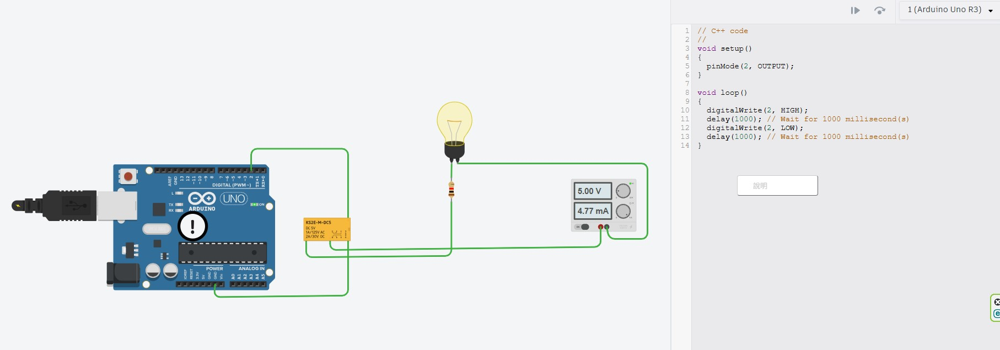

# ⚡ Arduino 數位控制繼電器電路與進階應用解析 (arduino_relay)

> **最後更新時間**: 2026-09-24 14:05:18 (UTC+8)  
> **使用模型**: Gemini 3.8 Flash  
> **執行 Agent**: Antigravity  

---

## 📖 系統導論與實驗電路觀測

在微控制器（MCU，如 Arduino、ESP32、樹莓派）的實務開發中，單晶片本體僅能處理 $3.3\text{V} \sim 5\text{V}$ 的弱電低功率數位邏輯訊號，而生活中的家電（如 AC 110V/220V 電燈、風扇）或工控致動器（如 DC 12V/24V 抽水馬達、電磁閥）則需要大電壓與大電流驅動。

**電磁繼電器（Electromechanical Relay, EMR）** 便是實現「**以微弱數位訊號，安全隔離並切換大功率負載**」最核心且經典的電氣橋樑。

---

### 📷 原始實驗電路截圖觀測 (Tinkercad Circuits)



#### 1. 實驗架構元件清單
* **控制器**: Arduino Uno R3（經由 USB 介面供電 $5\text{V}$）
* **數位控制腳位**: Pin 2（設定為 `OUTPUT`）
* **切換元件**: 小型訊號繼電器（型號 `KS2E-M-DC5`，額定規格：線圈 DC 5V，接點負載能力 1A/125V AC、2A/30V DC）
* **受控負載回路**:
  * 獨立直流電源供應器（設定輸出 $5.00\text{V}$）
  * 負載燈泡（Bulb）
  * 限流電阻（標示色碼，保護燈泡）
  * 繼電器常開開關接點（COM 與 NO 端）

---

### 🚨 關鍵工程診斷：為什麼晶片會出現警示驚嘆號（`!` 標誌）？

在 Tinkercad 模擬畫面中，Arduino Uno 板載的 **ATmega328P 微控制器晶片上方出現了醒目的驚嘆號（`!`）警告氣泡**。這在初學者的第一個繼電器電路中非常普遍，也是極具教學價值的核心工程觀念：

```
       [ 致命接法：Pin 2 直推線圈 ]
Arduino Pin 2 ────► [ 繼電器線圈 KS2E-M-DC5 ] ────► GND
                           │
                           ├─► ⚠️ 隱患 1: 線圈電流超載 (Overcurrent, > 30~50mA)
                           └─► ⚠️ 隱患 2: 關斷瞬間極高反電動勢 (Back EMF, 數十~數百伏特逆灌)
```

#### 隱患 1：GPIO 輸出驅動能力超載 (Overcurrent Hazard)
* **單晶片引腳極限**：ATmega328P 官方資料手冊規定，每個 GPIO 腳位的**建議最大持續電流為 $20\text{mA}$**（絕對最大額定值為 $40\text{mA}$，超過即有燒燬矽半導體接面的風險）。
* **繼電器線圈吸合電流**：小型 5V 繼電器線圈電阻通常僅有 $70\Omega \sim 150\Omega$。依據歐姆定律：
  $$I_{\text{coil}} = \frac{V_{\text{CC}}}{R_{\text{coil}}} = \frac{5\text{V}}{125\Omega} = 40\text{mA} \quad (\text{若 } R_{\text{coil}} = 70\Omega \text{ 則高達 } 71.4\text{mA})$$
* **結果**：直接由 Pin 2 抽載驅動線圈，會瞬間超過晶片安全電流閾值，導致引腳電壓驟降、單晶片過熱、重置（Brownout Reset），長期使用會導致該 GPIO 永久損毀。

#### 隱患 2：缺少續流二極體產生的電感反電動勢 (Back EMF / Inductive Kick)
* 繼電器內部本質上是一個**電感線圈 ($L$)**。根據電磁感應與電感端電壓公式：
  $$v_L(t) = L \frac{di}{dt}$$
* 當 Arduino 程式執行 `digitalWrite(2, LOW)` 時，線圈電流被迫在微秒級瞬間降至零（$\frac{di}{dt}$ 為極大負值）。
* 線圈為了維持磁場不消失，會產生高達數十伏特甚至數百伏特的**極高反向感應電壓脈衝**。此脈衝會直接逆向灌入 Pin 2 內部的 CMOS 閘極與靜電放電（ESD）防護二極體，造成單晶片永久穿孔損壞。

---

## 🔬 一、核心概念剖析 (Core Concepts)

### 1.1 繼電器工作原理與接點拓撲 (Relay Mechanism)

電磁繼電器由**低壓控制側（線圈端）**與**高壓負載側（接觸開關端）**構成，兩側在電氣上完全物理隔離：

```
                      【低壓控制回路】
                     線圈端 (+) Pin 2
                            │
                       ┌────┴────┐
                       │ 🌀 線圈 │ ──── 產生電磁吸力 ────┐
                       └────┬────┘                       │
                            │                            ▼
                     線圈端 (-) GND             ┌──────────────────┐
                                                │ 銜鐵 (Armature)  │
                      【高壓受控回路】          └────────┬─────────┘
                           COM (共同端)                  │
                                 o ─────────── 彈簧彈力 ─┘
                                /
                               / (吸合導通)
                              v
                      NC o         o NO (常開端)
                   (常閉接點)    (常開接點)
```

1. **COM (Common, 共同端)**：電路電源流入的樞紐端子。
2. **NC (Normally Closed, 常閉接點)**：線圈未通電時，受彈簧拉力與 COM 連接；線圈通電後斷開。
3. **NO (Normally Open, 常開接點)**：線圈未通電時斷開；線圈通電激磁後被銜鐵吸合導通。本實驗之負載燈泡即接在 COM 與 NO 之間。

---

### 1.2 正規工程設計：NPN 電晶體低側開關與續流二極體保護

正規電子工程設計中，**絕對嚴禁由微控制器 GPIO 直接驅動電感線圈**。業界標準解法是採用 **NPN 雙極性接面電晶體（BJT，如 2N2222、SS8050、BC547）** 作為**低側開關（Low-Side Switch）**，並在線圈兩端反向並聯 **續流二極體（Flyback / Freewheeling Diode，如 1N4007、1N4148）**。

#### A. 為什麼選擇「低側開關」(Low-Side Switching)？
* **拓撲定義**：負載（繼電器線圈）跨接在電源正極（$+5\text{V}$）與開關元件之間；開關元件（NPN 電晶體）則跨接在負載與系統共地（$\text{GND}$）之間。
* **驅動優勢**：NPN 電晶體的射極（Emitter）直接接至系統參考地（$V_E = 0\text{V}$）。因此，微控制器 Pin 2 輸出高電位（$+5\text{V}$ 或 $+3.3\text{V}$）時，基-射極電壓 $V_{BE} = V_B - V_E = V_B - 0\text{V} \approx 0.7\text{V}$，極易使電晶體導通。
* **高側開關（High-Side）的劣勢**：若採用 PNP 或高側架構，開關置於 $+5\text{V}$ 與線圈之間，則控制端需要將基極電位拉高至接近 $+5\text{V}$ 才能截止，若使用 $3.3\text{V}$ 的現代微控制器（如 ESP32、RP2040）將無法正常關斷，電路複雜度遠高於低側開關。

#### B. 深度飽和導通區（Hard Saturation）與電阻計算
為了讓電晶體擔任高效開關而非線性放大器，必須確保電晶體進入**深度飽和區**，使集-射極飽和壓降 $V_{CE(sat)} \le 0.1\text{V} \sim 0.2\text{V}$，此時電晶體功耗 $P_Q = V_{CE(sat)} \times I_C$ 趨近於零，不會發燙：

1. **集極負載電流（線圈額定電流）**：
   $$I_C \approx \frac{V_{\text{CC}} - V_{CE(sat)}}{R_{\text{coil}}} = \frac{5.0\text{V} - 0.2\text{V}}{120\Omega} \approx 40\text{mA}$$
2. **基極飽和驅動電流（強制電流增益 $\beta_{\text{forced}}$ 取 $10$）**：
   $$I_B \ge \frac{I_C}{\beta_{\text{forced}}} = \frac{40\text{mA}}{10} = 4\text{mA}$$
3. **基極限流電阻 $R_B$ 計算**：
   $$R_B = \frac{V_{\text{MCU}} - V_{BE}}{I_B} = \frac{5.0\text{V} - 0.7\text{V}}{4\text{mA}} = \frac{4.3\text{V}}{0.004\text{A}} = 1075\Omega \implies \text{標準選用 } 1\text{k}\Omega$$
   *(此時 Arduino Pin 2 僅需輸出 $4.3\text{mA}$，負擔僅為原本直接驅動的十分之一，完全在安全範圍！)*
4. **基極下拉電阻 $R_{PD} (10\text{k}\Omega)$ 的關鍵安全作用**：
   在 MCU 開機、重置或韌體引腳尚未初始化（處於高阻抗懸空態 High-Z）的瞬間，浮動雜訊極易感應至基極導致繼電器誤跳動。並聯一顆 $10\text{k}\Omega$ 電阻於基極與 GND 之間，可確保引腳在未受控時始終被拉至穩定 $0\text{V}$ 關閉態。

#### C. 續流二極體（Flyback Diode）物理消弧機制
* **導通狀態時**：二極體陰極（帶銀色色環端）接 $+5\text{V}$，陽極接集極（約 $0.2\text{V}$），二極體承受逆向偏壓完全截止，不影響電路工作。
* **關斷瞬間時**：電晶體由導通驟轉為截止，線圈電流被迫歸零。根據楞次定律（Lenz's Law），線圈產生自感電動勢企圖維持原電流方向，**線圈下端電位瞬間由 $0.2\text{V}$ 飆升至 $+60\text{V} \sim +200\text{V}$**！
* **續流鉗位**：當下端電位高於 $+5\text{V} + 0.7\text{V}$（約 $5.7\text{V}$）時，續流二極體立即順向導通，形成一個**線圈 ➔ 二極體 ➔ 線圈**的內部閉合回流迴路。電感中儲存的磁場能量 $\frac{1}{2}LI^2$ 在線圈內部電阻與二極體上轉化為微熱安全釋放，將集極電壓死死鎖定在 $5.7\text{V}$，保護電晶體與單晶片毫髮無傷。

#### D. 二極體選型對比：1N4007 vs 1N4148
* **1N4148（高速開關二極體）**：反向恢復時間極短（$t_{rr} \approx 4\text{ns}$），反應極快，適合小型訊號繼電器（如本專案 KS2E，線圈電流 $< 100\text{mA}$）。
* **1N4007（高壓整流二極體）**：耐壓達 $1000\text{V}$，持續電流 $1\text{A}$（瞬態突波承受力達 $30\text{A}$），通用性極高，適合各類中大型功率繼電器。

---

### 🔌 1.3 標準工程接線模擬圖與實體線路對照

以下為加入 **NPN 2N2222 電晶體**、**1N4007 續流二極體**、**1kΩ 基極電阻** 與 **10kΩ 下拉電阻** 後的完整正規接線模擬拓撲圖：

```
===================================================================================================
                    ⚡ Arduino 數位控制繼電器標準工程接線模擬圖 (低側開關 + 續流保護)
===================================================================================================

       [ 控制端：Arduino Uno ]                                   [ 驅動保護級：BJT + Diode ]
  ┌─────────────────────────────────┐                       
  │                                 │                       +5V 電源軌 (Arduino 5V 或 外部 5V)
  │                      [ Pin 2 ] ─┼────────[ 1kΩ R_B ]───────┐        │
  │                         (GPIO)  │                         │        ├────────────────┐
  │                                 │                         │        │                │
  │                         [ GND ] ─┼──┬──────────────────────┼────────┼───┐            │
  └─────────────────────────────────┘  │                      │        │   │        ┌───┴───┐
                                       │       [ 10kΩ R_PD ]  │        │   │        │ 陰極  │ [ 1N4007 ]
                                       │        (下拉電阻)    │        │   │        │ (銀環)│ 續流二極體
                                       └───────────┴──────────┤        │   │        └───┬───┘
                                                              │        │   │            │ 陽極
                                                            [ B ] 基極 │   │            │
                                                         ┌────┴────┐   │   │            │
                                                         │ 2N2222  │   │   │            │
                                                         │   NPN   │   │   │            │
                                                         └────┬────┘   │   │            │
                                                      射極 [ E ]       │   │            │
                                                              │        │   │            │
                                                              ▼        │   │            │
                                                          系統 GND ────┘   │            │
                                                                           │            │
                                                                           │            │
                                                                  線圈端子 1            │
                                                              ┌────────────┴────────┐   │
                                                              │  🌀 KS2E 繼電器線圈 │   │
                                                              └────────────┬────────┘   │
                                                                  線圈端子 2            │
                                                                           ├────────────┘
                                                                           │
                                                                           ▼
                                                                  集極 [ C ] (電晶體集極)

───────────────────────────────────────────────────────────────────────────────────────────────────
       [ 隔離受控回路：外接直流 5V 負載電路 (完全與 Arduino 隔離) ]

       外接電源供應器 (+) ────────► [ 💡 燈泡 ] ───► [ 限流電阻 ] ───► [ COM 接點 ]
       (獨立 5.00V 供電)                                                   │
                                                                           │ (激磁吸合導通)
                                                                           ▼
       外接電源供應器 (-) ◄───────────────────────────────────────────── [ NO 常開接點 ]
===================================================================================================
```

#### 📋 核心元件實體接線對照表 (Wiring Pinout Reference)

| 元件名稱 | 元件引腳 / 極性標記 | 連接目標端點 | 電氣功能說明 |
| :--- | :--- | :--- | :--- |
| **Arduino Uno** | **Digital Pin 2** | $1\text{k}\Omega$ 基極電阻第一端 | 輸出 $0\text{V} / 5\text{V}$ 數位控制邏輯信號 |
| **Arduino Uno** | **GND** | 麵包板系統接地軌 (GND) | 控制端接地參考基準面 |
| **電阻 $R_B$** | **$1\text{k}\Omega$ (棕黑紅金)** | Pin 2 與 2N2222 基極 (B) 之間 | 限制基極注入電流約 $4.3\text{mA}$，防 GPIO 超載 |
| **電阻 $R_{PD}$** | **$10\text{k}\Omega$ (棕黑橙金)** | 2N2222 基極 (B) 與 GND 之間 | 下拉電阻，防止開機懸空浮接導致繼電器誤動作 |
| **電晶體 Q1** | **2N2222 / SS8050** | **B (基極)**: 接 $1\text{k}\Omega$ 電阻後端<br>**C (集極)**: 接繼電器線圈下端與二極體陽極<br>**E (射極)**: 直接接至系統接地 (GND) | NPN 低側開關，微電流控制大電流飽和導通 |
| **二極體 D1** | **1N4007 / 1N4148** | **陰極 (銀色環線標示端)**: 接 $+5\text{V}$<br>**陽極 (黑色本體無環端)**: 接電晶體集極 (C) | **反向並聯保護**，消除關斷時的高壓自感電動勢 |
| **繼電器** | **KS2E-M-DC5 線圈端** | **線圈端 1**: 接 $+5\text{V}$ 電源軌<br>**線圈端 2**: 接電晶體集極 (C) 與二極體陽極 | 5V 激磁吸合電磁鐵，驅動內部機械銜鐵 |
| **繼電器** | **COM 接點 (Common)** | 燈泡限流電阻後端 | 負載供電回路開關樞紐 |
| **繼電器** | **NO 接點 (Normally Open)**| 外接獨立直流電源供應器負極 (-) | 常開端，繼電器吸合時閉合形成完整通路點亮燈泡 |

---

### 1.4 進階隔離：光耦合器 (Optocoupler) 機制

在商業販售的「Arduino 5V 繼電器模組」上，幾乎皆標配 **PC817 光耦合器**：
* 微控制器訊號僅驅動光耦內部的紅外發光二極體（LED，電流僅需 $5\text{mA}$）。
* 內部光敏三極管感光導通，再去觸發後級繼電器線圈。
* **優點**：微控制器接地系統與高功率負載回路完全電氣隔離（Galvanic Isolation），避免交流火花或馬達電磁雜訊（EMI）回灌導致 MCU 當機。

---

## 💻 二、實作與程式碼 (Practical Implementation & Code)

### 2.1 程式控制邏輯流程圖

在撰寫程式前，透過流程圖說明數位週期切換與負載動作之邏輯關係：

```mermaid
flowchart TD
    Start([系統開機啟動]) --> Init[初始化 Pin 2 為 OUTPUT 輸出模式]
    Init --> LoopStart{主迴圈 loop 執行}
    
    LoopStart --> HighState[digitalWrite Pin 2, HIGH]
    HighState --> LogHigh[激磁導通: 線圈通電, 銜鐵吸合 COM-NO]
    LogHigh --> BulbOn[💡 負載燈泡點亮 (回路導通)]
    BulbOn --> Delay1[保持導通 1000 毫秒 delay 1000]
    
    Delay1 --> LowState[digitalWrite Pin 2, LOW]
    LowState --> LogLow[消磁釋放: 線圈斷電, 彈簧復歸斷開 COM-NO]
    LogLow --> BulbOff[🌑 負載燈泡熄滅 (回路斷開)]
    BulbOff --> Delay2[保持斷開 1000 毫秒 delay 1000]
    
    Delay2 --> LoopStart
```

---

### 2.2 基礎版控制程式碼 (對應 Tinkercad 原版實驗)

```cpp
/**
 * @file arduino_relay_basic.ino
 * @brief Arduino 數位控制繼電器基礎循環切換程式
 * @note 適用於以數位 Pin 2 驅動繼電器模組之場景
 */

// 定義繼電器控制引腳
const int RELAY_PIN = 2;

// 定義開關延遲時間 (毫秒)
const unsigned long SWITCH_INTERVAL = 1000;

void setup() {
    // 初始化序列埠通訊，鮑率 9600 bps 用於即時除錯監控
    Serial.begin(9600);
    Serial.println(F("========================================"));
    Serial.println(F("⚡ Arduino 數位控制繼電器系統啟動"));
    Serial.println(F("========================================"));

    // 設定 Pin 2 為數位輸出模式
    pinMode(RELAY_PIN, OUTPUT);

    // 初始狀態預設為關閉 (LOW)
    digitalWrite(RELAY_PIN, LOW);
    Serial.println(F("狀態: 初始預設關閉 (Pin 2 = LOW)"));
}

void loop() {
    // 1. 輸出高電位，驅動繼電器吸合
    digitalWrite(RELAY_PIN, HIGH);
    Serial.println(F("[動作] 繼電器閉合 (HIGH) ──► 💡 燈泡點亮"));
    delay(SWITCH_INTERVAL); // 保持開燈狀態 1 秒

    // 2. 輸出低電位，釋放繼電器斷開
    digitalWrite(RELAY_PIN, LOW);
    Serial.println(F("[動作] 繼電器斷開 (LOW)  ──► 🌑 燈泡熄滅"));
    delay(SWITCH_INTERVAL); // 保持關燈狀態 1 秒
}
```

---

### 2.3 進階版非阻塞程式碼 (採用 `millis()` 狀態機架構)

在真實自動化專案中，使用 `delay(1000)` 會使 CPU 完全陷入停滯，無法即時處理按鈕輸入、感測器讀取或通訊封包。以下為工業級非阻塞寫法：

```cpp
/**
 * @file arduino_relay_non_blocking.ino
 * @brief 採用 millis() 的非阻塞式繼電器定時切換
 */

const int RELAY_PIN = 2;
const unsigned long INTERVAL = 1000; // 切換間隔 1 秒

unsigned long previousMillis = 0;   // 記錄前一次狀態翻轉的時間戳
bool relayState = false;            // 記錄當前繼電器開關狀態

void setup() {
    Serial.begin(9600);
    pinMode(RELAY_PIN, OUTPUT);
    digitalWrite(RELAY_PIN, LOW);
    Serial.println(F("非阻塞繼電器排程器運作中..."));
}

void loop() {
    unsigned long currentMillis = millis();

    // 判斷是否已達切換時間閾值
    if (currentMillis - previousMillis >= INTERVAL) {
        previousMillis = currentMillis; // 更新時間戳

        // 翻轉狀態
        relayState = !relayState;
        digitalWrite(RELAY_PIN, relayState ? HIGH : LOW);

        Serial.print(F("目前時間: "));
        Serial.print(currentMillis);
        Serial.print(F(" ms | 繼電器狀態: "));
        Serial.println(relayState ? F("導通 (ON 💡)") : F("斷開 (OFF 🌑)"));
    }

    // 此處主迴圈完全無阻塞，可同時執行其他感測器或按鈕任務...
}
```

---

## 🚀 三、基本電路的延伸應用想法 (Extended Applications)

將這個「**數位控制微功率 ➔ 大電流開關**」的基礎單元與各類感測器及通訊技術結合，可以衍生出多個實用且高價值的自動化系統：

```
                              ┌──► [應用 1] 人體感應走廊自動照明 (PIR + CDS)
                              ├──► [应用 2] 植栽溫室智慧自動灌溉 (土壤濕度 + 電磁閥)
[ Arduino 數位控制繼電器核心 ] ┼──► [應用 3] 伺服器機房智慧溫控排風 (DS18B20 + 散熱扇)
                              ├──► [應用 4] IoT 智慧物聯網插座 (ESP32 + MQTT / 手機 App)
                              └──► [應用 5] 雙負載安全互鎖電路 (利用 SPDT/DPDT 接點)
```

---

### 應用 1：智慧感測走廊節能照明系統 (PIR + CDS 雙條件觸發)
* **需求痛點**：樓梯間或地下室電燈長開耗電，忘記關燈浪費公電。
* **架構組合**：
  * **輸入**：HC-SR501 人體紅外線感測器（偵測動態）+ CDS 光敏電阻（偵測環境照度）。
  * **邏輯判斷**：唯有「環境昏暗（光線不足）」且「偵測到有人經過」時，才觸發繼電器開燈。
  * **安全延遲**：人離開後啟動 30 秒至 1 分鐘緩衝倒數計時，無人再觸發時自動關燈。

---

### 應用 2：智慧植栽與農園自動澆水系統 (Smart Irrigation)
* **需求痛點**：外出差旅時植栽缺水乾枯，手動澆水無法定量。
* **架構組合**：
  * **輸入**：電容式土壤濕度感測器（避免金屬腐蝕）。
  * **致動負載**：12V 直流沉水微型水泵或電磁閥（Solenoid Valve）。
  * **演算法考量**：加入**磁滯區間（Hysteresis）控制**（例如濕度低於 30% 開泵，高於 65% 才停泵），防止繼電器在臨界點附近頻繁快速跳動彈跳（Chattering）。

---

### 應用 3：環境精準恆溫與防潮排風系統 (Thermostat & Ventilation)
* **需求痛點**：爬蟲箱、孵化箱、3D 列印耗材防潮箱或伺服器機櫃需維持特定溫濕度。
* **架構組合**：
  * **感測器**：DHT22 / SHT31 高精度數位溫濕度感測器。
  * **雙路繼電器控制**：
    * 繼電器 1（加熱側）：接 PTC 發熱板，當溫度低於 $22^\circ\text{C}$ 時啟動。
    * 繼電器 2（排熱側）：接 12V 強力排風扇，當溫度高於 $32^\circ\text{C}$ 時啟動。
  * **安全機制**：程式內建超溫警報與看門狗計時器（Watchdog Timer），避免繼電器黏著導致過熱風險。

---

### 應用 4：IoT 智慧家電遠端插座與定時排程器 (ESP32 / Wi-Fi)
* **升級路徑**：將控制核心替換為 **ESP32 或 ESP8266**。
* **功能實現**：
  * 支援 **MQTT 通訊協定** 接入 Home Assistant 或 Apple HomeKit。
  * 透過手機 Web UI 或 LINE Notify 遠距查看家電通斷電狀態。
  * 雲端 NTP 網路對時：設定特定時段（如夜間離峰電價時段）自動給儲熱式熱水器或電動自行車充電。

---

### 應用 5：機械繼電器 (EMR) vs 固態繼電器 (SSR) 升級與選型權衡

在延伸專案選型時，必須根據負載特性選擇最適宜的開關元件：

| 評比維度 | 機械電磁繼電器 (EMR, 本實驗所用) | 固態繼電器 (SSR, Solid State Relay) |
| :--- | :--- | :--- |
| **內部切換原理** | 電磁鐵吸引機械金屬片接觸導通 | 半導體功率元件（雙向可控矽 Triac 或 MOSFET） |
| **切換動作聲音** | 有明顯且清脆的「喀噠」機械聲 | 完全靜音（無活動機械接點） |
| **開關反應速度** | 較慢（約 $5\text{ms} \sim 15\text{ms}$） | 極快（微秒級，支援低頻 PWM 調光調溫） |
| **接觸火花與壽命** | 斷開感性負載時接點易產生電弧，壽命有限（約數十萬次） | 無接點電弧火花，壽命極長（數千萬次以上） |
| **導通阻抗與發熱** | 導通接觸電阻極低，本體基本不發熱 | 存在飽和管壓降（約 $1\text{V} \sim 1.5\text{V}$），大電流時需外加散熱片 |
| **適用場景** | 低頻率開關、交直流通用、低成本小型專案 | 高頻率切換、無火花防爆環境、安靜環境、精密溫控 |

---

## ⚠️ 四、市電高壓 (AC 110V/220V) 接線安全準則

當由 Tinkercad 直流低壓模擬走向控制實體交流家電時，必須嚴格遵守以下工業安全守則：

1. **僅切斷火線（Live Wire, L）**：繼電器的 COM 與 NO 接點必須串聯在交流火線（L）上，**嚴禁串聯於中性線（Neutral, N）**。若切斷中性線，雖然電器停止運轉，但設備內部仍帶有高壓對地電位，人體誤觸將引發嚴重觸電致命危險。
2. **交流突波吸收器（Snubber）保護**：切換風扇、馬達或日光燈等感性負載時，接點分斷瞬間會產生數千伏特的接觸電弧火花，應在繼電器接點兩端跨接 **RC 阻容吸收回路（0.1μF + 100Ω）** 或 **壓敏電阻（MOV）** 消除火花。
3. **電路板爬電距離（Creepage Distance）**：PCB 高壓走線與低壓單晶片走線之間應保持至少 **$3\text{mm} \sim 5\text{mm}$** 以上的安全淨距，高低壓分界處常採用板上開槽（Slot isolation）處理以徹底隔絕高壓擊穿。

---

## 📝 提示詞歷史與變更記錄 (Prompt Archive)

### 🔹 [2026-09-24 13:58:22] [Gemini 3.8 Flash / Antigravity] 變更紀錄
- **模型/Agent**: Gemini 3.8 Flash / Antigravity
- **Prompt 原文**:
  ```text
  C:\Users\User\Desktop\20260924-1.jpg 這是我的第一個數位控制繼電器電路，幫我整理成筆記 arduino_relay，並延伸這個基本電路的應用想法
  ```
- **變更摘要**: 深度剖析使用者於 Tinkercad 設計的第一個 Arduino 繼電器控制電路，診斷微控制器出現警示驚嘆號（`!`）的根本原因（GPIO 驅動過載與缺乏續流二極體反電動勢風險），詳解 BJT 電晶體驅動與光耦隔離標準電路，提供基礎阻塞與進階非阻塞完整程式碼，並展開 5 大實用延伸應用與交流強電安全規範。

### 🔹 [2026-09-24 14:05:18] [Gemini 3.8 Flash / Antigravity] 變更紀錄
- **模型/Agent**: Gemini 3.8 Flash / Antigravity
- **Prompt 原文**:
  ```text
  正規工程設計絕不以 MCU 引腳直推線圈，而是使用 NPN 電晶體（如 2N2222、SS8050） 作為低側開關，並於線圈兩端反向並聯 續流二極體（Flyback Diode，如 1N4007、1N4148）：  加入這個的說明跟接線模擬圖
  ```
- **變更摘要**: 深度擴充正規工程驅動架構說明，詳解 NPN 電晶體低側開關原理、基極飽和電阻計算 ($1\text{k}\Omega$)、開機防誤動下拉電阻 ($10\text{k}\Omega$)、續流二極體反電動勢消弧與鉗位物理過程 (1N4007 vs 1N4148 對比)，並繪製高精確度的 ASCII 實體電路接線模擬拓撲圖與各接腳 Pinout 對照表。

