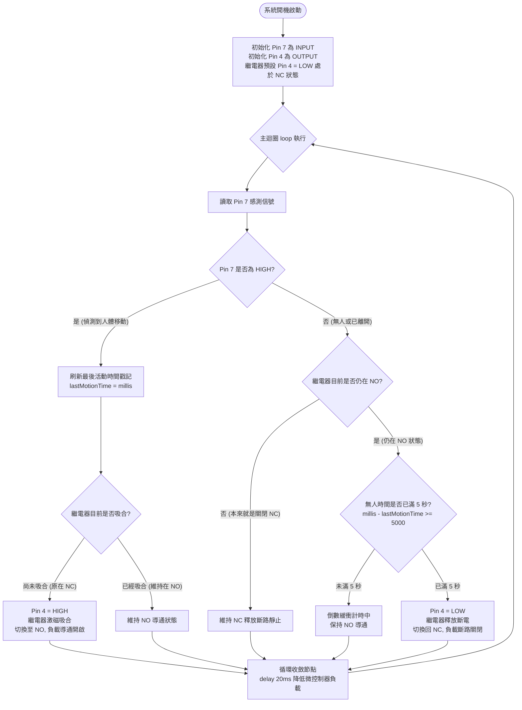

# 💡 Arduino Uno 人體感應控制繼電器 (PIR Pin 7 ➔ 繼電器 Pin 4) NC切換NO延遲5秒系統

> **最後更新時間**: 2026-09-29 14:57:46 (UTC+8)  
> **使用模型**: Gemini 3.8 Flash  
> **執行 Agent**: Antigravity  

---

## 📖 系統導論與硬體規格 (System Introduction & Hardware Specification)

本專案為 **Arduino Uno** 經典自動化控制實驗，核心任務為：「**透過 Pin 7 讀取 PIR 人體紅外線感測器訊號，控制連接於 Pin 4 的繼電器；當偵測到移動時，繼電器切換至常開端（NC ➔ NO），並在人員離開後延遲 5 秒關閉（NO ➔ NC）**」。

在設計演進中，使用者經歷了三個關鍵 Prompt 的演進階段：
* **第一個 Prompt (Stage 1)**：使用最直觀的 `delay(5000)` 實現 5 秒關閉，但程式會遭遇 5 秒阻塞（卡死）問題，無法在倒數期間偵測人員折返。
* **第二個 Prompt (Stage 2)**：改用非阻塞式 `millis()` 狀態機寫法，即使人離開後處於 5 秒倒數中，若人員在第 2 秒折返，微控制器仍能即時捕捉 Pin 7 高電位並重置計時器，實現平滑無閃爍的智慧照明控制！
* **第三個 Prompt (Stage 3)**：進一步整合 I2C LCD 1602（PCF8574 位址 `0x20`，SDA 接 A4、SCL 接 A5），實作待機 `"DECT..."` 與感應移動 `"Warning!"` 液晶螢幕顯示，詳見 [Arduino Uno PIR + 繼電器 + I2C LCD1602 專題筆記](./arduino_uno_pir7_relay4_lcd1602_i2c.md)。

---

### 📷 系統接線實驗截圖 (Tinkercad Circuits 0929-1.jpg)


#### 🔌 引腳接線對照清單 (Wiring Pinout)

依據實際接線電路圖（Tinkercad Circuits 模擬），各模組引腳對照如下：

1. **Parallax PIR 人體紅外線感測器 (555-28027 Rev B)**：
   * **左腳 (VCC / 紅圈處)**：黃色導線繞至 Arduino Uno 底部電源排針 **`5V`**
   * **中腳 (GND)**：黃色導線接至 Arduino Uno 頂部數位端 **`GND`**（Pin 13 旁）
   * **右腳 (OUT / Signal)**：黃色導線接至 Arduino Uno 數位引腳 **`Pin 7`** (`INPUT`)
2. **小型電磁繼電器 (KS2E-M-DC5 5V 雙排 8 腳)**：
   * **線圈驅動正極端 Coil (+)**：棕色導線接至 Arduino Uno 數位引腳 **`Pin 4`** (`OUTPUT`)
   * **線圈驅動負極端 Coil (-)**：棕色導線接至 Arduino Uno 底部電源端 **`GND`**
3. **外部受控照明迴路 (獨立 DC 電源供應器 + 燈泡負載)**：
   * 電源供應器正極 (+) ──► 綠色導線接至繼電器內部切換開關輸入端 (COM)
   * 繼電器常開端 (NO) ──► 綠色導線串聯限流電阻 ──► 燈泡一端
   * 燈泡另一端 ──► 綠色導線接回電源供應器負極 (-)
   * **電氣切換運作**：
     * **待機狀態（Pin 4 = LOW）**：繼電器線圈未通電，內部接點保持在 **NC (常閉端)**，COM 與 NO 之間呈開路，負載燈泡不亮。
     * **感應動作（Pin 4 = HIGH）**：繼電器線圈激磁吸合，接點從 NC **跳脫切換至 NO (常開端)**，回路閉合導通，燈泡瞬間點亮！
     * **人員離去延遲 5 秒後**：Pin 4 恢復輸出 LOW，線圈去磁，接點彈回 NC，燈泡熄滅。

---

## 🔬 一、核心概念剖析 (Core Concepts)

### 1.1 PIR 被動式紅外線感測器運作原理
PIR（Passive Infrared Sensor）本身不發射任何光線，而是被動接收人體（或溫血生物）輻射的熱紅外線。

```
                    ┌───────────────────────────────┐
                    │  人體移動輻射 (長波紅外 9~10μm) │
                    └───────────────┬───────────────┘
                                    │
                                    ▼
                    ┌───────────────────────────────┐
                    │   菲涅耳透鏡 (Fresnel Lens)   │
                    │   聚焦分區：交替形成敏感區/盲區 │
                    └───────────────┬───────────────┘
                                    │
                                    ▼
                    ┌───────────────────────────────┐
                    │  雙差動熱釋電晶體 (Pyroelectric)│
                    │  人體穿過引發電荷不平衡 (pA級) │
                    └───────────────┬───────────────┘
                                    │
                                    ▼
                    ┌───────────────────────────────┐
                    │ BISS0001 處理晶片 + 比較放大  │
                    │ 輸出 TTL 數位信號 (HIGH/LOW)   │
                    └───────────────────────────────┘
```

1. **熱釋電效應（Pyroelectric Effect）**：
   人體體溫（約 $36^\circ\text{C} \sim 37^\circ\text{C}$，即 $310\text{ K}$）依據維恩位移定律（$\lambda_{max} = \frac{2898}{T} \approx 9.35\,\mu\text{m}$），向外輻射長波紅外線（LWIR）。感測器內部的熱釋電薄膜吸收溫度變化時表面產生微弱電荷。
2. **雙差動補償結構**：
   感測器內部將兩片熱釋電元件反向串聯。當環境整體溫度均勻變化時（如陽光照射、氣溫漸升），兩元件產生的電荷互相抵消；只有當移動目標依序經過兩片元件的視角時，才會觸發脈衝電壓輸出。
3. **菲涅耳透鏡（Fresnel Lens）**：
   白色塑膠透鏡將空間視角切割為同心圓的多個感應帶（交替分佈的敏感區與盲區），人體移動跨越視線時形成「明-暗-明」交替紅外強度變化，極大化偵測靈敏度。
4. **模組觸發模式（建議設為 H 模式）**：
   - **L 模式（不可重複觸發）**：感應到後輸出 HIGH 一段固定時間，隨即強制變為 LOW，即使人一直在範圍內也不會持續保持。
   - **H 模式（可重複觸發，推薦）**：只要人體在感應範圍內持續活動，OUT 腳位將持續維持 `HIGH`，直到人離開後才開始結束計時。

---

### 1.2 電磁繼電器 (SPDT Relay) 運作原理與 NC/NO 接點機制
繼電器是利用**小電流（低壓弱電 5V）控制大電流（高壓強電 110V/220V）**的電磁機械開關。

```
              【繼電器內部接點動作剖面示意】

  [未激磁 / 關閉釋放態]                [激磁吸合 / 開啟動作態]
      (Pin 4 = LOW)                        (Pin 4 = HIGH)
         COM 共同端                            COM 共同端
             │                                     │
           ──┴──                                 ──┴──
          /                                           \
         / (彈簧拉回)                                   \ (電磁鐵吸合)
        ▼                                               ▼
      ┌────┐    ┌────┐                            ┌────┐    ┌────┐
      │ NC │    │ NO │                            │ NC │    │ NO │
      └────┘    └────┘                            └────┘    └────┘
     (導通閉合) (斷開隔絕)                       (斷開隔絕) (導通閉合)
```

1. **COM (Common, 共同端/公共端)**：動接點，隨內部銜鐵擺動，可在 NC 與 NO 之間切換。
2. **NC (Normally Closed, 常閉端)**：在線圈未通電（靜態無磁力）時，靠內部復位彈簧將接點拉住，與 COM 保持**常時導通**。
3. **NO (Normally Open, 常開端)**：在線圈未通電時與 COM 為**開路斷開**；當線圈通過電流產生磁場吸合銜鐵時，克服彈簧拉力切換導通 COM 與 NO。
4. **為什麼控制電燈必須接 COM 與 NO？**
   - **安全失效保護 (Fail-Safe)**：當 Arduino 斷電、控制系統當機或電源故障時，繼電器自動回歸常態（NO 斷開），負載自動斷電，杜絕無人看管時設備長通發熱走火之危險。
   - **省電考量**：走廊或房間大部分時間無人，繼電器線圈保持在去磁狀態（Pin 4 = LOW），不消耗 Arduino 的工作電流（單顆 5V 繼電器線圈吸合約消耗 70~90mA）。

---

### 1.3 控制時序與中途回跳防閃爍機制

本系統具備四大時序行為準則：
1. **即時吸合切換（Immediate Trigger）**：Pin 7 偵測到人體移動瞬間（`HIGH`），Pin 4 立即輸出 `HIGH`，繼電器由 NC 切換至 NO，負載通電。
2. **活動中持續刷新（Continuous Retriggering）**：當人員在範圍內持續走動，系統在每一主迴圈週期中不斷刷新計時基準 `lastMotionTime = millis()`，保持繼電器穩態導通。
3. **離去精確延遲 5 秒（5-Second Off Delay）**：當人員完全離開後，PIR 信號降為 `LOW`。系統開始計算已離開的時間差值：
   $$\Delta t = t_{current} - t_{lastMotion}$$
   當 $\Delta t \ge 5000\text{ ms}$ 時，判定人員已確認離開，Pin 4 轉為 `LOW`，繼電器切回 NC，負載關閉。
4. **中途回跳防頻閃（Anti-Flicker Bounceback）**：若在 5 秒倒數期間（例如第 3 秒）人員突然折返，PIR 再次變為 `HIGH`，系統立即重置計時器，繼電器持續保持在 NO，絕不發生燈光閃爍現象。

---

## 💻 二、程式邏輯流程圖與實作程式碼 (Flowchart & Code)

### 2.1 系統邏輯流程圖 (Mermaid Flowchart，無交叉走線架構)

在撰寫程式碼前，先以**由上而下、平行雙分支**之流程圖解說系統運行架構，確保邏輯清晰無交叉回繞：



---

### 2.2 工業級標準非阻塞式程式碼 (推薦實務採用)

採用非阻塞式 `millis()` 設計，主迴圈保持高速流暢運行，可即時捕捉人員折返事件：

```cpp
/**
 * @file arduino_uno_pir7_relay4_delay5s.ino
 * @brief Arduino Uno PIR 感應器 (Pin 7) 控制繼電器 (Pin 4) 延遲 5 秒系統
 * @details 當 Pin 7 感應到移動時，Pin 4 輸出 HIGH 使繼電器切換至 NO (常開導通)；
 *          人體離開後非阻塞延遲 5 秒關閉 (切換回 NC)。
 */

// ================= 引腳定義 =================
const int PIR_PIN   = 7; // 連接 PIR 紅外線人體感測器信號輸出 (OUT)
const int RELAY_PIN = 4; // 連接 繼電器模組控制輸入端 (IN)

// ================= 時間參數設定 =================
const unsigned long OFF_DELAY_TIME = 5000; // 人員離開後的延遲關閉時間 (毫秒，5000ms = 5秒)

// ================= 系統全域變數 =================
unsigned long lastMotionTime = 0; // 記錄最後一次偵測到人體動態的時間戳記 (毫秒)
bool relayActive = false;         // 記錄當前繼電器狀態 (true: 切換至 NO 導通 / false: 釋放回 NC 斷開)
int lastPirState = LOW;           // 記錄前一次 PIR 讀取狀態，用於狀態變更提示

void setup() {
    // 啟用序列埠通訊，鮑率 9600，方便電腦即時監控與除錯
    Serial.begin(9600);
    Serial.println(F("=================================================="));
    Serial.println(F("💡 Arduino Uno PIR (Pin 7) + 繼電器 (Pin 4) 控制系統啟動"));
    Serial.println(F("=================================================="));

    // 設定引腳模式
    pinMode(PIR_PIN, INPUT);    // Pin 7 設定為數位輸入 (接收 PIR 訊號)
    pinMode(RELAY_PIN, OUTPUT); // Pin 4 設定為數位輸出 (控制繼電器線圈)

    // 初始狀態配置：繼電器預設關閉 (LOW)，保持在常閉端 (NC) 狀態，負載斷電
    digitalWrite(RELAY_PIN, LOW);
    relayActive = false;

    Serial.println(F("[系統狀態] 系統就緒！繼電器初始狀態：NC (Pin 4 = LOW, 負載關閉)"));
    Serial.println(F("[工程提示] PIR 模組上電後通常需 30~60 秒預熱穩定期，期間若有短暫誤觸發屬正常現象。"));
}

void loop() {
    unsigned long currentMillis = millis(); // 取得自開機以來的當前毫秒數
    int pirValue = digitalRead(PIR_PIN);   // 讀取 Pin 7 的紅外線感測狀態 (HIGH 或 LOW)

    // ----------- 1. 偵測狀態變化事件輸出至 Serial Monitor -----------
    if (pirValue != lastPirState) {
        if (pirValue == HIGH) {
            Serial.println(F("\n[事件通知] 🚨 Pin 7 偵測到人體移動！準備切換繼電器至 NO..."));
        } else {
            Serial.println(F("\n[事件通知] 🍃 Pin 7 信號降為 LOW (人員離開)，啟動 5 秒離去延遲計時..."));
        }
        lastPirState = pirValue;
    }

    // ----------- 2. 核心時序控制邏輯 -----------
    if (pirValue == HIGH) {
        // 【狀況 A：感應到移動】
        lastMotionTime = currentMillis; // 持續刷新最後動態時間基準

        if (!relayActive) {
            // 原本處於 NC 狀態 ──► 激磁吸合切換至 NO 端
            digitalWrite(RELAY_PIN, HIGH);
            relayActive = true;
            Serial.println(F("[動作執行] ⚡ Pin 4 輸出 HIGH ➔ 繼電器吸合切換至 NO (常開導通) ➔ 💡 負載電燈開啟！"));
        }
    } else {
        // 【狀況 B：無人 (Pin 7 = LOW)】
        if (relayActive) {
            // 目前繼電器仍維持在 NO 導通狀態，計算無人經過的經過時間
            unsigned long elapsedTime = currentMillis - lastMotionTime;

            if (elapsedTime >= OFF_DELAY_TIME) {
                // 已超過設定的 5 秒延遲 ──► 釋放繼電器切換回 NC 端
                digitalWrite(RELAY_PIN, LOW);
                relayActive = false;
                Serial.println(F("[動作執行] ⏰ 延遲 5 秒已滿！Pin 4 輸出 LOW ➔ 繼電器切回 NC ➔ 🌑 負載電燈關閉！"));
            } else {
                // 尚在 5 秒倒數中，每隔 1 秒印出倒數提醒
                static unsigned long lastCountLog = 0;
                if (currentMillis - lastCountLog >= 1000) {
                    lastCountLog = currentMillis;
                    unsigned long remainingSeconds = (OFF_DELAY_TIME - elapsedTime + 999) / 1000;
                    Serial.print(F("[倒數計時中] 距離關閉還剩: "));
                    Serial.print(remainingSeconds);
                    Serial.println(F(" 秒..."));
                }
            }
        }
    }

    // 微幅延遲 20 毫秒，降低微控制器 CPU 輪詢負載 (每秒輪詢約 50 次)
    delay(20);
}
```

---

### 2.3 簡易版程式碼 (適合教學體驗與直觀展示)

若初學理解時希望用最簡明的架構測試，可參考下列簡易版本（使用 `delay(5000)`）：

```cpp
/**
 * @file arduino_uno_pir7_relay4_simple.ino
 * @brief 簡易版 PIR (Pin 7) 控制繼電器 (Pin 4) 延遲 5 秒程式
 * @note 使用 delay() 實作，程式碼直觀，但在 5 秒延遲期間無法中斷接收新的動態訊號。
 */

void setup() {
    pinMode(7, INPUT);  // Pin 7 連接 PIR 感測器輸出
    pinMode(4, OUTPUT); // Pin 4 連接 繼電器 IN 控制端
    digitalWrite(4, LOW); // 預設處於 NC 狀態 (關閉)
}

void loop() {
    // 讀取 Pin 7
    if (digitalRead(7) == HIGH) {
        digitalWrite(4, HIGH); // 偵測到人體移動：切換至 NO (開啟負載)
    } else {
        delay(5000);           // 無人時暫停等待 5 秒 (阻塞式)
        digitalWrite(4, LOW);  // 5 秒結束後：切換回 NC (關閉負載)
    }
}
```

---

## ⚡ 三、延伸思考與進階工程主題 (Extensions & Advanced Topics)

### 3.1 非阻塞式 (`millis`) vs 阻塞式 (`delay`) 深度對比

| 比較維度 | 簡易版 (`delay(5000)`) | 工業非阻塞版 (`millis()`) |
| :--- | :--- | :--- |
| **CPU 占用** | 程式在 `delay(5000)` 期間完全停滯卡死 | CPU 保持高速循環，每 20ms 輪詢一次 |
| **中途折返反應** | 人在第 2 秒折返時**無法偵測**，電燈仍會在第 5 秒強行熄滅 | 即時偵測到 Pin 7 為 HIGH，**立即撤銷倒數並保持亮燈** |
| **功能擴充性** | 無法同時執行其他任務（如讀取溫度、按鈕、Buzzer） | 可輕鬆平行處理多感測器與物聯網通訊 |
| **適用場合** | 單純課堂演示、快速驗證接線 | 實際工程部署、商業產品原型 |

---

### 3.2 繼電器驅動保護：反向感應電動勢 (Back-EMF) 與續流二極體
繼電器內部是由漆包線繞製的電感線圈。當 Pin 4 輸出 `HIGH` 時線圈儲存磁能；當 Pin 4 突然變為 `LOW` 斷開電流瞬間，由法拉第電磁感應定律：
$$V = -L \frac{di}{dt}$$
由於斷開時間 $dt$ 極短，線圈兩端會瞬間爆發出高達數十至數百伏特的反向感應突波高壓。

> [!CAUTION]
> **保護硬體安全必備原則**：
> 1. **市售模組**：市售 5V 繼電器模組通常已在 PCB 上並聯好 **反向續流二極體（如 1N4007/1N4148）** 與 **驅動三極管（如 S8050/2N2222）**，Arduino Pin 4 僅需提供訊號即可安全驅動。
> 2. **單體繼電器元件自行搭接**：若直接使用未帶電路板的繼電器元件，**嚴禁用 Arduino 引腳直接驅動線圈**（引腳最大耐受僅約 20mA，且突波會直接擊穿晶片），必須加裝 NPN 電晶體、基極限流電阻與續流二極體！

---

### 3.3 負載端火花消弧與 RC 吸收電路 (Snubber)
當繼電器接點（COM 與 NO）用於控制 AC 110V/220V 的日光燈、風扇或高功率 LED 燈具時：
- **開啟瞬間**：LED 驅動電源的輸入濾波電容會產生高達數十安培的**湧浪電流（Inrush Current）**，易造成接點表面金屬熔焊黏死。
- **斷開瞬間**：電感性負載（如馬達、傳統鎮流器）會在接點氣隙中引發高溫**電弧（Arcing）**，燒蝕碳化接點表面。
- **工程解法**：在繼電器 COM 與 NO 接點兩端**跨接 RC 突波吸收器（Snubber Network，如 $0.1\,\mu\text{F}$ 400V 耐壓薄膜電容串聯 $100\,\Omega$ 電阻）** 或 **壓敏電阻 (MOV)**，能吸收火花並延長繼電器接點壽命。

---

## 📝 提示詞歷史與變更記錄 (Prompt Archive)

### 🔹 [2026-09-29 14:53:04] [Gemini 3.8 Flash / Antigravity] 變更紀錄
- **模型/Agent**: Gemini 3.8 Flash / Antigravity
- **Prompt 原文**:
  ```text
  今天複習了PIR感應訊號控制繼電器 我使用了兩個prompt 地一個是寫一個arduino uno程式, pin 7接PIR, pin4接繼電器控制 當PIR感應到移動繼電器就會切換到no(由nc->no) 延遲五秒關閉
  ```
- **變更摘要**: 建立 Arduino Uno PIR (Pin 7) 控制繼電器 (Pin 4) 延遲 5 秒系統專題筆記 (`ec/arduino_uno_pir7_relay4_delay5s.md` 與對應 HTML)。詳細剖析 PIR 感測原理、電磁繼電器 NC/NO 切換機制、提供無交叉走線 Mermaid 流程圖、工業級非阻塞 `millis()` 狀態機完整註解程式與簡易版對照，並深入探討 Back-EMF 續流二極體與 RC 突波吸收工程防護。

### 🔹 [2026-09-29 14:57:46] [Gemini 3.8 Flash / Antigravity] 變更紀錄
- **模型/Agent**: Gemini 3.8 Flash / Antigravity
- **Prompt 原文**:
  ```text
  由於第一個程式用了delay,所以我用 改用非阻塞式的寫法
  C:\Users\User\Desktop\0929-1.jpg 這是我的接線圖
  ```
- **變更摘要**: 依據使用者提供的 Tinkercad 模擬截圖（`0929-1.jpg`），補齊真實硬體連線圖解與分析（PIR 左腳5V、中腳GND、右腳Pin 7，繼電器驅動接Pin 4、GND，獨立DC電源供應器串聯燈泡與繼電器COM-NO接點）。並深入解說由 Prompt 1 的 `delay(5000)` 重構為 Prompt 2 的 `millis()` 狀態機之非阻塞優勢。
