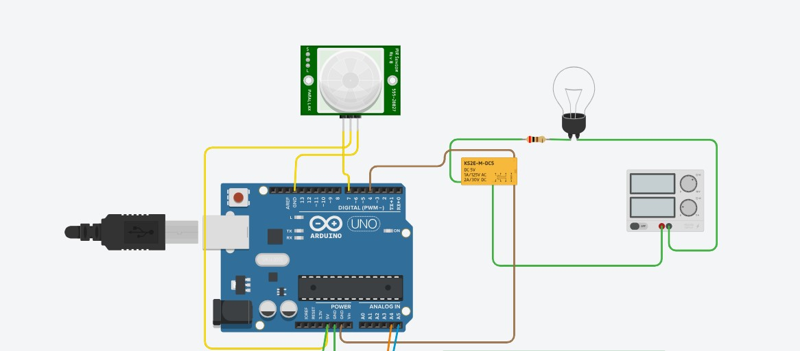
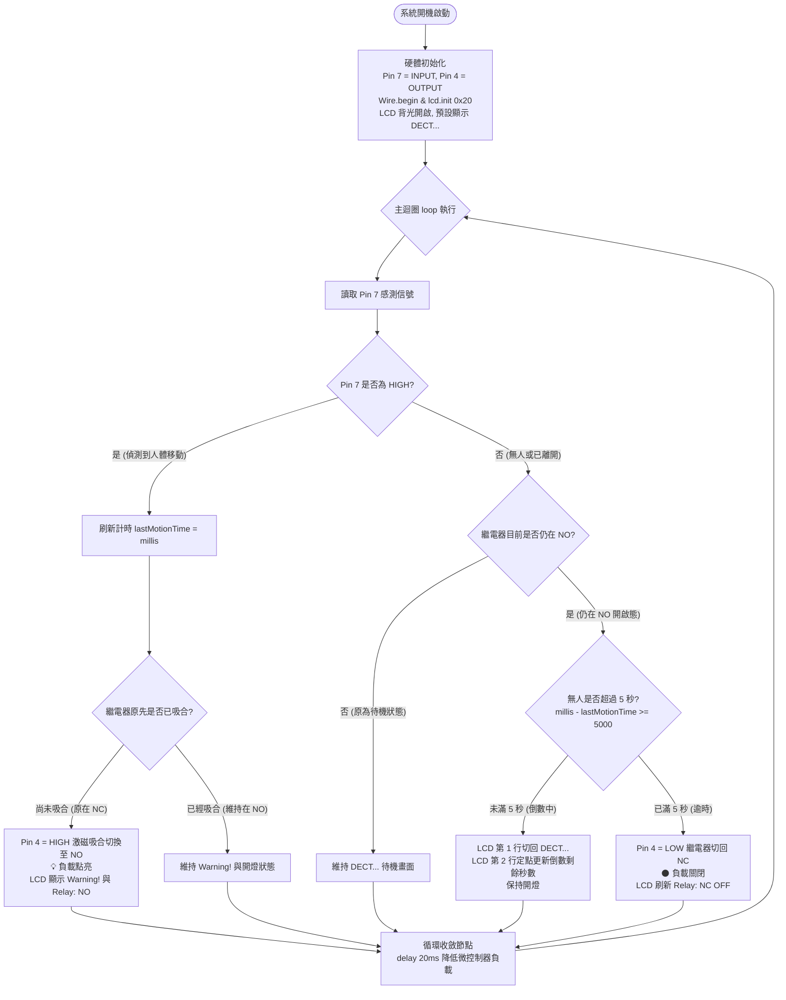

# 💡 Arduino Uno 人體感應控制繼電器與 I2C LCD1602 狀態監控系統 (Stage 3)

> **最後更新時間**: 2026-09-29 15:21:13 (UTC+8)  
> **使用模型**: Gemini 3.8 Flash  
> **執行 Agent**: Antigravity  

---

## 📖 系統導論與演進背景 (System Introduction & Evolution)

本專案為 **Arduino Uno** 智慧人體感測與負載控制系統的**第三階段（Stage 3）**升級版本。回顧整個開發演進過程：
* **第一階段 (Stage 1)**：實現基礎感應開關，Pin 7 接 PIR、Pin 4 接繼電器控制負載；感應移動時切換至常開端（NC ➔ NO），人員離開後使用直觀的 `delay(5000)` 延遲 5 秒關閉。
* **第二階段 (Stage 2)**：為了解決 `delay()` 導致 CPU 凍結 5 秒、無法即時捕捉中途人員折返的嚴重缺陷，重構為非阻塞式的 `millis()` 狀態機架構，具備活動持續刷新與防閃爍回跳機制。
* **第三階段 (Stage 3，本篇)**：加入 **I2C LCD 1602 液晶顯示模組（PCF8574 轉接板，位址 `0x20`）**。
  * 平時待機監測時，螢幕顯示：`"DECT..."`（Detecting 監控中），繼電器維持 NC 斷開。
  * 偵測到人體移動時，螢幕立即顯示：`"Warning!"`（警報/動作觸發），繼電器由 NC 切換至 NO 點亮負載，人員離開後非阻塞倒數 5 秒自動關閉。

---

### 📷 系統接線實驗截圖 (Tinkercad Circuits)



#### 🔌 完整硬體引腳接線對照清單 (Wiring Pinout)

在第二階段的電路基礎上，Arduino Uno 的類比排針 **A4 (SDA)** 與 **A5 (SCL)** 連接至 I2C LCD 1602 模組，僅需四條線即可完成液晶驅動：

| 硬體模組 | 模組引腳 | Arduino Uno 腳位 | 電氣屬性與信號功能說明 |
| :--- | :--- | :--- | :--- |
| **Parallax PIR 人體感測器**<br>(555-28027 / HC-SR501) | **VCC** | **5V** | 模組工作電源 (DC 4.5V~20V) |
| | **GND** | **GND** (頂部 Pin 13 旁) | 系統接地共地 |
| | **OUT / Signal** | **Pin 7** | 數位信號輸入 (`INPUT`)，感應到移動為 `HIGH`，無人為 `LOW` |
| **電磁繼電器**<br>(KS2E-M-DC5 / 5V Relay) | **Coil (+) / IN** | **Pin 4** | 數位信號輸出 (`OUTPUT`)，`HIGH` 激磁吸合切至 NO，`LOW` 切回 NC |
| | **Coil (-) / GND** | **GND** (底部電源排針) | 線圈接地共地 |
| **I2C LCD 1602 模組**<br>(PCF8574 轉接板，位址 `0x20`) | **GND** | **GND** | 模組電源接地 |
| | **VCC** | **5V** | 模組驅動電源 (DC 5V) |
| | **SDA** | **A4** (或專屬 SDA) | I2C 串列資料線 (Serial Data) |
| | **SCL** | **A5** (或專屬 SCL) | I2C 串列時脈線 (Serial Clock) |
| **受控負載側**<br>(獨立直流電源 + 電燈) | **COM (共同端)** | 外接電源供應器正極 (+) | 負載供電入口 |
| | **NO (常開端)** | 限流電阻 ➔ 燈泡正極 | **常態斷開；偵測移動吸合時閉合導通** |
| | **負載負極回流** | 外接電源供應器負極 (-) | 燈泡負極接回電源負極，形成受控迴路 |

---

## 🔬 一、核心概念剖析 (Core Concepts)

### 1.1 I2C 序列通訊與 PCF8574 晶片架構
傳統 LCD 1602 若以平行介面（Parallel Interface）連接，至少需要佔用微控制器 6 至 10 根 GPIO 引腳（RS, EN, D4~D7, 背光等）。採用 **PCF8574 I/O 擴展晶片** 後，將平行訊號壓縮為 **I2C（Inter-Integrated Circuit）兩線式協定**：

```
                    ┌─────────────────────────┐
                    │  Arduino Uno (Master)   │
                    │   A4 (SDA)    A5 (SCL)  │
                    └────────┬───────────┬────┘
                             │           │
                     SDA 資料線│           │ SCL 時脈線
                             ▼           ▼
                    ┌─────────────────────────┐
                    │ PCF8574 I2C 擴展晶片     │
                    │ (I2C Slave Address 0x20)│
                    └────────────┬────────────┘
                                 │ 8-Bit 準雙向平行 I/O (P0~P7)
                                 ▼
                    ┌─────────────────────────┐
                    │ HD44780 驅動 LCD 1602   │
                    │ (4-Bit 模式: RS, EN, D4~D7)│
                    └─────────────────────────┘
```

1. **I2C 兩線架構**：
   * **SDA (Serial Data)**：雙向開漏極（Open-Drain）資料傳輸線，需透過上拉電阻（通常 4.7kΩ）拉至 5V。
   * **SCL (Serial Clock)**：由主控端（Arduino）產生的同步時脈訊號。
2. **PCF8574 硬體位址決定機制（為什麼是 `0x20`？）**：
   * PCF8574 的 7-bit I2C 設備位址由高位固定碼 `0100` 與低三位硬體引腳 `A2, A1, A0` 決定：
     $$\text{Address} = [0, 1, 0, 0, A2, A1, A0]_2$$
   * 當擴展板上的三個位址焊點（A0, A1, A2）均**接地（LOW / 0）**時：
     $$[0, 1, 0, 0, 0, 0, 0]_2 = 0x20$$
   * 若模組未焊接跳線（或內部預設拉高為 1），則位址為 $[0, 1, 0, 0, 1, 1, 1]_2 = 0x27$。
   * **本專案依使用者指定，嚴格使用 `0x20` 進行通訊。**
3. **4-Bit 傳輸模式**：
   PCF8574 的 8 根輸出腳剛好映射至 LCD 1602 的控制端（RS, RW, EN, 背光 LED）與 4 根高位資料線（D4, D5, D6, D7）。每個位元組（Byte）資料分兩次（先高 4 位、再低 4 位）送入 LCD 內部暫存器。

---

### 1.2 狀態機與防 LCD 閃爍（Flicker-Free）更新策略

在液晶顯示控制中，初學者最常犯的錯誤是在 `loop()` 迴圈中無條件重複執行清屏與顯示指令：

```cpp
// ❌ 錯誤示範：螢幕嚴重劇烈閃爍 (LCD Flickering)
void loop() {
    lcd.clear(); // 每一圈都清屏，背光與點陣不斷重繪，肉眼看宛如壞掉閃爍！
    if (digitalRead(7) == HIGH) {
        lcd.print("Warning!");
    } else {
        lcd.print("DECT...");
    }
    delay(20);
}
```

> [!IMPORTANT]
> **防閃爍（Flicker-Free）兩大設計法則**：
> 1. **狀態變更觸發式更新（Event-Driven Update）**：只在系統狀態真正由「待機 ➔ 警報」或「警報 ➔ 待機」切換的瞬間，才清空行並重印標題。
> 2. **定點覆蓋寫入（In-Place Overwrite）**：若需顯示動態數值（例如倒數秒數 `4s` ➔ `3s`），直接使用 `lcd.setCursor(x, y)` 定位到該欄位進行部分覆蓋，並以空白字元消除前次殘留字串，絕不使用全域 `lcd.clear()`。

---

### 1.3 繼電器 NC/NO 與雙行顯示狀態對應

| 系統運行狀態 | PIR 信號 (Pin 7) | 繼電器狀態 (Pin 4) | 負載燈泡狀態 | LCD 第 1 行 (Line 0) | LCD 第 2 行 (Line 1) |
| :--- | :--- | :--- | :--- | :--- | :--- |
| **待機偵測中** | `LOW` (無移動) | `LOW` (線圈釋放) | 🌑 熄滅 (COM-NO 開路) | `PIR: DECT...` | `Relay: NC (OFF)` |
| **感應移動觸發** | `HIGH` (偵測移動) | `HIGH` (激磁吸合) | 💡 點亮 (COM-NO 導通) | `PIR: Warning!` | `Relay: NO (ON)` |
| **離去 5 秒倒數中** | `LOW` (人員已離開) | `HIGH` (保持吸合) | 💡 點亮 (COM-NO 導通) | `PIR: DECT...` | `Delay Off: 4s` |
| **5 秒逾時關閉** | `LOW` (無人) | `LOW` (切回 NC) | 🌑 熄滅 (COM-NO 開路) | `PIR: DECT...` | `Relay: NC (OFF)` |

---

## 💻 二、程式邏輯流程圖與實作程式碼 (Flowchart & Code)

### 2.1 系統邏輯流程圖 (Mermaid Flowchart，無交叉平行架構)

在撰寫程式碼前，以下流程圖展示整合 PIR、Relay 與 I2C LCD 的核心邏輯運作：



---

### 2.2 工業級非阻塞完整實作程式碼 (LiquidCrystal_I2C)

請確保 Arduino IDE 已安裝 `LiquidCrystal_I2C` 程式庫（由 Frank de Brabander 或 Marco Schwartz 維護之常用版本均可相容）：

```cpp
/**
 * @file arduino_uno_pir7_relay4_lcd1602_i2c.ino
 * @brief Arduino Uno PIR (Pin 7) 控制繼電器 (Pin 4) 與 I2C LCD 1602 (0x20) 狀態系統
 * @details 
 *   - PIR 監控待機時：LCD 顯示 "DECT..."，繼電器為 NC (關閉)
 *   - PIR 感測到物體移動時：LCD 顯示 "Warning!"，繼電器切換至 NO (導通開燈)
 *   - 人離開後：非阻塞離去延遲 5 秒，倒數結束後切回 NC
 *   - I2C LCD 位址：0x20 (PCF8574)，SDA 接 A4，SCL 接 A5
 */

#include <Wire.h>
#include <LiquidCrystal_I2C.h>

// ================= 硬體引腳定義 =================
const int PIR_PIN   = 7; // PIR 感測器信號輸出 (OUT) 接 Pin 7
const int RELAY_PIN = 4; // 繼電器線圈控制輸入 (IN) 接 Pin 4

// ================= I2C LCD 1602 設定 =================
// 指定 I2C 位址為 0x20，螢幕規格為 16 欄 2 行
LiquidCrystal_I2C lcd(0x20, 16, 2);

// ================= 時間參數設定 =================
const unsigned long OFF_DELAY_TIME = 5000; // 人員離開後的延遲關閉時間 (5000ms = 5秒)

// ================= 系統全域變數 =================
unsigned long lastMotionTime = 0; // 記錄最後一次偵測到人體動態的時間戳記 (毫秒)
bool relayActive = false;         // 繼電器狀態 (true: NO 開啟 / false: NC 關閉)
int lastPirState = LOW;           // 前次 PIR 狀態 (用於狀態變化偵測)
int lastRemainSec = -1;           // 前次倒數秒數 (用於防止 LCD 每一迴圈重複刷新)

void setup() {
    // 啟用序列埠通訊，鮑率 9600
    Serial.begin(9600);
    Serial.println(F("=================================================="));
    Serial.println(F("💡 Arduino Uno PIR + Relay + I2C LCD 1602 (0x20)"));
    Serial.println(F("=================================================="));

    // 設定引腳模式
    pinMode(PIR_PIN, INPUT);
    pinMode(RELAY_PIN, OUTPUT);

    // 初始狀態配置：繼電器預設關閉 (LOW)，保持在 NC (常閉端)
    digitalWrite(RELAY_PIN, LOW);
    relayActive = false;

    // 初始化 I2C LCD
    lcd.init();
    lcd.backlight(); // 開啟 LCD 背光
    lcd.clear();

    // 顯示開機初始歡迎畫面
    lcd.setCursor(0, 0);
    lcd.print("System Starting");
    lcd.setCursor(0, 1);
    lcd.print("Init I2C 0x20...");
    delay(1500); // 開機短暫展示

    // 進入預設監控待機狀態
    lcd.clear();
    lcd.setCursor(0, 0);
    lcd.print("PIR: DECT...    "); // 依需求顯示 "DECT..."
    lcd.setCursor(0, 1);
    lcd.print("Relay: NC (OFF) ");

    Serial.println(F("[系統狀態] 系統就緒！LCD 顯示 DECT...，繼電器為 NC (Pin 4 = LOW)"));
}

void loop() {
    unsigned long currentMillis = millis(); // 取得當前系統毫秒時間戳
    int pirValue = digitalRead(PIR_PIN);   // 讀取 Pin 7 PIR 訊號

    // ----------- 1. 偵測事件變化 (輸出至 Serial Monitor) -----------
    if (pirValue != lastPirState) {
        if (pirValue == HIGH) {
            Serial.println(F("\n[事件觸發] 🚨 偵測到物體移動！切換至 NO，LCD 顯示 Warning!"));
        } else {
            Serial.println(F("\n[事件觸發] 🍃 人員離開感應區，啟動 5 秒倒數，LCD 顯示 DECT..."));
        }
        lastPirState = pirValue;
    }

    // ----------- 2. 核心控制與非阻塞狀態機 -----------
    if (pirValue == HIGH) {
        // 【狀態 A：偵測到移動】
        lastMotionTime = currentMillis; // 持續刷新動態時間

        if (!relayActive) {
            // 原處於 NC ──► 激磁吸合切換至 NO 端
            digitalWrite(RELAY_PIN, HIGH);
            relayActive = true;

            // 更新 LCD 顯示為 Warning! 與 NO 導通 (定點覆蓋防閃爍)
            lcd.setCursor(0, 0);
            lcd.print("PIR: Warning!   "); // 依需求顯示 "Warning!"
            lcd.setCursor(0, 1);
            lcd.print("Relay: NO (ON)  ");

            Serial.println(F("[動作執行] ⚡ Pin 4 = HIGH ➔ 繼電器切換至 NO ➔ 💡 燈泡開啟！"));
        }
    } else {
        // 【狀態 B：人員離開 (Pin 7 = LOW)】
        if (relayActive) {
            unsigned long elapsedTime = currentMillis - lastMotionTime;

            if (elapsedTime >= OFF_DELAY_TIME) {
                // 已超過 5 秒延遲 ──► 釋放繼電器切換回 NC
                digitalWrite(RELAY_PIN, LOW);
                relayActive = false;
                lastRemainSec = -1;

                // 更新 LCD 回復待機監控畫面
                lcd.setCursor(0, 0);
                lcd.print("PIR: DECT...    ");
                lcd.setCursor(0, 1);
                lcd.print("Relay: NC (OFF) ");

                Serial.println(F("[動作執行] ⏰ 延遲 5 秒結束！Pin 4 = LOW ➔ 繼電器切回 NC ➔ 🌑 燈泡熄滅！"));
            } else {
                // 尚在 5 秒倒數中：第 1 行切回 DECT...，第 2 行定點顯示倒數秒數
                int remainSec = (OFF_DELAY_TIME - elapsedTime + 999) / 1000;

                // 只有秒數改變時才寫入 LCD，徹底消除畫面抖動
                if (remainSec != lastRemainSec) {
                    lastRemainSec = remainSec;

                    lcd.setCursor(0, 0);
                    lcd.print("PIR: DECT...    ");
                    lcd.setCursor(0, 1);
                    lcd.print("Delay Off: ");
                    lcd.print(remainSec);
                    lcd.print("s   "); // 補空白清除舊字元

                    Serial.print(F("[倒數計時] 距離關閉剩餘: "));
                    Serial.print(remainSec);
                    Serial.println(F(" 秒..."));
                }
            }
        }
    }

    delay(20); // 微幅延遲 20ms，降低 CPU 輪詢負載 (每秒約 50 次)
}
```

---

## ⚡ 三、延伸思考與進階主題 (Extensions & Advanced Topics)

### 3.1 I2C 位址掃描器 (I2C Scanner) 與 PCF8574 診斷程式
若將程式燒錄進實體 Arduino 後 LCD 螢幕僅有背光亮起但無文字（或卡在初始化），最常見的原因是 **I2C 實體位址不相符**。可先上傳下列通用 I2C Scanner 掃描硬體真實位址：

```cpp
/**
 * @file i2c_scanner.ino
 * @brief 掃描 I2C 匯流排上所有設備之真實位址
 */
#include <Wire.h>

void setup() {
    Wire.begin();
    Serial.begin(9600);
    while (!Serial);
    Serial.println(F("\n--- 開始掃描 I2C 設備 ---"));
}

void loop() {
    byte error, address;
    int nDevices = 0;

    for (address = 1; address < 127; address++) {
        Wire.beginTransmission(address);
        error = Wire.endTransmission();

        if (error == 0) {
            Serial.print(F("✅ 找到 I2C 設備！位址: 0x"));
            if (address < 16) Serial.print("0");
            Serial.println(address, HEX);
            nDevices++;
        }
    }
    if (nDevices == 0) Serial.println(F("❌ 未找到任何 I2C 設備，請檢查接線與上拉電阻！\n"));
    delay(5000);
}
```

---

### 3.2 對比度調節電位器 (Contrast Trimmer)
LCD 1602 後方通常有一顆藍色十字可調精密電位器（10kΩ）。若確認通訊位址為 `0x20` 且程式正常執行，但螢幕看不清字元：
* **現象一：螢幕只有第一排顯示 16 個白色實心方塊** ──► 尚未成功完成初始化或 I2C 位址錯誤。
* **現象二：背光亮但完全空白，看不到字** ──► 對比度偏低，請以一字起子**順時針或逆時針微調藍色電位器**，直到字元字跡清晰黑亮為止。

---

## 📝 提示詞歷史與變更記錄 (Prompt Archive)

### 🔹 [2026-09-29 15:21:13] [Gemini 3.8 Flash / Antigravity] 變更紀錄
- **模型/Agent**: Gemini 3.8 Flash / Antigravity
- **Prompt 原文**:
  ```text
  第三個階段加入i2c lcd 1602 所以我的prompt是 加上一個 lcd1602 i2c介面 使用的pcf8574 0x20,pir偵測的時候顯示"DECT..." 感應到物體顯示"Warning!"
  ```
- **變更摘要**: 建立 Stage 3 專題筆記（`ec/arduino_uno_pir7_relay4_lcd1602_i2c.md` 與對應 HTML 模擬器）。將 PIR (Pin 7) 與 繼電器 (Pin 4) 控制系統升級整合 I2C LCD 1602 (PCF8574，指定位址 `0x20`，SDA 接 A4、SCL 接 A5)。實作平時待機顯示 `"DECT..."`、感測移動顯示 `"Warning!"` 與離去延遲 5 秒倒數顯示，深入剖析 PCF8574 位址硬體原理、防螢幕閃爍更新策略與 I2C Scanner 診斷技術。
