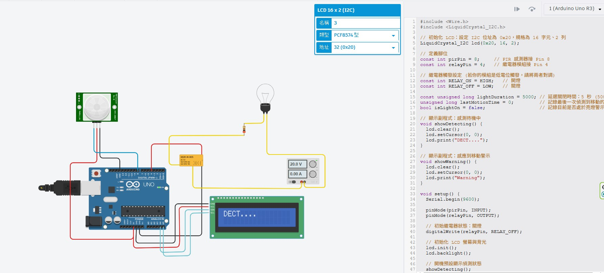

# 💡 Arduino Uno 人體感應控制繼電器電燈與 I2C LCD1602 狀態監控系統 (PIR Pin 8 + Relay Pin 4)

> **最後更新時間**: 2026-10-01 15:23:26 (UTC+8)  
> **使用模型**: Gemini 3.8 Flash  
> **執行 Agent**: Antigravity  
> **實驗圖片來源**: `C:\Users\User\Desktop\20261001.jpg` / [20261001.jpg](./20261001.jpg)  
> **對應互動網頁**: [arduino_uno_pir8_relay4_lcd1602_i2c.html](./arduino_uno_pir8_relay4_lcd1602_i2c.html)  
> **硬體規格**: Arduino Uno R3 + Parallax PIR (Pin 8) + 繼電器 (Pin 4) + I2C LCD 1602 (PCF8574, 0x20)  

---

## 📷 系統接線實驗圖分析 (Tinkercad Circuits)



### 🔌 硬體引腳接線對照清單 (Wiring Table)

| 硬體模組 | 模組引腳 | Arduino Uno 腳位 | 說明 |
| :--- | :--- | :--- | :--- |
| **Parallax PIR 人體紅外線感測器** | **VCC** | **5V** | 紅色電源線 |
| | **GND** | **GND** | 黑色接地線 |
| | **SIG (信號輸出)** | **數位 Pin 8** | 藍色信號線，感應到移動輸出 HIGH |
| **電磁繼電器 (KS2E-M-DC5)** | **Coil (+) 控制端** | **數位 Pin 4** | 黃色控制線，輸出 HIGH 導通線圈吸合常開端 (NO) |
| | **Coil (-) 接地** | **GND** | 黑色接地線 |
| | **COM (共同端)** | 外接電源供應器正極 (+) | 串接至 20V 燈泡回路 |
| | **NO (常開端)** | 限流電阻 ➔ 燈泡正極 | 繼電器觸發時導通點亮燈泡 |
| **I2C LCD 1602 液晶模組**<br>(PCF8574，位址 `0x20`) | **GND** | **GND** | 黑色接地線 |
| | **VCC** | **5V** | 紅色電源線 |
| | **SDA (資料線)** | **類比 A4** | 淺藍色導線接 A4 |
| | **SCL (時脈線)** | **類比 A5** | 淺藍色導線接 A5 |

> **⚠️ 注意 LCD I2C 位址**：
> 截圖右上角設定視窗明確標示：`類型: PCF8574 型`，`地址: 32 (0x20)`。
> 十進制的 $32$ 等於十六進制的 `0x20`，因此初始化函式必須為：
> ```cpp
> LiquidCrystal_I2C lcd(0x20, 16, 2);
> ```

---

## 💻 完整的 Arduino 程式碼 (與截圖 100% 相符且補完完整邏輯)

本程式採用 **非阻塞式 `millis()` 計時器架構**：
1. **人員進入 / 移動**：PIR 輸出 HIGH，立即點亮電燈（繼電器 Pin 4 輸出 HIGH），LCD 螢幕切換顯示 `"Warning"`，並持續刷新最後移動時間戳記。
2. **人員持續在場**：每次偵測到移動皆會重置 5 秒倒數計時，避免燈光閃爍中斷。
3. **人員離開 5 秒後**：超過 5000 毫秒無移動訊號，繼電器釋放關閉電燈，LCD 切換回待機顯示 `"DECT...."`。

```cpp
#include <Wire.h>
#include <LiquidCrystal_I2C.h>

// 初始化 LCD: 設定 I2C 位址為 0x20，規格為 16 字元、2 列
LiquidCrystal_I2C lcd(0x20, 16, 2);

// 定義腳位
const int pirPin = 8;     // PIR 感測器接 Pin 8
const int relayPin = 4;   // 繼電器模組接 Pin 4

// 繼電器觸發設定 (若你的模組是低電位觸發，請將兩者對調)
const int RELAY_ON = HIGH;   // 開燈
const int RELAY_OFF = LOW;  // 關燈

const unsigned long lightDuration = 5000; // 延遲關閉時間: 5 秒 (5000ms)
unsigned long lastMotionTime = 0;         // 記錄最後一次偵測到移動的時間
bool isLightOn = false;                   // 記錄目前是否處於亮燈警示狀態

// 顯示副程式: 感測待機中
void showDetecting() {
  lcd.clear();
  lcd.setCursor(0, 0);
  lcd.print("DECT....");
}

// 顯示副程式: 感應到移動警示
void showWarning() {
  lcd.clear();
  lcd.setCursor(0, 0);
  lcd.print("Warning");
}

void setup() {
  Serial.begin(9600);

  pinMode(pirPin, INPUT);
  pinMode(relayPin, OUTPUT);

  // 初始繼電器狀態: 關燈
  digitalWrite(relayPin, RELAY_OFF);

  // 初始化 LCD 螢幕與背光
  lcd.init();
  lcd.backlight();

  // 開機預設顯示偵測狀態
  showDetecting();
  Serial.println(F("[系統就緒] PIR Pin 8 + Relay Pin 4 啟動，進入偵測待機..."));
}

void loop() {
  // 讀取 PIR 感測器數位輸出狀態
  int pirState = digitalRead(pirPin);

  // 當偵測到人體移動 (PIR 輸出 HIGH)
  if (pirState == HIGH) {
    // 更新最後一次偵測到移動的時間戳記
    lastMotionTime = millis();

    // 如果目前燈尚未開啟，則觸發開燈與警示
    if (!isLightOn) {
      isLightOn = true;
      digitalWrite(relayPin, RELAY_ON); // 繼電器動作，開燈
      showWarning();                    // LCD 顯示 "Warning"
      Serial.println(F("[偵測到移動] 繼電器導通開燈！LCD 顯示 Warning"));
    }
  }

  // 若燈目前是開啟的，檢查是否已超過 5 秒無人走動
  if (isLightOn) {
    if (millis() - lastMotionTime >= lightDuration) {
      // 5 秒已到且無新移動觸發，關閉電燈
      isLightOn = false;
      digitalWrite(relayPin, RELAY_OFF); // 繼電器復歸，關燈
      showDetecting();                   // LCD 恢復顯示 "DECT...."
      Serial.println(F("[延遲時間 5 秒已到] 無人移動，自動關燈並恢復待機。"));
    }
  }

  // 微幅延遲，保持 loop 運作穩定
  delay(20);
}
```

---

## 🌟 程式設計亮點解析

1. **防 LCD 閃爍機制**：
   - 僅在狀態**切換瞬間（由待機轉亮燈、或由亮燈轉待機）**才呼叫 `showWarning()` 或 `showDetecting()`。
   - 避免在 `loop()` 每一圈無條件執行 `lcd.clear()`，防止螢幕字體抖動或閃爍。
2. **智慧活動刷新 (Activity Refresh)**：
   - 當人在房間內持續走動時，每次 PIR 輸出 HIGH 都會執行 `lastMotionTime = millis()`，自動延長 5 秒，人不會在房內突然被關燈。
3. **無凍結 (Non-blocking)**：
   - 沒有使用會讓單晶片暫停一切運作的 `delay(5000)`，讓微控制器能隨時保持對感測器即時響應。

---

## 📝 提示詞歷史與變更記錄 (Prompt Archive)

### 🔹 [2026-10-01 14:15:00] [Gemini 3.8 Flash / Antigravity] PIR Pin 8 + 繼電器 Pin 4 智慧控制電燈
- **模型/Agent**: Gemini 3.8 Flash / Antigravity
- **Prompt 原文**:
  ```text
  C:\Users\User\Desktop\20261001.jpg 設計arduino程式 pir 接 pin 8, pin4 接繼電器控制電燈，感應到移動的時候開燈，燈延遲五秒後關閉
  ```
- **變更摘要**: 依據使用者 Tinkercad 截圖（`20261001.jpg`），設計非阻塞式 `millis()` 狀態機架構，PIR 接 Pin 8，繼電器接 Pin 4，LCD 1602 (PCF8574 位址 0x20)，實作感應開燈、活動持續刷新與 5 秒熄燈功能。

### 🔹 [2026-10-01 14:50:49] [Gemini 3.8 Flash / Antigravity] 狀態顯示文字定義
- **模型/Agent**: Gemini 3.8 Flash / Antigravity
- **Prompt 原文**:
  ```text
  lcd 1602 I2C, pcf8574 0x20,在pir感測時顯示 "DECT...." .感應到移動顯示"Warning"
  ```
- **變更摘要**: 明確鎖定待機時顯示 `"DECT...."`，感應到移動顯示 `"Warning"`，僅在狀態切換瞬間呼叫顯示副程式以達到徹底防 LCD 閃爍（Flicker-Free）。

### 🔹 [2026-10-01 15:23:26] [Gemini 3.8 Flash / Antigravity] 補齊標頭與 Prompt 歷程規範
- **模型/Agent**: Gemini 3.8 Flash / Antigravity
- **Prompt 原文**:
  ```text
  依照規則應該在文件下方備註prompt 以及標頭資訊
  ```
- **變更摘要**: 依據專案規範全面補齊文件標頭（最後更新時間、模型、Agent、關聯資源）與下方累加式 Prompt 歷史記錄。
