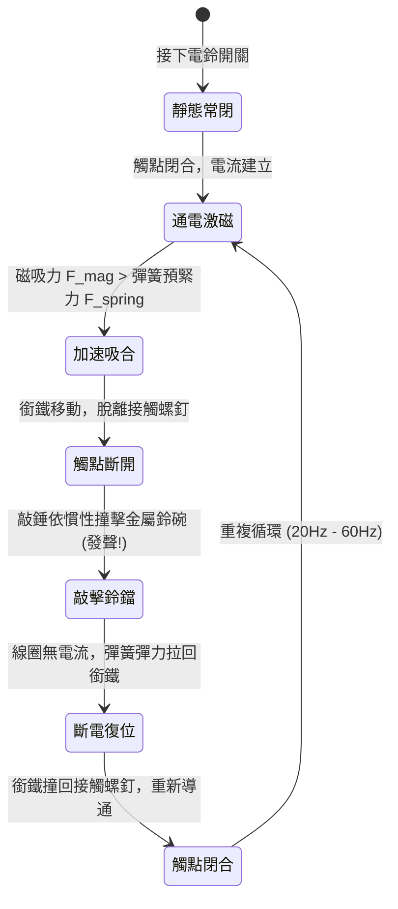

# ⚡ 電磁線圈電鈴 (Electric Bell) 原理解析、數值動力學與動態模擬設計

> **最後更新時間**: 2026-09-26 23:01:05 (UTC+8)  
> **使用模型**: Claude Opus 5.5 (claude-opus-5-5)  
> **執行 Agent**: Claude Code  

---

## 📖 導論：從電磁鐵到自激振盪機械聲響

電鈴（Electric Bell / Trembler Bell）是電磁學發展早期最經典、最具代表性的機電一體化發明之一。自 19 世紀約翰·米蘭德（John Mirand）於 1850 年代提出帶有自動斷續器（Make-and-break interrupter）的電鈴專利以來，這項裝置廣泛應用於學校鐘聲、火警警報、電話振鈴與居家門鈴中。

電鈴的核心精髓在於**利用電磁線圈（Electromagnet）將電能轉化為磁場吸力，並透過巧妙的機械接點回授（Mechanical Feedback），將直流電能轉化為機械自激振盪（Self-excited Oscillation），最終敲擊金屬鈴碗（Gong）產生高能量、穿透力極強的金屬敲擊聲響**。

本文件從電磁物理、機械多體動力學、聲學共振模態以及 Web Audio 數位合成四個維度，完整剖析電鈴的運作原理與模擬設計。

---

## 🔬 一、核心概念剖析 (Core Concepts)

```
        ┌──────────── [直流電源 DC Source] ────────────┐
        │                                              │
      [按鈕] (Push Button)                              │
        │                                              │
        ▼                                              │
 ┌──────────────┐     磁吸力 F_mag      ┌───────────┐  │
 │ 雙柱電磁線圈 │ ═══════════════════►  │ 軟鐵銜鐵  │  │
 │  (Solenoid)  │                      │ (Armature)│  │
 └──────────────┘                      └─────┬─────┘  │
        │                                    │        │
        │ 回路導線                           │ 敲擊桿 │
        │                                    ▼        │
        │                              (●) 敲錘       │
        │                               ║ (Clapper)   │
        │                               ║             │
        │                             ╭───╮           │
        │                             │ 鈴│ 撞擊發聲  │
        │                             │ 鐺│ (Sound)   │
        │                             ╰───╯           │
        ▼                                             │
 [接觸調節螺釘] ◄─── 彈簧片常閉接點 (Contact) ────────┘
  (Contact Screw)    (位移超過 x_break 時斷路)
```

### 1.1 電磁線圈與磁路吸力模型

電鈴通常採用 U 型雙柱軟鐵芯線圈（Twin-coil Electromagnet），兩個線圈反向串聯繞製，使一端形成 N 極、另一端形成 S 極，形成閉合度極高的低磁阻迴路（Low Reluctance Magnetic Circuit）。

#### (1) 安培環路定律與磁通密度
根據安培環路定律，在氣隙長度為 $g(t)$ 的磁路中：

$$\oint \vec{H} \cdot d\vec{l} = N I$$

磁路總磁阻（Reluctance）為鐵芯磁阻與雙氣隙磁阻之和：

$$\mathcal{R}_{total} = \mathcal{R}_{core} + 2 \mathcal{R}_{gap} = \frac{l_{core}}{\mu_r \mu_0 A} + \frac{2 g(t)}{\mu_0 A}$$

由於軟鐵芯相對磁導率 $\mu_r \gg 1000$，在氣隙未完全閉合時，磁阻主要由空氣隙主導：

$$\mathcal{R}_{total} \approx \frac{2 g(t)}{\mu_0 A}$$

氣隙中的磁通量 $\Phi$ 與磁通密度 $B$ 為：

$$\Phi = \frac{N I}{\mathcal{R}_{total}} \approx \frac{\mu_0 A N I}{2 g(t)}$$

$$B = \frac{\Phi}{A} = \frac{\mu_0 N I}{2 g(t)}$$

#### (2) 麥克斯韋磁吸力公式 (Maxwell's Lifting Force)
電磁鐵端面作用於軟鐵銜鐵的電磁吸力，可由磁場能量對氣隙位移的虛功求導求得：

$$F_{mag} = 2 \times \left( \frac{B^2 A}{2 \mu_0} \right) = \frac{B^2 A}{\mu_0} = \frac{\mu_0 A N^2 I(t)^2}{4 g(t)^2}$$

* **平方非線性關係**：吸力 $F_{mag} \propto I^2$ 且 $F_{mag} \propto \frac{1}{g^2}$。當銜鐵越靠近鐵芯，吸力呈現劇烈非線性激增；當氣隙拉大時，吸力迅速衰減。

---

### 1.2 自激振盪斷續機構 (Interrupter / Make-and-Break Mechanism)

電鈴不需要外加晶體管或交流振盪信號，其本質是一部**機電式弛張振盪器（Electromechanical Relaxation Oscillator）**。振盪循環分為四個明確階段：



1. **通電初期 (Make Phase)**：
   - 銜鐵處於靜止位置，彈簧片緊壓接觸螺釘，電路導通。
   - 線圈具有電感 $L$，電流依一階暫態指數上升：
     $$I(t) = \frac{V_{in}}{R} \left( 1 - e^{-\frac{t}{\tau_e}} \right), \quad \tau_e = \frac{L}{R}$$
2. **加速與斷開 (Break Phase)**：
   - 當 $I(t)$ 上升使 $F_{mag} > F_{preload}$ 時，銜鐵加速向前運動。
   - 銜鐵前進位移 $x > x_{contact}$ 後，彈簧片與螺釘脫離接觸，電路瞬間斷開！
3. **慣性敲擊 (Impact Phase)**：
   - 儘管電路已斷開、磁場迅速塌陷，銜鐵與敲錘已累積充足動量 $p = m v$，敲錘狠狠敲擊銅合金鈴鐺（Gong），將動能轉化為高頻聲波振動。
4. **彈力復位 (Reset Phase)**：
   - 磁力消失後，彈簧彈片的反作用彈力 $F_s = -k x$ 使銜鐵與敲錘向後彈回。
   - 銜鐵回到原點撞擊接觸螺釘，電路重新閉合，進入下一個週期。

---

### 1.3 暫態反電動勢與觸點電弧 (Back EMF & Spark Phenomenon)

由於線圈電感 $L$ 儲存磁場能量 $E = \frac{1}{2} L I^2$，在接點分離瞬間，電流變化率 $\frac{di}{dt} \to -\infty$，根據法拉第感應定律：

$$V_{terminal} = -L \frac{di}{dt}$$

瞬間感應出可達數百伏特的反向高壓。接點剛分離時間隙極小，觸點間的熔融金屬橋與高溫金屬蒸氣會引發電弧（只要電壓超過約十餘伏、電流超過數百毫安即可維持；純空氣間隙依巴申定律最低約需 300 V 才會擊穿，均勻電場下約 $3 \text{ kV/mm}$），在接點處產生微小的藍白色火花（Spark / Arc）。
- **影響**：長年累月會造成接點氧化、燒蝕與積碳，增大接觸電阻。
- **消弧對策**：並聯 RC 突波吸收器（Snubber: 串聯電容與電阻）或逆向並聯飛輪二極體（Flyback Diode）以吸收感應脈衝。

---

### 1.4 敲擊聲學與金屬共振頻譜 (Acoustics & Chladni Modes)

金屬鈴碗（Bell Gong）在受到敲錘彈性碰撞瞬間，發出的聲音與吉他琴弦或管樂器完全不同：
* **琴弦 / 空氣柱**：諧波呈整數倍關係（$f_0, 2f_0, 3f_0, \dots$），聽感溫暖和諧。
* **球殼 / 碟形金屬薄殼**：由二維撓曲波動方程描述（克拉尼圖形 Chladni nodal lines），模態由 Bessel 函數的零點決定，其泛音皆為**非整數倍非諧波（Inharmonic partials）**：

$$f_{(m,n)} \propto \frac{h}{R^2} \sqrt{\frac{E}{\rho (1 - \nu^2)}} \beta_{(m,n)}^2$$

| 振動模態 (Modals) | 典型頻率比率 ($f / f_0$) | 聲學感知特徵 | 能量衰減時間 ($\tau$) |
| :--- | :--- | :--- | :--- |
| **基模 (Fundamental $f_0$)** | **$1.00$** (約 1000 ~ 1300 Hz) | 鈴鐺厚實的主體音調 | 最長 (~ 800 ms) |
| **二次非諧泛音 (Mode 1)** | **$2.14$** (約 2500 Hz) | 金屬清脆感、穿透力 | 次長 (~ 500 ms) |
| **三次非諧泛音 (Mode 2)** | **$3.25$** (約 3800 Hz) | 刺耳的金屬邊緣感 | 中等 (~ 300 ms) |
| **四次非諧泛音 (Mode 3)** | **$4.88$** (約 5800 Hz) | 極高頻亮色 | 短 (~ 120 ms) |
| **打擊雜訊 (Impact Transient)** | 寬頻帶噪聲 (Band-passed) | 敲錘球撞擊瞬間的「叮」硬聲 | 極短 (~ 8 ms) |

---

## ⚙️ 二、實作與應用範例 (Practical Examples)

### 2.1 機械與電路耦合微分方程數值模型

電鈴運動可精確建模為單自由度非線性受迫阻尼振子：

$$m \frac{d^2 x}{dt^2} + c \frac{dx}{dt} + k (x - x_0) = F_{mag}(I, x) + F_{contact}(x) + F_{gong}(x)$$

其中：
1. **電磁力**：
   $$F_{mag}(I, x) = \begin{cases} \frac{\mu_0 A N^2 I(t)^2}{4 (g_0 - x)^2} & (\text{若電路閉合}) \\ 0 & (\text{若電路斷開}) \end{cases}$$
2. **接觸螺釘恢復力**：
   $$F_{contact}(x) = \begin{cases} -k_{stop} (x - x_{min}) & (x < x_{min}) \\ 0 & (x \ge x_{min}) \end{cases}$$
3. **鈴鐺剛性碰撞力**：
   $$F_{gong}(x) = \begin{cases} -k_{gong} (x - x_{gong}) - c_{gong} \dot{x} & (x > x_{gong}) \\ 0 & (x \le x_{gong}) \end{cases}$$

---

### 2.2 Web Audio API 物理聲學合成代碼實作

以下為純前端 JavaScript 程式碼，不依賴外部 MP3 檔案，利用非諧波加法合成與動態包絡線合成逼真的金屬電鈴敲擊聲：

```javascript
// 金屬電鈴聲響合成器 (Web Audio API Inharmonic Additive Synthesizer)
class ElectricBellAcousticEngine {
    constructor() {
        this.ctx = null;
        this.baseFreq = 1150; // 基模頻率 (Hz)
        this.volume = 0.6;
    }

    init() {
        if (!this.ctx) {
            const AudioContext = window.AudioContext || window.webkitAudioContext;
            this.ctx = new AudioContext();
        }
        if (this.ctx.state === 'suspended') {
            this.ctx.resume();
        }
    }

    // 敲擊單次鈴聲觸發
    playStrike(intensity = 1.0) {
        if (!this.ctx) this.init();
        const now = this.ctx.currentTime;

        // 非諧泛音比率與相對振幅衰減時間配置
        const partials = [
            { ratio: 1.00, gain: 0.60 * intensity, decay: 0.85 },  // 基模
            { ratio: 2.14, gain: 0.40 * intensity, decay: 0.55 },  // Mode 1
            { ratio: 3.25, gain: 0.28 * intensity, decay: 0.38 },  // Mode 2
            { ratio: 4.88, gain: 0.15 * intensity, decay: 0.20 },  // Mode 3
            { ratio: 6.27, gain: 0.08 * intensity, decay: 0.12 }   // Mode 4
        ];

        // 主輸出增益
        const masterGain = this.ctx.createGain();
        masterGain.gain.setValueAtTime(this.volume, now);
        masterGain.connect(this.ctx.destination);

        // 1. 合成多個金屬共振模態 (Sinusoidal Oscillators)
        partials.forEach(p => {
            const osc = this.ctx.createOscillator();
            const gain = this.ctx.createGain();

            osc.type = 'sine';
            osc.frequency.setValueAtTime(this.baseFreq * p.ratio, now);

            // 敲擊起音 (Attack) 與指數衰減 (Exponential Decay)
            gain.gain.setValueAtTime(0.001, now);
            gain.gain.linearRampToValueAtTime(p.gain, now + 0.0015); // 1.5ms 瞬態衝擊
            gain.gain.exponentialRampToValueAtTime(0.0001, now + p.decay);

            osc.connect(gain);
            gain.connect(masterGain);

            osc.start(now);
            osc.stop(now + p.decay);
        });

        // 2. 金屬敲擊硬衝擊雜訊 (Impulsive Click Transient)
        const bufferSize = this.ctx.sampleRate * 0.02; // 20ms
        const noiseBuffer = this.ctx.createBuffer(1, bufferSize, this.ctx.sampleRate);
        const output = noiseBuffer.getChannelData(0);
        for (let i = 0; i < bufferSize; i++) {
            output[i] = (Math.random() * 2 - 1) * Math.exp(-i / (this.ctx.sampleRate * 0.004));
        }

        const noiseSrc = this.ctx.createBufferSource();
        noiseSrc.buffer = noiseBuffer;

        // 帶通濾波器模擬敲錘頭部高硬度撞擊
        const filter = this.ctx.createBiquadFilter();
        filter.type = 'bandpass';
        filter.frequency.setValueAtTime(4500, now);
        filter.Q.setValueAtTime(3.0, now);

        const noiseGain = this.ctx.createGain();
        noiseGain.gain.setValueAtTime(0.35 * intensity, now);
        noiseGain.gain.exponentialRampToValueAtTime(0.001, now + 0.02);

        noiseSrc.connect(filter);
        filter.connect(noiseGain);
        noiseGain.connect(masterGain);

        noiseSrc.start(now);
    }
}
```

---

### 2.3 物理動畫與 Canvas 即時渲染核心架構

在前端模擬器中，物理引擎採用動態時間步進（$\Delta t \approx 1/120\text{ s}$）：
- **開關控制**：按下按鈕時，電路允許通電；若銜鐵位移小於接點分離閾值，電流建立。
- **線圈可視化**：繪製磁感線流動動畫（流動光點與磁力線虛線）。
- **觸點火花粒子效果**：當狀態由閉合轉為斷開時，於接點座標發射 8~15 顆具備重力與壽命衰減的隨機彩色微粒子。
- **聲波漣漪效果**：敲錘撞擊鈴鐺瞬間，生成同心擴散光環並播放 Web Audio 敲擊音。

---

## 🚀 三、延伸思考與進階主題 (Extensions & Advanced Topics)

### 3.1 直流電鈴與交流電鈴 (AC Bell) 的本質差異

| 特性 | 直流電鈴 (DC Trembler Bell) | 交流電鈴 (AC Polarized / Gong Bell) |
| :--- | :--- | :--- |
| **斷續機構** | **需要** 機械式斷續彈簧片與接觸螺釘 | **不需要** 斷續器接點 |
| **振動來源** | 線圈磁力與機械接點交替通斷的自激振盪 | 依賴交流電本身的頻率（50Hz / 60Hz）交變磁場 |
| **敲錘驅動** | 單向吸引，靠彈簧復位敲擊 | 雙向吸引，永久磁鐵搭配交流線圈，左打一下右打一下（雙打鈴） |
| **火花與壽命** | 接點易氧化磨損、產生射頻干擾 (RFI) | 無開閉觸點火花，壽命極長且維護成本低 |
| **常見用途** | 老式門鈴、火警鈴、玩具實驗 | 傳統市話振鈴（90V AC 20Hz）、學校鐘聲、消防警報 |

---

### 3.2 接觸點電弧抑制與電磁相容性 (EMC)
電鈴工作時，電弧不僅損耗觸點，還會向空間輻射寬頻電磁干擾（EMI／RFI），干擾附近的無線電廣播與微控制器（MCU）。現代工業若使用機電蜂鳴器，必須採取以下防護：
1. **雙向瞬態抑制二極體 (TVS Diode)**：箝位線圈兩端電壓。
2. **接點鍍金 / 鉑銥合金 (Platinum-Iridium contacts)**：耐高溫抗電弧燒蝕。
3. **電磁屏蔽金屬外罩 (Faraday Shielding)**：隔離高頻電磁輻射。

---

## 📝 提示詞歷史與變更記錄 (Prompt Archive)

### 🔹 [2026-09-22 14:26:00] [Antigravity / Gemini 3.8 Flash] 變更紀錄
- **模型/Agent**: Gemini 3.8 Flash / Antigravity
- **Prompt 原文**:
  ```text
  利用電子線圈設計一個電鈴的動態模擬跟聲音
  ```
- **變更摘要**: 建立電磁線圈電鈴原理筆記，詳解安培磁路、麥克斯韋磁吸力、斷續器弛張振盪、聲學非諧波共振模態，並提供 Web Audio API 合成演算法與動力學模型。

### 🔹 [2026-09-26 23:01:05] [Claude Opus 5.5 (claude-opus-5-5) / Claude Code] 變更紀錄
- **模型/Agent**: Claude Opus 5.5 (claude-opus-5-5) / Claude Code
- **Prompt 原文**:
  ```text
  檢視所有檔案內容中的敘述與說明，確認概念與敘述的正確性
  修正後，將修改內容，附加在每個檔案的最下方區塊並標誌時間戳記與模型代號
  確認概念與解釋說明都是正確的
  ```
- **變更摘要**: 全面檢視概念與敘述正確性並修正：
  - 2.1 節電磁力公式分母由 2 改為 4，與 1.1 節推導 μ0AN²I²/(4g²) 一致
  - 修正接點火花成因：為金屬蒸氣電弧（空氣間隙依巴申定律最低約 300 V 才擊穿），刪除「數十伏即擊穿空氣」
  - 早期電話使用交流振鈴，直流電鈴用途改為門鈴、火警鈴；EMP 改為 EMI／RFI
