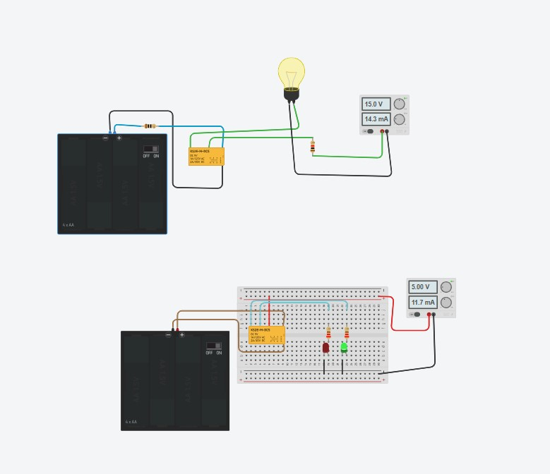
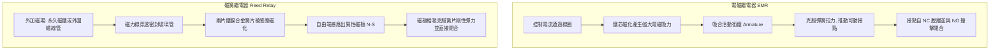
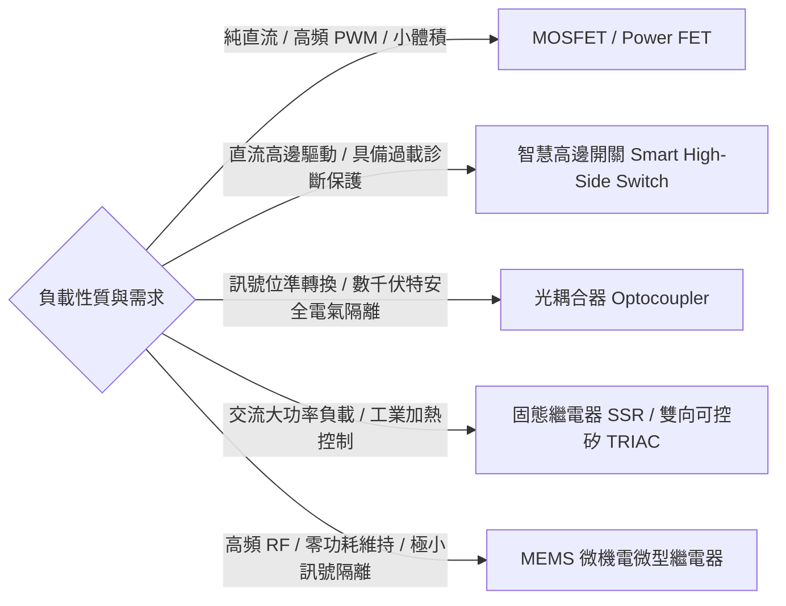
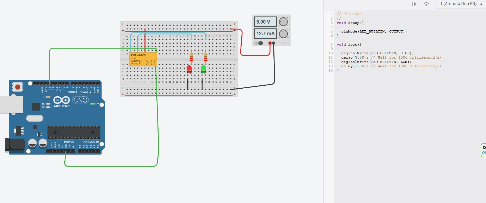

# 繼電器控制電路、內部結構與動態模擬原理解析

> **最後更新時間**: 2026-09-26 23:01:05 (UTC+8)  
> **使用模型**: Claude Opus 5.5 (claude-opus-5-5)  
> **執行 Agent**: Claude Code  

---

## 📌 原始電路設計與實驗架構

下圖為本次實驗所設計的兩種經典手動繼電器控制電路（基於標準 5V SPDT 電磁繼電器與麵包板實驗平台）：



---

## 一、 繼電器核心概念剖析 (Core Concepts)

### 1. 什麼是繼電器 (Relay)?
繼電器（Relay）是一種「**以小控大、電氣隔離**」的自動電氣開關。其主要作用為利用低電壓、微弱電流的控制訊號（例如微控制器 MCU、感測器或乾電池），來安全控制高電壓、大電流或交流電（AC）的負載迴路。

### 2. 電磁繼電器的基本組成與端子定義
一顆典型的單刀雙擲（SPDT, Single Pole Double Throw）電磁繼電器由以下五大機構組成：
1. **控制線圈 (Electromagnet Coil)**：通電時產生電磁吸力，未通電時無磁性。
2. **固定鐵芯 (Iron Core) 與極靴**：集中並增強電磁線圈產生的磁通量。
3. **活動銜鐵 (Armature)**：受磁力吸引而擺動的軟磁鐵片。
4. **復歸彈簧 (Return Spring)**：在線圈斷電時提供拉力，將銜鐵拉回初始機械位置。
5. **切換接點組 (Electrical Contacts)**：
   * **COM (Common，共用端)**：連接動觸點的樞軸端，為負載電流的主要進出點。
   * **NC (Normally Closed，常閉端)**：在線圈**未通電（De-energized）**時，動觸點在彈簧拉力下與 NC 接點保持緊密閉合。
   * **NO (Normally Open，常開端)**：在線圈**通電（Energized）**時，銜鐵被吸合，使動觸點脫離 NC 並與 NO 接點緊密閉合。

---

## 二、 實作與應用範例：兩套原始電路深度剖析

### ⚡ 電路一（上方設計）：低壓隔離控制高功率負載

```
【控制端 (6V 隔離區)】                       【負載端 (15V 大功率迴路)】
  [4xAA 6V 電池盒]                         [15.0V 直流穩壓電源 (+)]
        │ (滑動開關)                                   │
        ▼                                             ▼
  ┌───────────┐         磁力吸合            ┌───────────┐
  │ 繼電器線圈 ├─── ─ ─ ─ ─ ─ ─ ─ ─ ──▶   │  COM 接點  │
  └─────┬─────┘                             └─────┬─────┘
        │                                         │ (通電閉合)
     [GND 負極]                             ┌─────▼─────┐
                                            │  NO 接點   │
                                            └─────┬─────┘
                                                  │
                                            ┌─────▼─────┐
                                            │  白熾燈泡  │
                                            └─────┬─────┘
                                                  │ (限流電阻)
                                            [15.0V 電源 (-)]
```

#### 1. 控制原理
* **輸入控制端**：採用 4 顆 AA 電池串聯（約 6.0V），透過電池盒內建的滑動開關（Slide Switch）直接控制供應給繼電器線圈的激磁電流。
* **輸出受控端**：獨立採用 15.0V / 14.3mA 的外部直流穩壓電源供應器，與白熾燈泡（Incandescent Lamp）及限流分壓電阻串聯，透過繼電器的 COM 與 NO 構成獨立回路。
* **物理隔離特性**：控制端 6V 與負載端 15V 的**地線完全不相連（Galvanic Isolation）**，僅透過磁場耦合傳遞開關指令，有效防止負載端的突波干擾回竄至控制電路。

#### 2. 控制邏輯狀態表
| 電池盒開關狀態 | 線圈激磁狀態 | 電磁吸力 | 接點動作 | 15V 負載迴路 | 燈泡狀態 | 電源輸出電流 |
| :---: | :---: | :---: | :---: | :---: | :---: | :---: |
| **OFF (開路)** | 0V / 0mA (斷電) | 無磁場 | COM 連接 NC (NO 斷開) | 斷路 (Open Circuit) | **熄滅 (OFF)** | 0.0 mA |
| **ON (閉合)** | ~6V / 激磁通電 | 克服彈簧吸合 | COM 切換至 NO (閉合) | 通路 (Closed Circuit) | **發光 (ON)** | ~14.3 mA |

---

### 🚦 電路二（下方設計）：SPDT 單刀雙擲雙態切換邏輯

```
【輸入激磁端】                              【5.0V 邏輯指示負載端】
  [4xAA 6V 電池盒]                                 [+5.00V 匯流排]
        │ (開關)                                          │
        ▼                                                 ▼
  ┌───────────┐                              ┌─────────────────────────┐
  │ 繼電器線圈 │                              │       COM 共用端        │
  └─────┬─────┘                              └───┬─────────────────┬───┘
        │                                        │                 │
     [GND]                                [未通電/閉合]        [通電/吸合]
                                                 │                 │
                                           ┌─────▼─────┐     ┌─────▼─────┐
                                           │  NC 接點  │     │  NO 接點  │
                                           └─────┬─────┘     └─────┬─────┘
                                                 │                 │
                                           ┌─────▼─────┐     ┌─────▼─────┐
                                           │ 紅色 LED  │     │ 綠色 LED  │
                                           └─────┬─────┘     └─────┬─────┘
                                                 │ (限流電阻)      │ (限流電阻)
                                                 └────────┬────────┘
                                                          ▼
                                                    [GND 負極接地]
```

#### 1. 控制原理
* **負載組態**：在麵包板上，以 5.00V 穩壓電源作為系統電源。
* **接點配置**：
  * **COM 端**接至 5.0V 正極軌。
  * **NC（常閉端）**串聯限流電阻接至**紅色 LED**。
  * **NO（常開端）**串聯限流電阻接至**綠色 LED**。
* **互斥切換邏輯**：利用 SPDT 機械觸點物理上「非 A 即 B」的互鎖幾何結構，確保同一時間紅色與綠色 LED 絕不可能同時亮起。

#### 2. 控制邏輯狀態表
| 電池開關狀態 | 繼電器狀態 | COM 連接端 | 紅色 LED (待機/停止) | 綠色 LED (運行/動作) | 負載總電流 | 系統代表意涵 |
| :---: | :---: | :---: | :---: | :---: | :---: | :---: |
| **OFF** | 釋放 (De-energized) | **NC 導通** | 🔴 **亮起 (ON)** | 🟢 熄滅 (OFF) | ~11.7 mA | 系統待機 / 停機警示 |
| **ON** | 吸合 (Energized) | **NO 導通** | 🔴 熄滅 (OFF) | 🟢 **亮起 (ON)** | ~11.7 mA | 系統運轉 / 正常動作 |

---

## 三、 繼電器種類與內部結構運作原理

### 1. 電磁繼電器 (Electromagnetic Relay) vs 磁簧繼電器 (Reed Relay)



### 2. 磁簧開關 (Reed Switch) 運作原理深入剖析
磁簧開關是一種高靈敏度、高密封性的磁敏開關元件：
1. **結構組成**：由一對經過退火處理（高導磁、低矯頑力）的**鐵鎳合金（Fe-Ni Alloy）彈性簧片**組成，密封在充有乾燥氮氣等保護性氣體或真空的小型微型玻璃管中。簧片接點部位通常鍍有耐磨金屬（如銠 Rhodium、釕 Ruthenium 或金 Gold）。
2. **作動機制**：
   * **外部無磁場時**：兩根簧片因自身的機械彈性保持微小間隙（Gap），電路呈現斷開狀態。
   * **外部磁場靠近（永久磁鐵或電磁線圈）**：平行於簧片軸向的磁力線穿過簧片，兩片金屬簧片被磁化為一對磁偶極子。在兩片重疊的尖端處，分別感應出**相異磁極（一端為 N 極，另一端為 S 極）**。
   * **相吸閉合**：異性相吸的磁力大於簧片本身的機械彈性恢復力時，兩片簧片瞬間吸合接觸，形成導通迴路。
   * **磁場撤離**：磁場減弱或消失後，鐵鎳合金的低剩磁特性使得磁性迅速消失，簧片在自身彈性力作用下迅速彈開分開。

#### 電磁繼電器 vs 磁簧繼電器深度對比表
| 比較項目 | 電磁機械繼電器 (EMR) | 磁簧繼電器 (Reed Relay) |
| :--- | :--- | :--- |
| **開關機構** | 線圈＋鐵芯＋銜鐵＋機械觸點 | 密封玻璃管＋雙金屬磁簧片 |
| **切換速度 (響應時間)** | 較慢（5 ms ~ 20 ms） | 極快（0.2 ms ~ 1.0 ms） |
| **接觸電阻與彈跳 (Bounce)** | 接點彈跳大（約 1~5 ms） | 彈跳極微小（< 0.5 ms） |
| **工作環境耐受度** | 接點暴露易受潮氧化、產生粉塵 | 玻璃完全密封，耐腐蝕、防爆、防塵 |
| **驅動功率** | 較大（約 200 mW ~ 500 mW） | 極低（約 10 mW ~ 50 mW，可用 MCU 直驅）|
| **耐載電流 / 耐壓能力** | 極高（可承載 10A ~ 30A，250VAC） | 較小（通常 < 1A ~ 2A，30VDC） |
| **機械與電氣壽命** | 電氣約 10 萬次級；機械約 1000 萬次 | 可達 1 億次以上 |

---

## 四、 積體電路 (IC) 中繼電器的現代固態替代方案 (Solid-State Alternatives)

隨著電子設備走向微型化、高頻切換與高可靠度，傳統繼電器的機械磨損、體積與聲音限制逐漸顯露。現代晶片設計採用以下五大固態半導體解決方案：



1. **功率 MOSFET (金屬氧化物半導體場效電晶體)**：電壓控制型元件，導通電阻可低至數毫歐姆，切換頻率可達數百 kHz，極適合馬達 PWM 調速。
2. **智慧功率開關 (Smart High-Side Switch / PROFET)**：內部整合電荷泵、過流/過熱保護與電流回授診斷（如 BTS4140）。
3. **光耦合器 (Optocoupler / Photocoupler)**：利用光電隔離達成 2500V ~ 5000Vrms 絕緣，有效阻絕地迴路噪訊（如 PC817）。
4. **光耦合固態繼電器 (PhotoMOS / Solid State Relay - SSR)**：兼具電氣隔離與無聲、無接點火花、超長壽命特性。
5. **MEMS 微機電開關**：晶圓微懸臂梁結構，具備優異的高頻 RF 隔離與極低插入損失。

---

## 五、 繼電器的多元產業與實際工程應用 (Applications)

1. **汽車電子與動力系統 (Automotive Systems)**：起動馬達吸力繼電器（100A~300A）、車燈與喇叭控制、電動車 (EV) 400V~800V 高壓氣密防爆主正/主負接觸器。
2. **工業自動化與 PLC 系統 (Industrial & PLC)**：PLC 輸出端子隔離、馬達正反轉硬體機械互鎖 (Interlock)、急停安全繼電器 (Safety Relay)。
3. **智慧家庭與物聯網 (IoT Smart Home)**：智慧插座微型繼電器、冷氣空調 HVAC 壓縮機耐大湧浪電流控制。
4. **電力系統與保護電驛 (Power Protection Relays)**：過電流保護電驛 (50/51 Relay) 觸發高壓真空斷路器（VCB）跳脫、漏電斷路器 (GFCI / RCCB)。

---

## 六、 Arduino 微控制器自動化繼電器控制與程式深度解析 (Arduino Microcontroller Automation)

在現代控制與物聯網系統中，繼電器主要由單晶片（如 Arduino Uno、ESP32、STM32）根據演算法、感測器數值或網路指令進行全自動觸發。

下圖為在 Tinkercad 平台上所建立的 **Arduino Uno 自動切換 5V 繼電器 SPDT 負載電路**：



### 1. 電路接線架構說明
本電路將微控制器邏輯與外部受控負載在麵包板上進行對接：
* **Arduino 控制端**：
  * **訊號輸出 (Signal)**：數位腳位 `Pin 13`（板載 LED 腳位 `LED_BUILTIN`）以綠色導線連接至繼電器線圈的輸入端（Pin 1）。
  * **控制接地 (GND)**：Arduino 系統接地腳位 `GND` 以綠色導線連接至繼電器線圈負端（Pin 8），形成完整的控制迴路。
* **外部負載電路端**：
  * 外部直流穩壓電源供應器設定為 **5.00 V**（螢幕顯示工作電流為 **12.7 mA**）。
  * 電源正極（紅線）接入麵包板頂部電源軌，並以紅色跳線接入繼電器的 **COM (Common)** 共用端子。
  * 繼電器 **NC (常閉端)** 以藍色導線串聯限流電阻連接至**紅色 LED**，陰極接至電源接地軌。
  * 繼電器 **NO (常開端)** 以藍色導線串聯限流電阻連接至**綠色 LED**，陰極接至電源接地軌。

---

### 2. Arduino C++ 程式碼清單與逐行解析

```cpp
// C++ code
// Arduino Uno 自動週期控制繼電器雙色燈狀態

void setup()
{
  // 初始化數位腳位 13 (LED_BUILTIN) 為輸出模式 (OUTPUT)
  // 此腳位將向繼電器線圈發送高/低電位邏輯訊號
  pinMode(LED_BUILTIN, OUTPUT);
}

void loop()
{
  // 【階段一：線圈激磁】
  // 輸出 5V 高電位，驅動繼電器線圈產生磁場吸合內部銜鐵
  digitalWrite(LED_BUILTIN, HIGH);
  
  // 維持通電狀態 3000 毫秒 (3 秒)
  // 此時 COM 擺動接觸 NO (常開)，綠色 LED 點亮，紅色 LED 熄滅
  delay(3000); // 綠燈運轉維持 3 秒

  // 【階段二：線圈釋放】
  // 輸出 0V 低電位，線圈失磁，銜鐵藉由彈簧拉力復歸
  digitalWrite(LED_BUILTIN, LOW);
  
  // 維持斷電狀態 1000 毫秒 (1 秒)
  // 此時 COM 復歸接觸 NC (常閉)，紅色 LED 點亮，綠色 LED 熄滅
  delay(1000); // 紅燈待機維持 1 秒
}
```

#### 控制時序與狀態機真值表
程式在 `loop()` 內部循環執行，形成「**綠燈通電 3 秒 ➔ 紅燈斷電 1 秒**」的週期交替運作：

| 運行階段 | 保持時間 | Pin 13 電位 | 繼電器線圈 | 內部銜鐵狀態 | 導通接觸點 | 紅色 LED (待機) | 綠色 LED (運轉) | 外部負載電流 | 系統狀態意涵 |
| :---: | :---: | :---: | :---: | :---: | :---: | :---: | :---: | :---: | :---: |
| **Phase 1** | 3.0 秒 (3000ms) | `HIGH` (+5V) | 激磁通電 | 磁力克服彈簧吸合 | **COM - NO 閉合** | 🔴 熄滅 (OFF) | 🟢 **點亮 (ON)** | ~12.7 mA | 機具運轉中 (RUN) |
| **Phase 2** | 1.0 秒 (1000ms) | `LOW` (0V) | 失磁斷電 | 彈簧拉力拉回原位 | **COM - NC 閉合** | 🔴 **點亮 (ON)** | 🟢 熄滅 (OFF) | ~12.7 mA | 機具待機中 (STOP) |

> 📌 **程式碼細節補充說明**：
> 截圖中第 11 行註解寫著 `// Wait for 1000 millisecond(s)`，但實際執行的函式是 `delay(3000)`。在工程開發中，這屬於常見的「程式碼修改後註解未同步更新」現象。編譯器與單晶片純粹依據數字參數 `3000` 執行，因此實際綠燈導通時間為 3 秒，紅燈待機時間為 1 秒。

---

### 3. ⚠️ 極重要工程警告：單晶片直接驅動繼電器的兩大致命隱患

在 Tinkercad 模擬中，Arduino 腳位可直接驅動繼電器線圈；然而在**真實硬體電路中，這是會燒毀單晶片的危險接法**：

#### ① GPIO 引腳電流超載 (Overcurrent)
* **單晶片耐流極限**：ATmega328P 官方規格手冊規定，每個 I/O 引腳的**建議最大工作電流為 20 mA**（絕對額定最大值 40 mA）。
* **繼電器線圈需求**：以常見的 5V 繼電器（如 KEMET KS2E-M-DC5 或松樂 SRD-05VDC-SL-C）為例，其線圈電阻約為 $70\Omega \sim 125\Omega$。依歐姆定律計算：
  $$I_{coil} = \frac{5\text{ V}}{70\ \Omega} \approx 71.4\text{ mA}$$
* **結果**：71.4 mA 遠超出單晶片接腳負荷，會導致晶片引腳迅速過熱、熱擊穿損壞。

#### ② 反向感應電動勢突波 (Back-EMF / Inductive Kickback)
* **電磁原理**：繼電器線圈具備大電感量（Inductor $L$）。當程式執行 `digitalWrite(LED_BUILTIN, LOW)` 使電流瞬間中斷（$\frac{di}{dt}$ 極大）時，線圈會依楞次定律產生強大的反向電動勢：
  $$V_{back} = -L \frac{di}{dt}$$
* **結果**：若以電晶體驅動且沒有續流二極體，集極端突波可達 **數十至上百伏特**；若由腳位直驅，反向感應電流則會強迫流經 MCU 內部的 ESD 保護二極體與輸出級，反覆承受可能使該腳位永久損毀。

---

### 4. 工業級 Arduino 繼電器標準驅動電路設計 (Transistor Driver & Flyback Diode)

為確保微控制器的安全，標準電路必須配置**電晶體驅動級**與**飛輪保護二極體**：

```
Arduino MCU                     驅動與保護電路                      繼電器線圈
───────────                    ──────────────                      ──────────
                             +5V (外部電源或系統電源) ─────────────┬──────────┐
                                                                  │          │
                                                           ┌──────┴──────┐   │
                                                           │  線圈 Coil  │   │ 飛輪二極體 (Flyback Diode)
                                                           └──────┬──────┘   ▲ 1N4007 / 1N4148
                                                                  │ (反向並聯)│
                                                                  ├──────────┘
                                                                  │
Pin 13 ────[ 1kΩ 限流電阻 ]──── 基極 (B)                          │
                                    ┌──────┐                      │
                                    │ NPN  │                      ▼
                                    │ 三極管 ├───── 集極 (C) ──────┘
                                    │(2N2222)
                                    └──────┘
                                      │ 射極 (E)
                                      ▼
                                     GND (共同接地)
```

1. **三極管 / MOSFET 擴流開關**：
   * Arduino 腳位經 1 kΩ 電阻約輸出 **4 mA** 基極電流至 NPN 三極管（如 2N2222、S8050）的基極（約為集極電流的 1/10~1/20，確保深度飽和），使三極管進入飽和導通狀態，由外部電源與集極承載 70mA 的線圈電流。
2. **飛輪二極體 (Flyback Diode)**：
   * 在繼電器線圈兩端**反向並聯**一顆 1N4007 或高速 1N4148 二極體。
   * 斷電瞬間，反向感應電勢會透過二極體順向導通，形成局部閉合回路洩放電感能量，將線圈兩端的反向電壓箝位在約 0.7V（集極電壓不超過 $V_{CC} + 0.7\text{V}$），徹底消除高壓突波。
3. **光耦合隔離模組 (Optocoupler)**：
   * 帶光耦的模組（如 PC817 繼電器模組）可實現「光電隔離」，但前提是移除 JD-VCC 跳線、線圈側使用獨立電源；若與 Arduino 共用 5V／GND，則並未真正隔離。

---

## 📝 提示詞歷史與變更記錄 (Prompt Archive)

### 🔹 [2026-09-17 14:18:12] [Gemini 3.1 Pro / Antigravity] 變更紀錄
- **模型/Agent**: Gemini 3.1 Pro / Antigravity
- **Prompt 原文**:
  ```text
  C:\Users\User\Desktop\0917.jpg 這是我設計的兩個繼電器控制電路，兩個設計分別解說繼電器的控制原理，還有控制邏輯。另外補充，繼電器的種類與運作原理，延伸討論到積體電路中繼電器的替代方案
  ```
- **變更摘要**: 建立繼電器控制電路與原理解析筆記，包含圖片中兩個電路的運作邏輯分析，並補充繼電器的核心概念及積體電路中的替代方案。

### 🔹 [2026-09-17 14:22:50] [Gemini 3.8 Flash / Antigravity] 變更紀錄
- **模型/Agent**: Gemini 3.8 Flash / Antigravity
- **Prompt 原文**:
  ```text
  將原始的電路設計加入檔案，並利用繪圖進行動態模擬繼電器的運作，另外再設計繼電器磁簧開關與接點的動態展示，最後再增加繼電器的相關應用
  ```
- **變更摘要**: 
  1. 將原始電路圖片 (`relay_circuits_0917.jpg`) 複製並嵌入筆記中。
  2. 深入擴充電磁繼電器與磁簧開關 (Reed Switch) 內部接點結構與磁化動作原理對比分析。
  3. 全面整理繼電器在車載高壓接觸器、工業 PLC 互鎖安全模組、智慧家居 IoT 及電網保護電驛的多元應用實務。
  4. 同步規劃 HTML 動態互動模擬畫布（電路動態切換、內部機械接點動作、磁簧開關磁吸動態展示）。

### 🔹 [2026-09-17 14:36:27] [Gemini 3.8 Flash / Antigravity] 變更紀錄
- **模型/Agent**: Gemini 3.8 Flash / Antigravity
- **Prompt 原文**:
  ```text
  C:\Users\User\Desktop\arduino.jpg 加入這一個設計圖與程式解說
  ```
- **變更摘要**: 
  1. 複製並嵌入 Arduino 繼電器控制設計圖 (`arduino.jpg`)。
  2. 深入解析 Arduino C++ 程式碼架構與時序邏輯（綠燈 3 秒 / 紅燈 1 秒狀態機）。
  3. 詳細分析單晶片直接驅動繼電器的 GPIO 電流超載與反向電動勢 (Back-EMF) 破壞隱患。
  4. 提供正規工業級電晶體驅動級與飛輪二極體保護電路設計方案。

### 🔹 [2026-09-26 23:01:05] [Claude Opus 5.5 (claude-opus-5-5) / Claude Code] 變更紀錄
- **模型/Agent**: Claude Opus 5.5 (claude-opus-5-5) / Claude Code
- **Prompt 原文**:
  ```text
  檢視所有檔案內容中的敘述與說明，確認概念與敘述的正確性
  修正後，將修改內容，附加在每個檔案的最下方區塊並標誌時間戳記與模型代號
  確認概念與解釋說明都是正確的
  ```
- **變更摘要**: 全面檢視概念與敘述正確性並修正：
  - KS2E-M-DC5 為 KEMET 產品（原誤植為 OMRON）
  - 反電動勢敘述區分直驅與電晶體驅動；1 kΩ 基極電阻實際約 4 mA（非 1~2 mA）；0.7V 箝位指線圈反向電壓
  - 光耦隔離需移除 JD-VCC 跳線並獨立供電；EMR 壽命改為電氣約 10 萬次、機械約 1000 萬次
  - 磁簧片為退火處理的軟磁材料（非「磁化熱處理」）；封裝氣體改為乾燥氮氣等保護氣體
