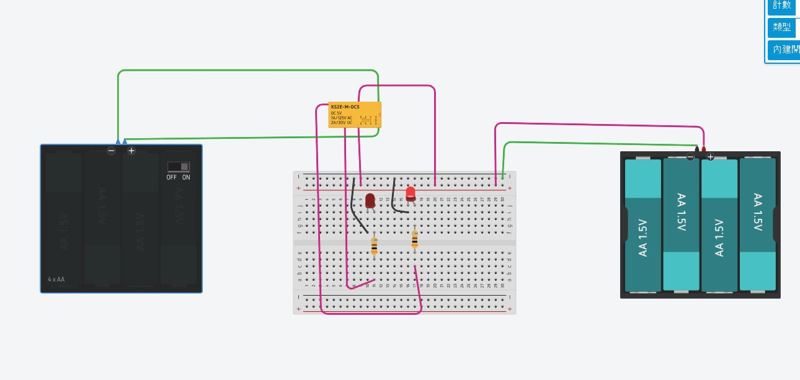

# ⚡ 電磁繼電器 SPDT 雙路切換控制電路：完整設計原理、接線剖析與工程計算筆記

> **最後更新時間**: 2026-09-15 14:57:50 (UTC+8)  
> **使用模型**: Gemini 3.7 Flash  
> **執行 Agent**: Antigravity  

---

## 📑 目錄
1. [原始設計圖檔與電路概覽 (Original Design & Circuit Overview)](#1-原始設計圖檔與電路概覽-original-design--circuit-overview)
2. [核心概念與底層工作原理 (Core Concepts)](#2-核心概念與底層工作原理-core-concepts)
   - 2.1 電磁感應與電樞機械切換原理
   - 2.2 SPDT / Form C 接點架構 (COM, NC, NO)
   - 2.3 電氣隔離 (Galvanic Isolation) 的安全與工程意義
3. [電路詳細接線剖析與元件功能 (Detailed Wiring & Hardware Breakdown)](#3-電路詳細接線剖析與元件功能-detailed-wiring--hardware-breakdown)
   - 3.1 控制端迴路 (Control / Coil Circuit)
   - 3.2 負載端迴路 (Load / Contact Circuit)
   - 3.3 繼電器 KS2E-M-DC5 引腳與接點對應
4. [電路工作狀態與真值表 (Operating States & Truth Table)](#4-電路工作狀態與真值表-operating-states--truth-table)
   - 4.1 狀態 A：控制開關 OFF（線圈未激磁，常態釋放）
   - 4.2 狀態 B：控制開關 ON（線圈通電激磁，吸合動作）
5. [關鍵電氣計算與設計推導 (Engineering Calculations)](#5-關鍵電氣計算與設計推導-engineering-calculations)
   - 5.1 LED 限流電阻計算 ($R_{\text{limit}}$)
   - 5.2 限流電阻功率耗散評估 ($P_R$)
   - 5.3 繼電器線圈電流與電壓耐受分析
6. [延伸思考與工業級進階設計 (Extensions & Advanced Topics)](#6-延伸思考與工業級進階設計-extensions--advanced-topics)
   - 6.1 反向電動勢 (Back-EMF) 與續流二極體 (Flyback Diode) 保護
   - 6.2 微控制器 (Arduino / ESP32) 電晶體驅動架構
   - 6.3 接點彈跳 (Contact Bounce) 與電弧抑制 (Snubber)
   - 6.4 電磁繼電器 (EMR) vs 固態繼電器 (SSR) 選型評估
7. [動態網頁與 PDF 匯出指南 (Web Simulator & Export)](#7-動態網頁與-pdf-匯出指南-web-simulator--export)

---

## 1. 原始設計圖檔與電路概覽 (Original Design & Circuit Overview)

### 📸 原始 Tinkercad 電路設計圖檔



* **圖檔來源**：[relay1.jpg](file:///D:/CLASS_NOTE/ec/relay1.jpg)
* **實作平台**：Autodesk Tinkercad Circuits
* **核心元件**：
  * 左側：4 x AA 電池盒（6V，具備滑動開關）—— 控制端電源
  * 中上方：KS2E-M-DC5 直流 5V 電磁繼電器（SPDT / Form C）
  * 中下方：標準麵包板、2 顆紅色 LED、2 顆 220Ω 限流電阻
  * 右側：4 x AA 電池盒（6V）—— 負載端獨立電源

本實驗為在 Tinkercad Circuits 平台上建構的**電磁繼電器 (Electromagnetic Relay, EMR) 單刀雙擲 (SPDT / 1 Form C) 雙路指示切換控制電路**。

```
                     【電路系統拓撲與電氣隔離示意】
┌─────────────────────────┐               ┌───────────────────────────────┐
│     控制端迴路 (隔離)    │               │        負載端迴路 (工作端)     │
│                         │               │                               │
│  [4xAA 6V 電池盒]       │               │  [4xAA 6V 電池盒]             │
│       │                 │               │       │                       │
│  [滑動開關 (OFF/ON)]    │               │       ├─── (+6V) ──► COM (公共端)
│       │                 │               │       │                 │
│  [繼電器線圈 Coil] ─────┼─ 磁力耦合 ────┼───────┤        ┌── NC ──┴── NO ──┐
│  (KS2E-M-DC5, 5V)       │  (無電氣直連) │       │        │                 │
│       │                 │               │       │     [LED1 紅]         [LED2 紅]
│  [電池負極 GND1]        │               │       │        │                 │
│                         │               │       │     [電阻 220Ω]       [電阻 220Ω]
└─────────────────────────┘               │       │        │                 │
                                          │       └─── (-GND2) ──────────────┘
                                          └───────────────────────────────┘
```

### 實驗電路核心特點：
1. **雙電源完全電氣隔離 (Galvanic Isolation)**：控制端線圈電源與負載端 LED 電源彼此獨立，無共地，體現「小訊號安全控制大負載/獨立負載」的工業控制核心概念。
2. **互補式狀態切換 (Complementary Switching)**：利用繼電器的 **NC (Normally Closed 常閉)** 與 **NO (Normally Open 常開)** 兩組接點，實現單一開關切換兩個 LED 互補亮滅（一亮一滅、一滅一亮）。

---

## 2. 核心概念與底層工作原理 (Core Concepts)

### 2.1 電磁感應與電樞機械切換原理

電磁繼電器本質上是一種**電氣控制的機械式開關**。其內部主要構造包含：
* **電磁線圈 (Solenoid Coil)**：繞製於鐵芯上的絕緣導線。
* **動鐵芯 / 電樞 (Armature)**：可自由擺動的軟磁鐵片。
* **復位彈簧 (Return Spring)**：提供機械反作用力，在斷電時將電樞拉回原位。
* **觸點系統 (Contact System)**：包含公共接點 (COM)、常閉接點 (NC) 與常開接點 (NO)。

```
             【繼電器內部結構與電磁吸合動作機制】
           
           斷電釋放狀態 (De-energized)           通電吸合狀態 (Energized)
           
                 NC  NO                                NC  NO
                  │   │                                 │   │
                  ●   ○                                 ○   ●
                   \                                         \
                    \ ◄── COM (活動觸點)                       \ ◄── COM (活動觸點)
                     │                                         │
               ╭─────┴─────╮                             ╭─────┴─────╮
               │  電樞銜鐵 │                             │  電樞銜鐵 │
               ╰─────┬─────╯                             ╰─────┬─────╯
              彈簧 ▲ │                                         │ ▼ 磁吸力 F_mag
                   │ └── 復位彈簧拉緊                          └── 克服彈簧拉力
              ───────┴───────                           ───────┴───────
               ┌───────────┐                             ┌───────────┐
               │ 鐵芯(無磁)│                             │鐵芯(強磁N)│
               │   線圈    │                             │  線圈(通電)│
               │  I = 0    │                             │  I > 0    │
               └───────────┘                             └───────────┘
```

依據**法拉第電磁感應定律**與**安培環路定律**，當電流 $I$ 通入線圈時：
1. 線圈產生磁動勢 $\mathcal{F} = N \cdot I$（$N$ 為線圈匝數）。
2. 鐵芯聚集磁力線並被磁化，在鐵芯端部與電樞之間產生強大電磁吸力：
   $$F_{\text{mag}} = \frac{B^2 \cdot A}{2\mu_0} = \frac{\Phi^2}{2\mu_0 A}$$
   * $B$ 為磁通密度 ($T$)
   * $A$ 為磁極有效截面積 ($m^2$)
   * $\mu_0 = 4\pi \times 10^{-7}\text{ H/m}$ 為真空導磁率
3. 當 $F_{\text{mag}} > F_{\text{spring}}$（彈簧機械阻力）時，電樞被迅速吸向鐵芯，推動活動觸點由 NC 切換閉合至 NO。

---

### 2.2 SPDT / Form C 接點架構 (COM, NC, NO)

本電路所採用的繼電器接點形式為 **單刀雙擲 (Single-Pole Double-Throw, SPDT)**，在繼電器標準命名中稱為 **Form C 接點**：

| 接點代號 | 英文全稱 | 中文名稱 | 未通電狀態 (De-energized) | 通電吸合狀態 (Energized) |
| :--- | :--- | :--- | :--- | :--- |
| **COM** | Common | 公共接點 | 主輸入端 / 電流源輸入 | 主輸入端 / 電流源輸入 |
| **NC** | Normally Closed | 常閉接點 | **導通 (Closed / Connected)** | **斷開 (Open / Disconnected)** |
| **NO** | Normally Open | 常開接點 | **斷開 (Open / Disconnected)** | **導通 (Closed / Connected)** |

> **切換順序（Break-Before-Make 先斷後通）**：  
> 標準 Form C 接點在切換過程中，活動臂會先離開 NC 接點（兩者皆斷開），經過微小的飛行時間（Transit Time，約 $1 \sim 3\text{ ms}$）後才撞擊閉合 NO 接點，有效避免 NC 與 NO 之間發生瞬間短路。

---

### 2.3 電氣隔離 (Galvanic Isolation) 的安全與工程意義

電磁繼電器在工業與物聯網控制中不可取代的核心價值在於**電氣隔離 (Galvanic Isolation)**：
1. **電壓等級隔離**：控制端可以用 3.3V / 5V 的低壓安全訊號（如 Arduino, ESP32, 樹莓派），控制 110V/220V AC 市電負載或高壓直流馬達。
2. **雜訊阻絕**：高功率負載（如感性馬達、電磁閥開關）產生的電氣突波、大電流突入與地迴路雜訊（Ground Bounce）完全不會傳遞回敏感的微控制器核心。
3. **故障防護**：負載端若發生嚴重短路或過載燒毀，控制端電路依然能受到物理絕緣（空氣間隙與線圈骨架絕緣材料）的嚴密保護。

---

## 3. 電路詳細接線剖析與元件功能 (Detailed Wiring & Hardware Breakdown)

依據實際硬體連線照片，電路各部分的精確連接架構如下：

```
                                  【詳細電路接線圖 (Schematic)】
                                  
       ┌─── 左側電源 (控制端) ───┐                             ┌─── 右側電源 (負載端) ───┐
       │                         │                             │                         │
      [+] 6V (4xAA)             [-] 6V (GND1)                 [+] 6V (4xAA)             [-] 6V (GND2)
       │                         │                             │                         │
    [開關 S1]                    │                             ├── 麵包板下排 (+)軌       └── 麵包板負極(-)軌
       │                         │                             │                                 ▲   ▲
       └───[ 綠線 ]───┐         │                             └───[ 桃紅線 ]─┐                  │   │
                      │         │                                            │                  │   │
                      ▼         ▼                                            ▼                  │   │
              ┌─────────────────────────┐                          ┌──────────────────┐         │   │
              │  繼電器 KS2E-M-DC5      │                          │                  │         │   │
              │  [Coil+]       [Coil-]  │                          │                  │         │   │
              │     │             │     │                          │                  │         │   │
              │  (內部線圈 5V DC)       │                          │                  │         │   │
              │                         │                          │                  │         │   │
              │       [ COM ] ──────────┼──────────────────────────┘ (公共端 +6V)     │         │   │
              │        /     \          │                                             │         │   │
              │      (NC)    (NO)       │                                             │         │   │
              └───────┬────────┬────────┘                                             │         │   │
                      │        │                                                      │         │   │
        [ 桃紅線 1 ] ─┘        └── [ 桃紅線 2 ]                                       │         │   │
              │                        │                                              │         │   │
              ▼ (Col 10)               ▼ (Col 17)                                     │         │   │
          ┌───────┐                ┌───────┐                                          │         │   │
          │ LED 1 │ (常態燈)       │ LED 2 │ (動作燈)                                 │         │   │
          │ Anode │                │ Anode │                                          │         │   │
          └───┬───┘                └───┬───┘                                          │         │   │
       Cathode│ (Col 11)        Cathode│ (Col 16)                                     │         │   │
              ▼                        ▼                                              │         │   │
          [ R1: 220Ω ]             [ R2: 220Ω ]                                       │         │   │
              │                        │                                              │         │   │
              └────────────────────────┴──────────────────────────────────────────────┴─────────┘
```

### 3.1 控制端迴路 (Control / Coil Circuit)
* **電源**：左側電池盒（4 顆 1.5V AA 鹼性電池串聯，標稱電壓 $6.0\text{ V}$），配備獨立滑動開關（Slide Switch）。
* **線路走線**：
  * 正極（綠色導線）經由開關連接至 KS2E-M-DC5 繼電器的線圈輸入引腳（Coil+）。
  * 負極（綠色導線）直接連接至 KS2E-M-DC5 繼電器的線圈接地引腳（Coil-）。
* **功能**：由使用者撥動開關，提供或切斷線圈激磁電流。

### 3.2 負載端迴路 (Load / Contact Circuit)
* **電源**：右側電池盒（4 顆 1.5V AA 電池，標稱電壓 $6.0\text{ V}$）。
  * 桃紅色導線接至麵包板下方正極電源軌（Red Bus Line, $+$）。
  * 綠色導線接至麵包板上方與下方負極電源軌（Blue Bus Line, $-$ / GND）。
* **公共端連接**：桃紅色導線從正電源軌引出，連接至繼電器的 **COM 引腳**。
* **常閉通道 (NC Channel - LED 1)**：
  * 桃紅色導線自繼電器 **NC 引腳** 接出至麵包板 **第 10 行 (Column 10)**。
  * **LED 1 (紅色)**：陽極 (長腳/Anode) 插於 Column 10，陰極 (短腳/Cathode) 插於 Column 11。
  * **限流電阻 $R_1$ ($220\ \Omega$)**：一端接 Column 11，跨越中央溝槽連接至下方區域，並透過跳線連接至下排負極接地軌。
* **常開通道 (NO Channel - LED 2)**：
  * 桃紅色導線自繼電器 **NO 引腳** 接出至麵包板 **第 17 行 (Column 17)**。
  * **LED 2 (紅色)**：陽極 插於 Column 17，陰極 插於 Column 16。
  * **限流電阻 $R_2$ ($220\ \Omega$)**：一端接 Column 16，跨越中央溝槽連接至下方區域並接入負極接地軌。

### 3.3 繼電器 KS2E-M-DC5 引腳與規格解讀

在元件外殼上標註有完整規格：
* **型號**：`KS2E-M-DC5`
* **線圈額定電壓**：`DC 5V`
* **接點額定負載**：
  * 交流負載：$1\text{A} / 125\text{V AC}$
  * 直流負載：$2\text{A} / 30\text{V DC}$
* **封裝形式**：標準小型雙列直插 (DIP) 封裝，適合訊號切換與小型負載控制。

---

## 4. 電路工作狀態與真值表 (Operating States & Truth Table)

### 4.1 狀態 A：控制開關 OFF（線圈未激磁，常態釋放）

* **控制端狀態**：左側開關處於 OFF，線圈無電流通過 ($I_{\text{coil}} = 0$)，電磁鐵無磁性。
* **接點狀態**：在內部復位彈簧拉力作用下，COM 與 NC 接點維持接觸導通，COM 與 NO 保持斷開。
* **電流路徑**：
  1. 右側 $+6\text{V} \to \text{COM} \to \text{NC} \to \text{Col 10} \to \text{LED 1 (陽極} \to \text{陰極)} \to \text{Col 11} \to R_1 (220\Omega) \to \text{GND}$（**形成閉合迴路，LED 1 點亮**）。
  2. COM 與 NO 斷開，LED 2 迴路開路，無電流通過（**LED 2 熄滅**）。

### 4.2 狀態 B：控制開關 ON（線圈通電激磁，吸合動作）

* **控制端狀態**：左側開關切至 ON，6V 電壓施加於線圈兩端，產生激磁電流。
* **接點狀態**：鐵芯產生電磁吸力，吸動電樞使活動觸點脫離 NC，並強行壓向 NO 接點閉合。
* **電流路徑**：
  1. COM 與 NC 斷開，LED 1 迴路斷路（**LED 1 熄滅**）。
  2. 右側 $+6\text{V} \to \text{COM} \to \text{NO} \to \text{Col 17} \to \text{LED 2 (陽極} \to \text{陰極)} \to \text{Col 16} \to R_2 (220\Omega) \to \text{GND}$（**形成閉合迴路，LED 2 點亮**）。

### 4.3 電路狀態真值表 (Truth Table)

| 控制開關 (S1) | 線圈狀態 ($V_{\text{coil}}$) | COM-NC 接點 | COM-NO 接點 | LED 1 (NC 通道) | LED 2 (NO 通道) | 系統總結狀態 |
| :---: | :---: | :---: | :---: | :---: | :---: | :---: |
| **OFF (斷開)** | 0V (未激磁) | **導通 (Closed)** | 斷開 (Open) | 🔴 **亮 (ON)** | ⚫ **滅 (OFF)** | **常態待機指示** |
| **ON (閉合)** | ~6V (通電激磁) | 斷開 (Open) | **導通 (Closed)** | ⚫ **滅 (OFF)** | 🔴 **亮 (ON)** | **動作激勵指示** |

---

## 5. 關鍵電氣計算與設計推導 (Engineering Calculations)

### 5.1 LED 限流電阻計算 ($R_{\text{limit}}$)

LED 為非線性電流驅動元件，其導通壓降幾乎恆定，若未串聯限流電阻直接接入 6V 電源，將導致電流過大而瞬間燒毀（Thermal Runaway）。

#### 設計參數：
* 負載端電源電壓：$V_{CC} = 4 \times 1.5\text{ V} = 6.0\text{ V}$
* 標準紅色 LED 順向導通壓降：$V_F \approx 2.0\text{ V}$（典型值 $1.8\text{ V} \sim 2.2\text{ V}$）
* 目標安全工作電流：$I_F = 18\text{ mA} = 0.018\text{ A}$（標準 LED 額定電流為 $20\text{ mA}$）

#### 計算公式與步驟：
根據歐姆定律與克希荷夫電壓定律 (KVL)：
$$V_{CC} = V_F + I_F \cdot R_{\text{limit}}$$

解出限流電阻理論值：
$$R_{\text{limit}} = \frac{V_{CC} - V_F}{I_F} = \frac{6.0\text{ V} - 2.0\text{ V}}{0.018\text{ A}} = \frac{4.0\text{ V}}{0.018\text{ A}} \approx 222.2\ \Omega$$

**工程標準阻值選用**：
* 選擇 E12 系列最接近之標準電阻值：**$220\ \Omega$**。
* 重新計算實際迴路電流：
  $$I_{\text{actual}} = \frac{6.0\text{ V} - 2.0\text{ V}}{220\ \Omega} = \frac{4.0\text{ V}}{220\ \Omega} \approx 18.18\text{ mA}$$
  此數值非常接近且低於 $20\text{ mA}$ 最大額定值，兼顧高亮度與長壽命。

---

### 5.2 限流電阻功率耗散評估 ($P_R$)

電阻在工作時會將多餘電能轉換為熱能，必須驗證其功率是否在電阻額定功率內：
$$P_R = I_{\text{actual}}^2 \cdot R = (0.01818\text{ A})^2 \times 220\ \Omega \approx 0.0727\text{ W} = 72.7\text{ mW}$$

亦可用壓降計算：
$$P_R = V_R \cdot I = 4.0\text{ V} \times 0.01818\text{ A} = 0.0727\text{ W}$$

**安全裕度分析**：
* 實驗常用碳膜電阻額定功率為 $1/4\text{ W} = 0.25\text{ W} = 250\text{ mW}$。
* 額定負載率：$\frac{72.7\text{ mW}}{250\text{ mW}} \times 100\% \approx 29.1\%$（遠低於 50% 降額設計準則，電阻發熱極微，運作高度可靠）。

---

### 5.3 繼電器線圈電流與電壓耐受分析

* **KS2E-M-DC5 線圈標稱規格**：
  * 標稱電壓：$V_{\text{nominal}} = 5.0\text{ V}$
  * 線圈電阻：$R_{\text{coil}} \approx 125\ \Omega \sim 167\ \Omega$（依典型 5V 通信繼電器功率 $150\text{ mW} \sim 200\text{ mW}$）
* **在 6.0V 電源下的運行表現**：
  * 線圈電流：$I_{\text{coil}} = \frac{6.0\text{ V}}{125\ \Omega} = 48\text{ mA}$
  * 線圈功耗：$P_{\text{coil}} = \frac{(6.0\text{ V})^2}{125\ \Omega} = 0.288\text{ W} = 288\text{ mW}$
  * **容許度判定**：小型 5V 繼電器的最大連續耐受電壓 (Maximum Allowable Voltage) 通常為標稱電壓的 $130\% \sim 150\%$（即 $6.5\text{ V} \sim 7.5\text{ V}$），因此使用 4 顆 AA 電池（6V）可可靠吸合且在安全耐受範圍內。

---

## 6. 延伸思考與工業級進階設計 (Extensions & Advanced Topics)

在實際工程與產品設計中，將此基本電路擴展至微控制器或工業控制系統時，需導入以下關鍵保護與驅動技術：

### 6.1 反向電動勢 (Back-EMF) 與續流二極體 (Flyback Diode) 保護

繼電器線圈為典型**感性負載 (Inductive Load)**。當控制開關由 ON 瞬間切換至 OFF 時，根據愣次定律 (Lenz's Law)：
$$V_{\text{back}} = -L \frac{di}{dt}$$
由於電流在極短微秒時間內驟降至零（$dt \to 0$），線圈兩端會產生高達數百伏特的反向高壓突波（Back-EMF Spike）。

```
        【續流二極體 (Flyback Diode) 保護電路原理】
        
              (+) 6V
                │
        ┌───────┴───────┐
        │               │
        │             ┌─┴─┐
        │             │ ▲ │  續流二極體 (1N4007 / 1N4148)
        │             │ │ │  (平時反偏截止，斷電時順向導通)
      [線圈]          └─┬─┘
     (Inductor)         │
        │               │
        └───────┬───────┘
                │
            [開關 / 電晶體]
                │
              (GND)
```

* **保護原理**：在線圈兩端**反向並聯一顆二極體**（如 1N4007 或 1N4148，陰極接正電源，陽極接負端）。
* **作用過程**：
  * 正常通電時，二極體承受反向偏壓，處於截止狀態。
  * 斷電瞬間，反向電動勢使二極體順向導通，將突波能量限制在線圈與二極體構成的閉合迴路中釋放消耗，保護前級開關接點或驅動晶體免遭擊穿。

---

### 6.2 微控制器 (Arduino / ESP32) 電晶體驅動架構

單晶片 (MCU) 的 GPIO 引腳最大輸出電流通常僅 $8\text{ mA} \sim 20\text{ mA}$，無法直接驅動需要 $40\text{ mA} \sim 80\text{ mA}$ 的繼電器線圈。必須採用 **NPN 電晶體 (2N2222 / 2N3904) 或 N-MOSFET (2N7000)** 作為開關：

```
           【MCU GPIO 驅動繼電器標準電路】
           
                                   +5V / +6V (VCC_Relay)
                                      │
                              ┌───────┴───────┐
                              │               │
                            [線圈]          [ 1N4148 ]
                              │             (續流二極體)
                              │               │
                              └───────┬───────┘
                                      │ 集極 (Collector)
  MCU GPIO ───[ 1kΩ ~ 4.7kΩ ]────┤ B (Base) 
  (3.3V/5V)      基極電阻          │ NPN (2N2222)
                                      ▼ 射極 (Emitter)
                                      │
                                    (GND)
```

---

### 6.3 接點彈跳 (Contact Bounce) 與電弧抑制 (Snubber)

1. **接點彈跳 (Contact Bounce)**：
   * 機械接點在閉合撞擊瞬間，由於金屬彈性會產生持續 $1 \sim 5\text{ ms}$ 的微小物理彈跳（多次通斷）。
   * 若接點訊號接入 MCU 作為數位中斷輸入，需加入**硬體 RC 濾波電路**或**軟體防彈跳 (Debouncing) 演算法**。
2. **大功率負載電弧滅弧 (Snubber Circuit)**：
   * 當切換感性交流負載（如馬達、泵浦）時，斷開瞬間接點間會產生高溫電弧（Arcing），侵蝕金屬接點。
   * 需在接點兩端並聯 **RC 吸收迴路 (Snubber)** 或 **壓敏電阻 (MOV)** 進行滅弧以延長接點壽命。

---

### 6.4 電磁繼電器 (EMR) vs 固態繼電器 (SSR) 選型評估

| 比較維度 | 電磁繼電器 (EMR - 本電路類型) | 固態繼電器 (SSR) |
| :--- | :--- | :--- |
| **切換元件** | 機械動鐵芯、金屬銀合金觸點 | 光耦隔離 + 半導體 (Triac / MOSFET) |
| **工作壽命** | 機械壽命約 $10^7$ 次，電氣壽命約 $10^5$ 次 | **近乎無限**（無機械磨損） |
| **切換速度** | 較慢 ($5\text{ ms} \sim 15\text{ ms}$) | **極快 ($\mu\text{s}$ 級)** |
| **切換聲音** | 有清脆的「喀噠」機械撞擊聲 | **完全無聲** |
| **導通阻抗** | 極低接觸電阻 ($< 50\text{ m}\Omega$)，無顯著發熱 | 有半導體壓降 ($1\sim 1.6\text{V}$)，大電流需散熱片 |
| **漏電流** | **完全斷開，零漏電流** | 存在微小半導體漏電流 ($\mu\text{A} \sim \text{mA}$) |
| **適用場合** | 訊號切換、交直流通用、低成本、高絕緣要求 | 高頻頻繁切換、無聲要求、極長壽命需求 |

---

## 7. 動態網頁與 PDF 匯出指南 (Web Simulator & Export)

為提供更直觀的學習與教學體驗，本筆記同步生成對應的互動式視覺化 HTML 檔案與延伸模擬手冊：
* 🌐 **本電路互動模擬網頁**：[relay_spdt_circuit_analysis.html](file:///D:/CLASS_NOTE/ec/relay_spdt_circuit_analysis.html)
* 🔗 **延伸參考筆記 (2路磁簧繼電器模擬)**：[reed_relay_2ch_simulation.html](file:///D:/CLASS_NOTE/ec/reed_relay_2ch_simulation.html)（包含雙通道電磁場分佈、微秒級彈跳波形與磁滯曲線即時模擬器）
* **包含功能**：
  1. **即時互動式電路模擬器**：可直接點擊開關切換 ON/OFF，觀察線圈磁場激磁、電樞物理擺動、接點切換與 LED1/LED2 的動態電流發光效果。
  2. **彩色電路原理圖與接線圖對照**。
  3. **動態歐姆定律與限流計算器**：可自訂 $V_{CC}, V_F, I_F$ 即時計算電阻值與耗散功率。
  4. **一鍵匯出 PDF / 列印按鈕**：內建專屬列印排版 CSS，可一鍵生成清晰完美的工程報告 PDF。

---

## 📝 提示詞歷史與變更記錄 (Prompt Archive)

### 🔹 [2026-09-15 14:48:48] Gemini 3.7 Flash 變更紀錄
- **模型/Agent**: Gemini 3.7 Flash / Antigravity
- **Prompt 原文**:
  ```text
  C:\Users\User\Desktop\relay1.jpg 這是我今天完成的繼電器控制電路，解釋電路跟設計，做成詳細的筆記
  ```
- **變更摘要**: 依據使用者上傳的 Tinkercad 繼電器控制電路照片 (relay1.jpg)，深度剖析 KS2E-M-DC5 繼電器結構、SPDT/Form C 切換工作原理、電氣隔離、LED 限流電阻計算推導、反向電動勢續流保護與電路真值表，建立 Markdown 專業筆記與對應的 HTML 互動模擬網頁。

### 🔹 [2026-09-15 14:53:38] Gemini 3.7 Flash 變更紀錄
- **模型/Agent**: Gemini 3.7 Flash / Antigravity
- **Prompt 原文**:
  ```text
  加入原始設計圖檔
  ```
- **變更摘要**: 將原始電路設計圖檔 (`relay1.jpg`) 複製歸檔至 `D:\CLASS_NOTE\ec\`，並於 Markdown 筆記及 HTML 互動網頁中嵌入顯示原始設計圖與元件標註。

### 🔹 [2026-09-15 14:57:50] Gemini 3.7 Flash 變更紀錄
- **模型/Agent**: Gemini 3.7 Flash / Antigravity
- **Prompt 原文**:
  ```text
  add a reference link  to reed_relay_2ch_simulation.html
  ```
- **變更摘要**: 於 Markdown 與 HTML 文件中增設前往 2路磁簧繼電器模擬器 (`reed_relay_2ch_simulation.html`) 的延伸導覽與參考資源連結。
