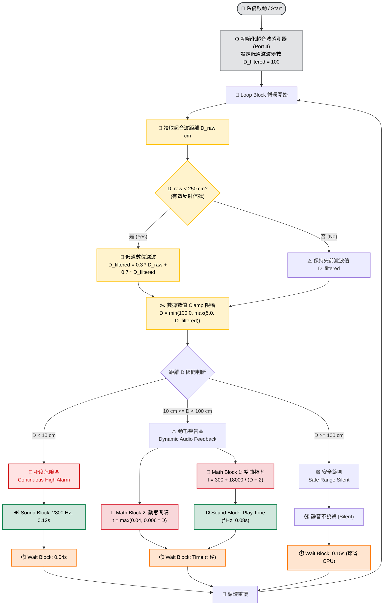
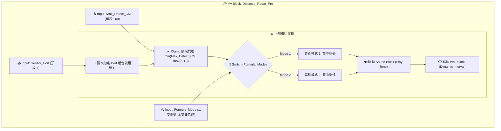

# EV3 超音波距離反饋蜂鳴器與倒車雷達演算法延伸研究報告
**Distance Audio Feedback Radar System & Block Architecture Research**

> [!NOTE]
> 本研究報告彙整 LEGO Mindstorms EV3 超音波感測器 (Ultrasonic Sensor) 與聲音積木 (Sound Block) 之延伸動態對映演算法，並提供**完整圖型化積木配置 (Graphical Block Architecture)** 與**數據線 (Data Wires) 接線視圖**。
>
> 🕒 **戳記時間**：`2026-09-07 16:13:36 (UTC+8)`  
> 🤖 **生成模型**：`Gemini 3.8 Flash`

---

## 📑 研究目錄 (Table of Contents)
1. [系統理論與數據對映模型](#1-系統理論與數據對映模型)
2. [完整圖型積木配置圖 (Mermaid Block Flowchart)](#2-完整圖型積木配置圖-mermaid-block-flowchart)
3. [EV3 官方積木視覺化面板與數據線接線細節](#3-ev3-官方積木視覺化面板與數據線接線細節)
4. [My Block 自訂積木內部封裝圖型 (Custom Block Architecture)](#4-my-block-自訂積木內部封裝圖型-custom-block-architecture)
5. [ev3dev Python 高級演算法範例](#5-ev3dev-python-高級演算法範例)
6. [EV3 官方軟體版本對照與線上資源連結](#6-ev3-官方軟體版本對照與線上資源連結)

---

## 1. 系統理論與數據對映模型

倒車雷達系統的核心目標在於將距離數據 $D$ (cm) 轉換為人體能即時感知危險的聲音特徵。



### 4 大演算法對映公式

> [!TIP]
> **雙曲急迫對映 (Inverse Hyperbolic Curve)** 在近距離時頻率呈斜率陡升，能大幅提升驅動者或視障使用者對撞擊臨界的反應速度！

1. **雙重調變模型 (Dual Modulation)**：
   - 頻率：$$f(D) = 2600 - 23.5 \times (D - 5) \quad (\text{Hz})$$
   - 間隔：$$T_{\text{wait}}(D) = \max\left(0.04,\, 0.006 \times D\right) \quad (\text{秒})$$

2. **反比雙曲急迫曲線 (Reciprocal Hyperbolic Curve)**：
   - 頻率：$$f(D) = 300 + \frac{18000}{D + 2} \quad (\text{Hz})$$

3. **二次方縮放嗶聲間隔 (Quadratic Interval Curve；備選公式，第 2 章後的實作改用 $t = \max(0.04, 0.006D)$)**：
   - 間隔：$$T_{\text{interval}}(D) = 0.03 + 0.8 \times \left(\frac{D}{100}\right)^2 \quad (\text{秒})$$

4. **一階低通平滑濾波器 (Low-Pass Filter)**：
   - 數據平滑：$$D_{\text{filtered}}^{(k)} = 0.3 \times D_{\text{raw}}^{(k)} + 0.7 \times D_{\text{filtered}}^{(k-1)}$$

---

## 2. 完整圖型積木配置圖 (Mermaid Block Flowchart)

以下為 EV3 程式在 `Loop Block (無限循環)` 內部的完整圖型積木配置與數據線流向：

```mermaid
flowchart LR
    subgraph Loop["🔄 Loop Block (無限迴圈程式看板)"]
        direction LR
        
        subgraph SensorBlock["📡 超音波感測器 (Yellow Sensor)"]
            US["感測模式: 距離 (cm)<br/>連接埠: Input Port 4<br/><b>輸出: Distance D (cm)</b>"]
        end

        subgraph Math1Block["🧮 Math 積木 1 (Red Data)"]
            Math1["進階算術表達式<br/><b>300 + 18000 / (a + 2)</b><br/>Input a: Distance D<br/><b>輸出: Frequency f (Hz)</b>"]
        end

        subgraph Math2Block["🧮 Math 積木 2 (Red Data)"]
            Math2["進階算術表達式<br/><b>max(0.04, a * 0.006)</b><br/>Input a: Distance D<br/><b>輸出: Seconds t (s)</b>"]
        end

        subgraph SoundBlock["🔊 聲音積木 (Green Action)"]
            Sound["模式: 播放單音 (Play Tone)<br/>Duration: 0.08s<br/>Play Type: Play Once (1)<br/>Input: Frequency f"]
        end

        subgraph WaitBlock["⏱️ 等待積木 (Orange Flow)"]
            Wait["模式: 時間 (Time Seconds)<br/>Input: Seconds t"]
        end

        US ==>|黃色數據線: 距離 D| Math1
        US ==>|黃色數據線: 距離 D| Math2
        Math1 ==>|黃色數據線(數字): 頻率 f| Sound
        Math2 ==>|黃色數據線(數字): 時間 t| Wait
        Sound --> Wait
    end

    classDef sensorStyle fill:#fff3cd,stroke:#ffc107,stroke-width:2px,color:#000;
    classDef mathStyle fill:#f8d7da,stroke:#dc3545,stroke-width:2px,color:#000;
    classDef soundStyle fill:#d1e7dd,stroke:#198754,stroke-width:2px,color:#000;
    classDef waitStyle fill:#ffe5d0,stroke:#fd7e14,stroke-width:2px,color:#000;
    classDef loopStyle fill:#fff9f0,stroke:#ff9800,stroke-width:3px,color:#000;

    class US sensorStyle;
    class Math1 mathStyle;
    class Math2 mathStyle;
    class Sound soundStyle;
    class Wait waitStyle;
    class Loop loopStyle;
```

---

## 3. EV3 官方積木視覺化面板與數據線接線細節

> [!WARNING]
> **軟體操作觀念澄清 (Software Interface Clarification)**：
> 在 LEGO MINDSTORMS EV3 Education 官方軟體（不論是經典 EV3 Lab 還是 Scratch 架構的 EV3 Classroom）中，**軟體視窗內並沒有稱為「接線與引腳對照明細表」的點擊按鈕或內建文字表單功能！**
> 
> 本研究報告中的「引腳對照明細表」是講師與工程師在開發與教學過程中，為了幫助理解 **數據流向 (Data Flow Mapping)** 所繪製的視覺對照表。
> - **在 EV3 Lab (LabVIEW 圖型版)**：點擊積木底部的彩色數據接頭 (Data Hub)，用滑鼠拉出 **實體彩色數據線 (Data Wires)**。
> - **在 EV3 Classroom (Scratch 拼圖版)**：無拉線機制，而是將綠色算術運算塊 `( ) / ( )` 直接拖拖至 Sound/Wait 積木的圓形參數欄位中。

### 積木元件配置與數據埠 (Data Plugs) 對照視圖

```
  ┌────────────────────────────────────────────────────────────────────────────────────────────────────────────────────────┐
  │ 🔄 Loop Block (無限迴圈)                                                                                              │
  │                                                                                                                        │
  │  ┌────────────────────┐    ┌───────────────────────────────────┐    ┌───────────────────────────────────┐              │
  │  │ 📡 Ultrasonic       │    │ 🧮 Math (Frequency)               │    │ 🔊 Sound (Play Tone)              │              │
  │  │ Port: 4            │    │ Mode: Advanced                    │    │ Duration: 0.08s                   │              │
  │  │ Mode: Measure (cm) │    │ Expr: 300 + 18000 / (a + 2)       │    │ Play Type: Play Once (1)          │              │
  │  ├────────────────────┤    ├───────────────────────────────────┤    ├───────────────────────────────────┤              │
  │  │ [Dist Out Pin] ──┐ │    │ [a Pin (In)]      [Result Out] ───┼───>│ [Frequency Pin (In)]              │              │
  │  └──────────────────┼─┘    └──────▲────────────────────────────┘    └───────────────────────────────────┘              │
  │                     │             │                                                                                    │
  │                     │             │ (Distance Data Wire D)                                                             │
  │                     └─────────────┴───────────────┐                                                                    │
  │                                                   ▼                                                                    │
  │                            ┌───────────────────────────────────┐    ┌───────────────────────────────────┐              │
  │                            │ 🧮 Math (Interval)                │    │ ⏱️ Wait (Time)                     │              │
  │                            │ Mode: Advanced                    │    │ Mode: Time Seconds                │              │
  │                            │ Expr: max(0.04, a * 0.006)        │    │                                   │              │
  │                            ├───────────────────────────────────┤    ├───────────────────────────────────┤              │
  │                            │ [a Pin (In)]      [Result Out] ───┼───>│ [Seconds Pin (In)]                │              │
  │                            └───────────────────────────────────┘    └───────────────────────────────────┘              │
  └────────────────────────────────────────────────────────────────────────────────────────────────────────────────────────┘
```

### 數據引腳 (Pin Mapping) 表格

| 積木順序 | 積木名稱 | 模式 (Block Mode) | 引腳名稱 (Pin Name) | 引腳型態 | 數據流向 (Wire Routing) |
| :--- | :--- | :--- | :--- | :--- | :--- |
| **Block 1** | Ultrasonic Sensor | Measure cm | `Distance Output` | 輸出 (Numeric) | 轉接至 Block 2 `a Pin` 與 Block 3 `a Pin` |
| **Block 2** | Math Block 1 | Advanced | `Plug a (Input)` | 輸入 (Numeric) | 接收來自 Block 1 的距離 $D$ |
| | | | `Result (Output)` | 輸出 (Numeric) | 接至 Block 4 的 `Frequency Pin` |
| **Block 3** | Math Block 2 | Advanced | `Plug a (Input)` | 輸入 (Numeric) | 接收來自 Block 1 的距離 $D$ |
| | | | `Result (Output)` | 輸出 (Numeric) | 接至 Block 5 的 `Seconds Pin` |
| **Block 4** | Sound Block | Play Tone | `Frequency (Input)`| 輸入 (Numeric) | 接收來自 Block 2 的頻率 $f$ |
| **Block 5** | Wait Block | Time Seconds | `Seconds (Input)` | 輸入 (Numeric) | 接收來自 Block 3 的時間 $t$ |

---

## 4. My Block 自訂積木內部封裝圖型 (Custom Block Architecture)

為了提升程式模組化與重用性，可將動態計算與發聲輸出封裝為青綠色 **My Block：`Distance_Radar_Pro`**。



---

## 5. ev3dev Python 高級演算法範例

> [!IMPORTANT]
> 包含低通濾波 (Low-pass Filter)、雙曲頻率與動態等待時間之完整 Python 原始碼：

```python
#!/usr/bin/env python3
"""
LEGO EV3 Distance Audio Feedback Radar System
Advanced Research Implementation using Python & ev3dev2
"""

import time
from ev3dev2.sensor.lego import UltrasonicSensor
from ev3dev2.sound import Sound

def run_radar_system():
    # 1. 初始化設備
    us = UltrasonicSensor('in4')
    sound = Sound()
    
    print("=======================================")
    print("  EV3 Distance Radar Active (Port 4)  ")
    print("=======================================")
    
    d_filtered = 100.0  # 初始化平滑變數
    
    try:
        while True:
            d_raw = us.distance_centimeters
            
            # 2. 一階低通平滑濾波 (Low-Pass Filter)
            if d_raw < 250.0:
                d_filtered = 0.3 * d_raw + 0.7 * d_filtered
            
            # 3. 數值範圍截斷 (Clamp Filter [5.0, 100.0])
            dist = min(100.0, max(5.0, d_filtered))
            
            # 4. 警報區間分流判斷
            if dist < 10.0:
                # 超近極度危險區 (< 10cm)：持續長鳴高頻 Siren
                sound.tone(2800, 120)
                time.sleep(0.04)
            elif dist < 100.0:
                # 10cm ~ 100cm：雙曲急迫頻率 + 雙重調變發聲間隔
                freq = int(300 + (18000 / (dist + 2.0)))     # 雙曲急迫曲線
                interval = max(0.04, 0.006 * dist)          # 動態縮短間隔
                
                sound.tone(freq, 60)
                time.sleep(interval)
            else:
                # 安全範圍：靜音並降低 CPU 負擔
                time.sleep(0.15)
                
    except KeyboardInterrupt:
        print("\nRadar System Shutdown cleanly.")

if __name__ == "__main__":
    run_radar_system()
```

---

## 6. EV3 官方軟體版本對照與線上資源連結

| 軟體名稱 | 核心引擎 / 平台 | 狀態 | 相容作業系統 | 官方說明與線上下載連結 |
| :--- | :--- | :--- | :--- | :--- |
| **EV3 Lab (經典桌面版)** | NI LabVIEW G-code | Retired (已退役) | Windows 7/8/10, macOS (≤ 10.14) | [LEGO Education Retired EV3 Lab Downloads](https://education.lego.com/en-us/downloads/retiredproducts/mindstorms-ev3-lab/software) |
| **EV3 Classroom (跨平台 App)** | Scratch 3.0 | Active (現行版) | Win 10/11, macOS, iOS, Android, ChromeOS | [LEGO Education EV3 Classroom Software](https://education.lego.com/en-us/downloads/mindstorms-ev3/software) |
| **EV3 MicroPython** | Pybricks MicroPython | Active (進階版) | 跨平台 (VS Code + SD 卡) | [Pybricks EV3 Documentation](https://pybricks.com/) |
| **EV3 官方產品資源與指南** | 官方手冊 / 課堂教案 | Active (維護中) | 全平台 Web 資源 | [LEGO Education Product Resources](https://education.lego.com/en-us/product-resources/mindstorms-ev3/) |
| **EV3 官方韌體更新指南** | EV3 Brick Firmware | Active | 全平台 | [LEGO EV3 Firmware Update Page](https://education.lego.com/en-us/product-resources/mindstorms-ev3/downloads/firmware-update) |
| **ev3dev Linux 開放系統** | Debian Linux | Open Source | Micro SD 引導 | [ev3dev.org Official Portal](https://www.ev3dev.org/) |

---

> 創作者 / 紀錄者：EV3 機器人專題研究小組  
> 記錄日期：2026 年 09 月 07 日  
> 🕒 戳記時間：`2026-09-07 16:13:36 (UTC+8)`  
> 🤖 模型代號：`Gemini 3.8 Flash`

---

## 📝 提示詞歷史與變更記錄 (Prompt Archive)

### 🔹 [2026-09-26 23:01:05] [Claude Opus 5.5 (claude-opus-5-5) / Claude Code] 變更紀錄
- **模型/Agent**: Claude Opus 5.5 (claude-opus-5-5) / Claude Code
- **Prompt 原文**:
  ```text
  檢視所有檔案內容中的敘述與說明，確認概念與敘述的正確性
  修正後，將修改內容，附加在每個檔案的最下方區塊並標誌時間戳記與模型代號
  確認概念與解釋說明都是正確的
  ```
- **變更摘要**: 全面檢視概念與敘述正確性並修正：
  - EV3-G 數字資料線為黃色（原標示紅色、藍色）
  - 1/(D+2) 為反比雙曲線（非 inverse hyperbolic）；間隔公式為二次方（非指數），並註明實作採 max(0.04, 0.006D)
  - EV3 Classroom 核心為 Scratch 3.0（刪除誤植的 LPF2）
