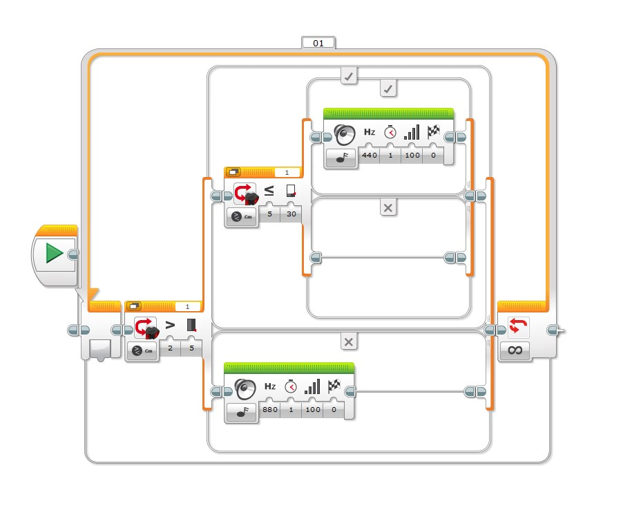
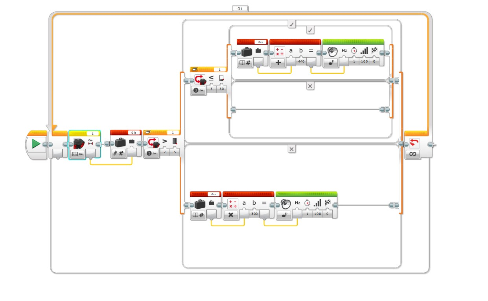

# 🤖 LEGO EV3 雙層巢狀切換、變數動態音頻對映演算法筆記

> **最後更新時間**: 2026-09-14 15:49:34 (UTC+8)  
> **使用模型**: Gemini 3.6 Flash  
> **執行 Agent**: Antigravity  

---

## 📌 概述 (Overview)

本筆記擴充針對 LEGO MINDSTORMS EV3 Visual Programming (`EV3-G`) 中，利用變數與數學運算積木（Math Block）實現「動態音頻調變 (Dynamic Frequency Modulation)」之實作程式 (`cm2hz.jpg`) 進行深度討論。重點分析原程式中正比算式的視覺與心理學盲點，並提出兩種「**距離越短，音頻越高**」的核心對映演算法（負斜率線性演算法與雙曲倒數演算法）。

---

## 📷 1. 程式版本與架構對比 (Program Version Comparison)

| 特性 | 圖 1：定頻警報程式 (`2swtcih.jpg`) | 圖 2：動態調頻實作程式 (`cm2hz.jpg`) |
| :--- | :--- | :--- |
| **原圖檔** |  |  |
| **感測器讀值處理** | 直接傳入 Switch 進行閾值比較 | 讀取後寫入數字變數 `dis` 暫存 |
| **音效頻率來源** | 靜態寫死常數 ($880\text{ Hz}$ / $440\text{ Hz}$) | 讀取 `dis` 經 Math Block 計算後資料線動態注入 |
| **運算邏輯** | 無數學運算 | 內層: $\text{Freq} = \text{dis} + 440$<br/>外層: $\text{Freq} = \text{dis} \times 300$ |

---

## ⚠️ 2. 實作程式 (cm2hz.jpg) 的正比痛點與盲點剖析

### 原算式盲點說明：
在 `cm2hz.jpg` 中，作者試圖利用數學積木讓聲音隨距離改變，但採用的公式為：
1. **內層 True 分支 ($5\text{ cm} < d \le 30\text{ cm}$)**：
   $$\text{Frequency} = \text{dis} + 440$$
   * 當距離 $d = 30\text{ cm}$ 時，音頻為 $30 + 440 = 470\text{ Hz}$。
   * 當距離靠近至 $d = 6\text{ cm}$ 時，音頻降至 $6 + 440 = 446\text{ Hz}$。
2. **外層 False 分支 ($d \le 5\text{ cm}$)**：
   $$\text{Frequency} = \text{dis} \times 300$$
   * 當距離 $d = 5\text{ cm}$ 時，音頻為 $5 \times 300 = 1500\text{ Hz}$。
   * 當距離靠近至 $d = 1\text{ cm}$ 時，音頻劇降至 $1 \times 300 = 300\text{ Hz}$！

> ❌ **問題核心**：上述公式均為**正比關係**。當障礙物越靠近，音頻反而**越來越低沉**，完全違反汽車倒車雷達與緊急警報「越靠近音調越亢高急促」的人因工程直覺！

---

## 🎯 3. 「距離越短，音頻越高」演算法推導 (Frequency Mapping Algorithms)

為實現「距離越短（$d \downarrow$），音頻越高（$f \uparrow$）」，需使用**負斜率線性對映**或**雙曲倒數對映**。

### 演算法 A：負斜率線性對映 (Negative Slope Linear Mapping)

假設在 $5\text{ cm} < d \le 30\text{ cm}$ 區間內：
* 最遠邊界 $d = 30\text{ cm}$ 時，期望發出低頻提示音 $f = 440\text{ Hz}$。
* 最近邊界 $d = 5\text{ cm}$ 時，期望發出高頻預警音 $f = 880\text{ Hz}$。

代入線性負斜率通用公式：
$$\text{Frequency}(d) = f_{\text{high}} - \left( \frac{f_{\text{high}} - f_{\text{low}}}{d_{\text{max}} - d_{\text{min}}} \right) \cdot (d - d_{\text{min}})$$

$$\text{Frequency}(d) = 880 - \left( \frac{880 - 440}{30 - 5} \right) \times (d - 5) = 880 - 17.6 \times (d - 5) = \mathbf{968 - 17.6 \times d}$$

#### 🧩 EV3 積木設定方式：
1. 點選紅色 **Math Block (高級數學運算法模式)**。
2. 在公式欄輸入 `968 - (17.6 * a)`。
3. 接腳 `a` 連接讀取變數 `dis` 的數值輸出接腳。
4. 將 Math 運算結果接入 Sound 積木的 `Hz` 埠。

---

### 演算法 B：雙曲倒數非線性對映 (Reciprocal Hyperbolic Mapping)

在極近危險區 ($d \le 5\text{ cm}$)，若希望聲音隨距離縮短而**呈幾何級數爆發式急促升高**，採用雙曲倒數公式：

$$\text{Frequency}(d) = \frac{K}{d} + f_{\text{base}}$$

設定 $K = 2000, f_{\text{base}} = 300$：
* $d = 5\text{ cm} \implies \text{Freq} = \frac{2000}{5} + 300 = \mathbf{700\text{ Hz}}$
* $d = 2\text{ cm} \implies \text{Freq} = \frac{2000}{2} + 300 = \mathbf{1300\text{ Hz}}$
* $d = 1\text{ cm} \implies \text{Freq} = \frac{2000}{1} + 300 = \mathbf{2300\text{ Hz}}$

---

## 💻 4. 程式邏輯與虛擬碼 (Pseudo Code)

```python
# ----------------------------------------------------
# LEGO EV3 動態調頻 (距離越短音頻越高) 演算法虛擬碼
# ----------------------------------------------------

FUNCTION Main():
    sensor_port = 1
    
    WHILE True:  # Loop 01 (無限迴圈)
        # 讀取感測器並存入變數 dis
        dis = ReadDistanceSensor(port=sensor_port)
        
        IF dis > 5:
            IF dis <= 30:
                # 5cm < dis <= 30cm: 負斜率線性調頻 (440Hz ~ 880Hz)
                calc_freq = 968 - (17.6 * dis)
                calc_freq = Clamp(calc_freq, min_val=440, max_val=880)
                
                # 發音時間設短 (0.2s)，呈現流暢音頻滑調效果
                PlayTone(frequency=calc_freq, duration=0.2, volume=100, wait=TRUE)
            ELSE:
                Pass  # >30cm 靜音
        ELSE:
            # dis <= 5cm: 雙曲倒數急促調頻 (700Hz ~ 2300Hz)
            safe_d = MAX(dis, 1)  # 防止除以零
            calc_freq = (2000 / safe_d) + 300
            calc_freq = Clamp(calc_freq, min_val=700, max_val=2300)
            
            PlayTone(frequency=calc_freq, duration=0.1, volume=100, wait=TRUE)
            
    END WHILE
END FUNCTION
```

---

## 🔬 5. 實務應用與演算法邊界保護

1. **頻率上下限截斷 (Pitch Clamping)**：EV3 蜂鳴器高於 $3000\text{ Hz}$ 音質會失真，需使用截斷函數限制音頻於 $250\text{ Hz} \sim 2500\text{ Hz}$。
2. **音效持續時間優化**：將原本的 `1.0 秒` 播放時間調縮為 `0.1 ~ 0.2 秒`，才能實現連續滑順的調頻與高響應度倒車雷達體驗。

---

## 📝 提示詞歷史與變更記錄 (Prompt Archive)

### 🔹 [2026-09-14 15:49:34] [Antigravity / Gemini 3.6 Flash] 變更紀錄
- **模型/Agent**: Gemini 3.6 Flash / Antigravity
- **Prompt 原文**:
  ```text
  增加匯出成pdf的按鈕
  ```
- **變更摘要**: 在 HTML 網頁標頭區域新增「📄 匯出成 PDF / 列印筆記」快捷按鈕，設定內建 `window.print()` 原生列印視窗，並補充 `@media print` 專屬樣式（自動隱藏按鈕、防止程式碼與公式跨頁裁切）。

### 🔹 [2026-09-14 15:46:22] [Antigravity / Gemini 3.6 Flash] 變更紀錄
- **模型/Agent**: Gemini 3.6 Flash / Antigravity
- **Prompt 原文**:
  ```text
  latex的語法沒有完全呈現
  ```
- **變更摘要**: 升級解析器至 KaTeX Auto-render 引擎，校正行內與區塊 LaTeX 算數標籤。

### 🔹 [2026-09-14 15:45:11] [Antigravity / Gemini 3.6 Flash] 變更紀錄
- **模型/Agent**: Gemini 3.6 Flash / Antigravity
- **Prompt 原文**:
  ```text
  C:\Users\User\Desktop\cm2hz.jpg 加入這個實作程式的討論，提出距離越短音頻越高的算法，整理成筆記
  ```
- **變更摘要**: 匯入 `cm2hz.jpg` 實作程式圖，剖析正比盲點並推導負斜率與雙曲倒數對映演算法。

### 🔹 [2026-09-14 15:25:15] [Antigravity / Gemini 3.6 Flash] 變更紀錄
- **模型/Agent**: Gemini 3.6 Flash / Antigravity
- **Prompt 原文**:
  ```text
  將原圖型加入網頁內容 做成筆記
  ```
- **變更摘要**: 匯入基礎定頻圖 `2swtcih.jpg` 至筆記內。

---
